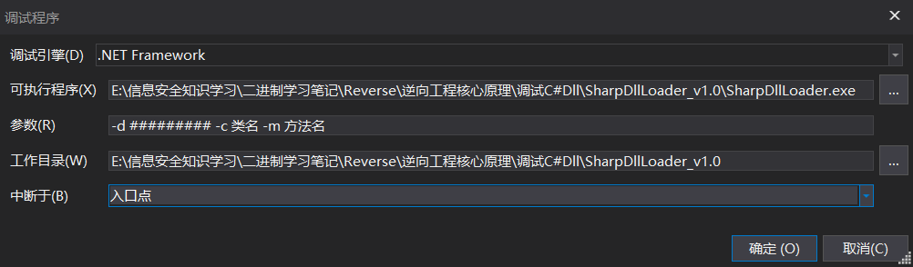
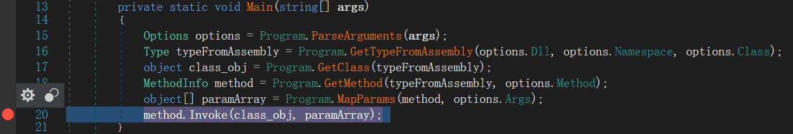
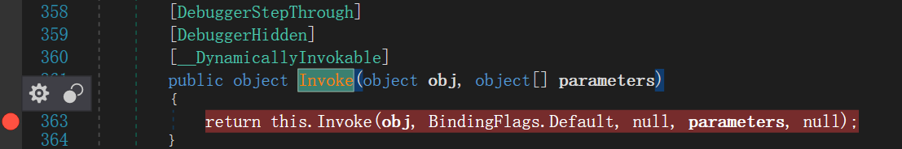
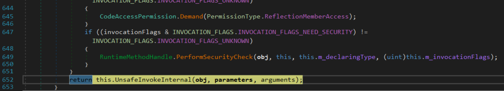
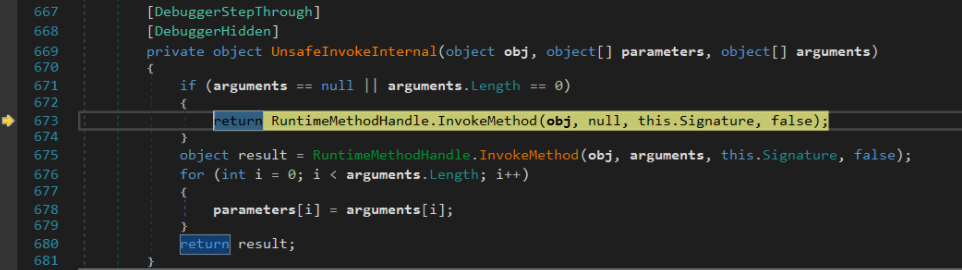
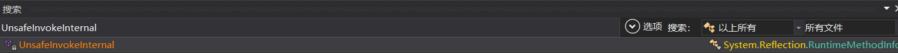
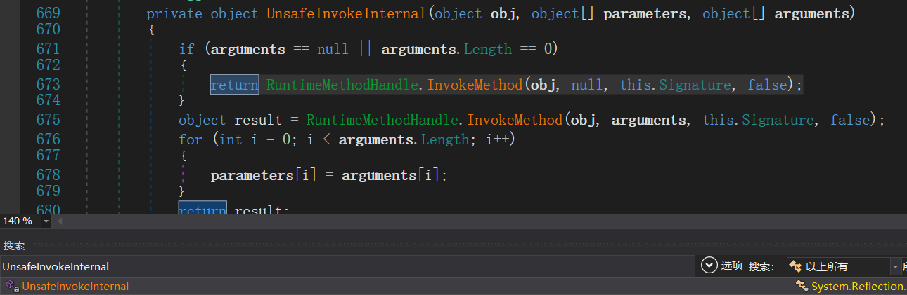
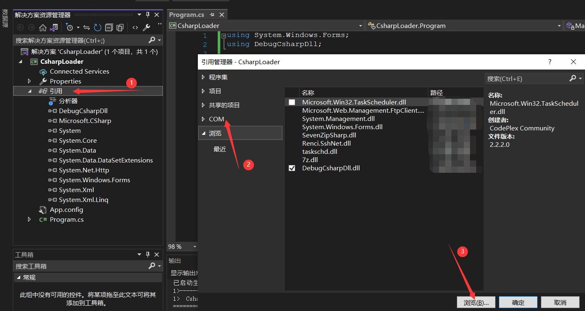
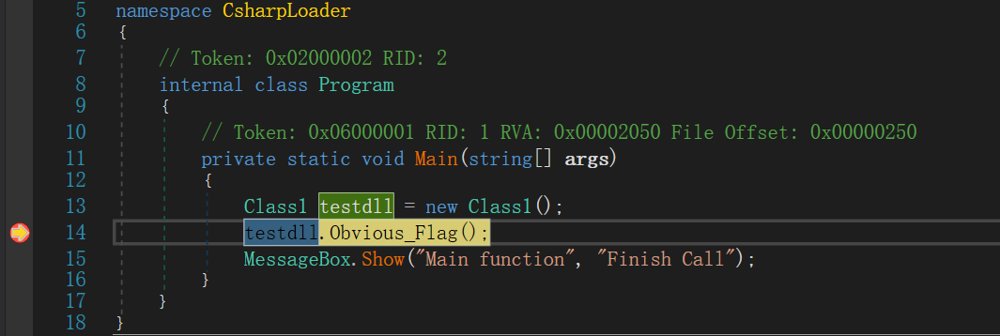
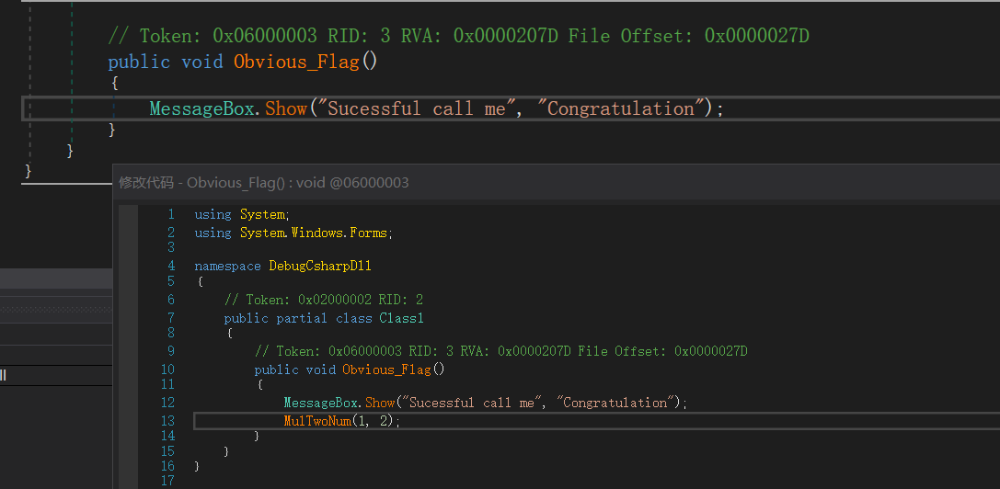

# 总思路

通过另外的启动器来调用dll，并且通过调试器的介入来达到调试dll的目的。还没有发现其他的方式可以简单便捷的调试C#的dll文件。

需要注意的是，c#的动态链接库的调用方式都需要对应好位数，32位用32位，64位用64位。不然会报错

# 思路1

通过[`SharpDllLoader_v1.0.exe`](https://github.com/hexfati/SharpDllLoader)借助dnspy来调试dll。这个程序是32位的

开发者给的用法

```
SharpDllLoader.exe -d DLL_PATH [-n NAMESPACE] -c DLL_CLASS -m METHOD [-a "ARG1 ARG2"]
```

`-n`和`-a `参数是可选的。

## 方式1



反正就这个命令，进去之后会断在Main函数这，但是呢第二行就会报错，没治。

按照开发者说的：



在invoke这一步，F11进去



看到这一步，F10，一直f10，直到看到类似的代码



F11跟进去，然后继续F10，直到看见如下指令，然后F11



最后就到了要调试的dll里面。

## 方式2

简便的方法，进去Main函数之后，直接ctrl+shift+k进行搜索，搜索`UnsafeInvokeInternal `然后双击



进去之后，在

```c#
return RuntimeMethodHandle.InvokeMethod(obj, null, this.Signature, false);
```

的地方下断点。



等运行到这里的时候，f11就可以进去dll了。

类似的malware的遇到通过invoke方式载入恶意代码的也可以通过类似的方式进行跳转调试。

# 思路2

通过自己写的程序加载dll程序并且进行调用。

- vs2022
- DebugCsharpDll.dll

这是那个dll程序：现在通过一个load在利用

```c#
using System.Windows.Forms;

namespace DebugCsharpDll
{
    public class Class1
    {
        public int AddTwoNum(int a, int b)
        {
            return a + b;
        }
        public int MulTwoNum(int a, int b)
        {
            return (a * b);
        }
        public void Obvious_Flag()
        {
            MessageBox.Show("Sucessful call me",  "Congratulation");
        }

    }
}
```

dll的利用程序，这里还是同语言好调用，用c调用挺麻烦

```c#
using System.Windows.Forms;
// 引用引用的dll的命名空间
using DebugCsharpDll;

namespace CsharpLoader
{
    internal class Program
    {
        static void Main(string[] args)
        {
            Class1 testdll = new Class1();
            testdll.Obvious_Flag();
            MessageBox.Show("Main function", "Finish Call");
        }
    }
}
```



通过这个方法，载入dll，然后通过下面的代码正常的调用就行，然后用这个exe去dnspy调试。

```c#
            Class1 testdll = new Class1();
            testdll.Obvious_Flag();
```



在这里直接步入F11就可以跳进去这个dll了，进入dll之后，可以修改dll的代码，然后通过一个函数跳转到其他的地方

