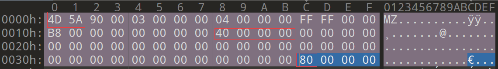
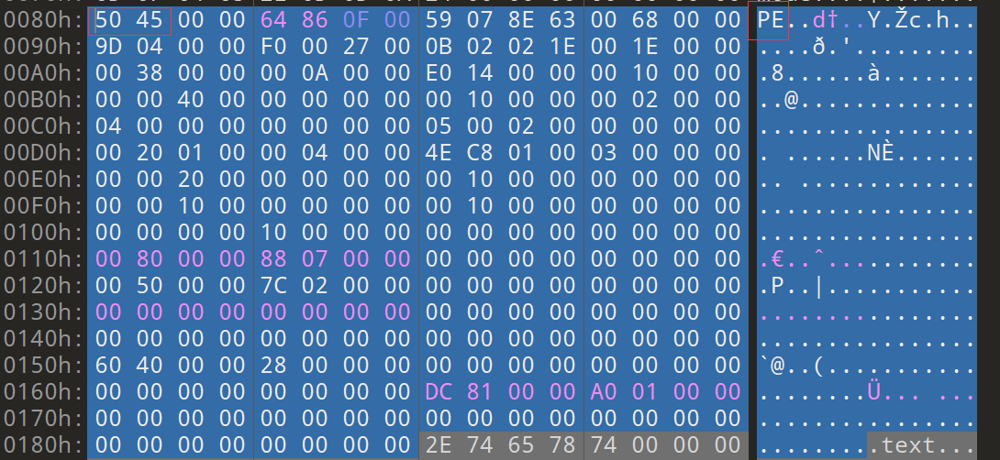
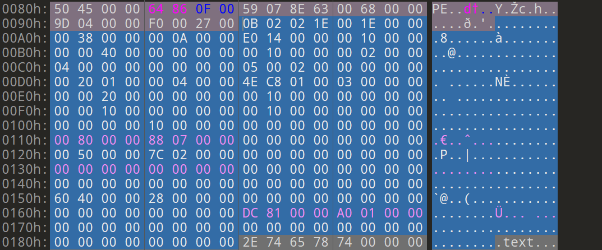
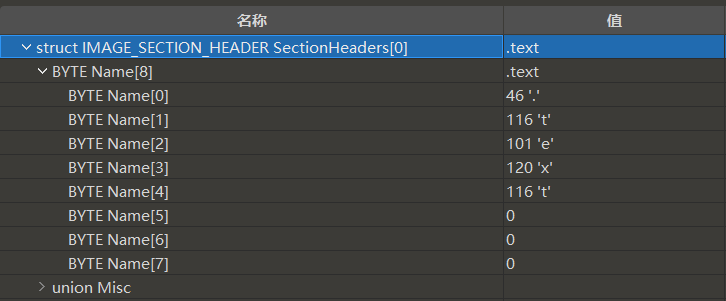
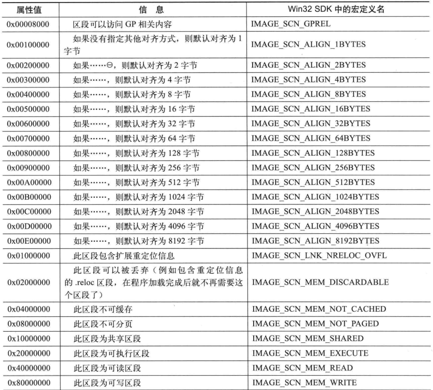
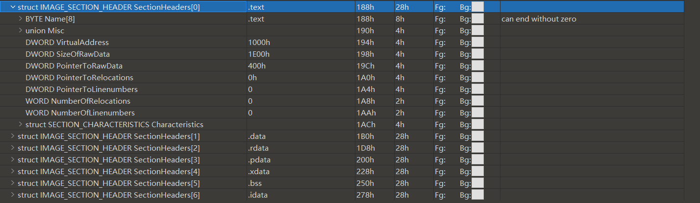
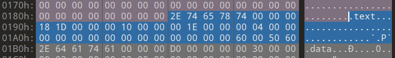
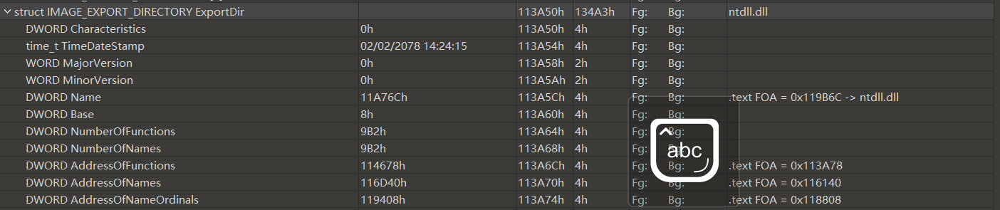
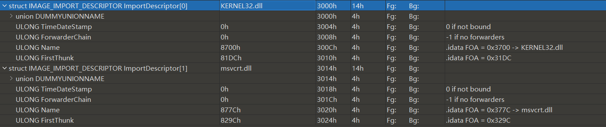
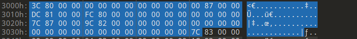

# 写在前面

微软基于COFF（通用项目文件格式）来设计的可执行文件，本篇学习笔记是基于《黑客免杀攻防》一书来学习记录的，之前有一篇记录是基于《逆向工程核心原理》写的[逆向工程学习-PE文件格式 | R-o-o-t-k-i-t (hellorootkit.github.io)](https://hellorootkit.github.io/2021/08/31/逆向工程学习-PE文件结构/?highlight=pe)这两篇相互独立，只不过是不同的时间再次学习一下罢了。

可以在文件`WinNt.h`文件中找到。

一些缩写。

- RAW：文件偏移
- RVA：相对虚拟地址（是指相对与ImageBase的偏移）
- VA：虚拟地址，也就是程序被加载到内存中的地址

# 利用010editor

首先下载对应的[模板](https://www.sweetscape.com/010editor/repository/templates/)，然后在010里运行模板，然后alt+f4显示模板变量，这样看起来比较方便，效果如下：


这里分析起来结构就如虎添翼了。

# MS-DOS头

普遍存在于PE文件中的一个没啥用的节区，当PE文件运行在dos系统（DOS作为微软公司在个人计算机上使用的一个操作系统载体，1981年 - 1995年）时会执行，告诉你这个程序不能在dos系统里执行。在winnt.h文件的14889行可以找到DOS头的信息

```c
// DOS .EXE header
typedef struct _IMAGE_DOS_HEADER{
    WORD   e_magic;                   // Magic number
    WORD   e_cblp;                    // Bytes on last page of file
    WORD   e_cp;                      // Pages in file
    WORD   e_crlc;                    // Relocations
    WORD   e_cparhdr;                 // Size of header in paragraphs
    WORD   e_minalloc;                // Minimum extra paragraphs needed
    WORD   e_maxalloc;                // Maximum extra paragraphs needed
    WORD   e_ss;                      // Initial (relative) SS value
    WORD   e_sp;                      // Initial SP value
    WORD   e_csum;                    // Checksum
    WORD   e_ip;                      // Initial IP value
    WORD   e_cs;                      // Initial (relative) CS value
    WORD   e_lfarlc;                  // File address of relocation table
    WORD   e_ovno;                    // Overlay number
    WORD   e_res[4];                  // Reserved words
    WORD   e_oemid;                   // OEM identifier (for e_oeminfo)
    WORD   e_oeminfo;                 // OEM information; e_oemid specific
    WORD   e_res2[10];                // Reserved words
    LONG   e_lfanew;                  // File address of new exe header
  } IMAGE_DOS_HEADER, *PIMAGE_DOS_HEADER;
```



## e_magic

就是`4D 5A`这两个字节，表示这是一个DOS下的可执行文件

## e_ss; e_sp……

这两个值用来在程序开始的时候初始化`SS SP`的两个寄存器的值，剩下的后面的几个就是初始化各个对应的寄存器的值。

## e_lfarlc

这个头指向了程序中重定位表的地址

## e_lfanew

这个值指向的是PE文件头（NT头）的偏移，这个数字的偏移是`0x3c`（从MZ那开始算起）

# DOS签名


这里就是一串字符串，和一些汇编代码，可以在dos里显示出这个字符串的汇编代码。

# PE头（NT头）

在哪个头文件的15186行可以找对对应的描述

```c
typedef struct _IMAGE_NT_HEADERS64 {
    DWORD Signature;
    IMAGE_FILE_HEADER FileHeader;
    IMAGE_OPTIONAL_HEADER64 OptionalHeader;
} IMAGE_NT_HEADERS64, *PIMAGE_NT_HEADERS64;

typedef struct _IMAGE_NT_HEADERS {
    DWORD Signature;
    IMAGE_FILE_HEADER FileHeader;
    IMAGE_OPTIONAL_HEADER32 OptionalHeader;
} IMAGE_NT_HEADERS32, *PIMAGE_NT_HEADERS32;
```

不论是64位的程序还是32位的程序，这个结构体包含的内容基本是一样的。



## Signature

```c
DWORD Signature;
```

这个字段由四个字节组成`PE\x00\x00`

## IMAGE_FILE_HEADER

```c
IMAGE_FILE_HEADER FileHeader;
```

这个结构中包含了整个PE文件的概览信息，文件的15006行。

```c
typedef struct _IMAGE_FILE_HEADER {
    WORD    Machine;
    WORD    NumberOfSections;
    DWORD   TimeDateStamp;
    DWORD   PointerToSymbolTable;
    DWORD   NumberOfSymbols;
    WORD    SizeOfOptionalHeader;
    WORD    Characteristics;
} IMAGE_FILE_HEADER, *PIMAGE_FILE_HEADER;
```

### Machine

一个两字节的值，表示了该程序运行在何种CPU上。在15034行可以看到宏定义，很重要的值，但是利用起来没啥用。

```c
#define IMAGE_FILE_MACHINE_UNKNOWN      0
#define IMAGE_FILE_MACHINE_I386         0x014c  // Intel 386.
#define IMAGE_FILE_MACHINE_R3000        0x0162  // MIPS little-endian, 0x160 big-endian
#define IMAGE_FILE_MACHINE_R4000        0x0166  // MIPS little-endian
#define IMAGE_FILE_MACHINE_R10000       0x0168  // MIPS little-endian
#define IMAGE_FILE_MACHINE_WCEMIPSV2    0x0169  // MIPS little-endian WCE v2
#define IMAGE_FILE_MACHINE_ALPHA        0x0184  // Alpha_AXP
#define IMAGE_FILE_MACHINE_SH3          0x01a2  // SH3 little-endian
#define IMAGE_FILE_MACHINE_SH3DSP       0x01a3
#define IMAGE_FILE_MACHINE_SH3E         0x01a4  // SH3E little-endian
#define IMAGE_FILE_MACHINE_SH4          0x01a6  // SH4 little-endian
#define IMAGE_FILE_MACHINE_SH5          0x01a8  // SH5
#define IMAGE_FILE_MACHINE_ARM          0x01c0  // ARM Little-Endian
#define IMAGE_FILE_MACHINE_THUMB        0x01c2  // ARM Thumb/Thumb-2 Little-Endian
#define IMAGE_FILE_MACHINE_ARMNT        0x01c4  // ARM Thumb-2 Little-Endian
#define IMAGE_FILE_MACHINE_AM33         0x01d3
#define IMAGE_FILE_MACHINE_POWERPC      0x01F0  // IBM PowerPC Little-Endian
#define IMAGE_FILE_MACHINE_POWERPCFP    0x01f1
#define IMAGE_FILE_MACHINE_IA64         0x0200  // Intel 64
#define IMAGE_FILE_MACHINE_MIPS16       0x0266  // MIPS
#define IMAGE_FILE_MACHINE_ALPHA64      0x0284  // ALPHA64
#define IMAGE_FILE_MACHINE_MIPSFPU      0x0366  // MIPS
#define IMAGE_FILE_MACHINE_MIPSFPU16    0x0466  // MIPS
#define IMAGE_FILE_MACHINE_AXP64        IMAGE_FILE_MACHINE_ALPHA64
#define IMAGE_FILE_MACHINE_TRICORE      0x0520  // Infineon
#define IMAGE_FILE_MACHINE_CEF          0x0CEF
#define IMAGE_FILE_MACHINE_EBC          0x0EBC  // EFI Byte Code
#define IMAGE_FILE_MACHINE_AMD64        0x8664  // AMD64 (K8)
#define IMAGE_FILE_MACHINE_M32R         0x9041  // M32R little-endian
#define IMAGE_FILE_MACHINE_CEE          0xC0EE
```

### NumberOfSections

这个文件中节区的数目，如果说要新增一个节区的话，就要更改这里。

### TimeDateStamp

文件的时间戳，在样本分析中可以根据时间戳来进行画像和溯源，这是比系统的日期和时间更加精确的时间。


可以看到都精确到秒了。

### NumberOfSymbols

符号表中的符号的数量，COFF文件的符号表 **长度固定**，只有通过这个结构才能算出来符号表的结尾

### SizeOfOptionalHeader

可选头（拓展头）的大小，这个头就在该结构体的后面。可以通过这个大小来判断32位（E0 00）和64位（F0 00）。

### Characteristics

这个字段阐述了PE文件的属性，这个值是由众多的属性的值组合成的一个数字，看起来只有两个字节，但是包含了很多的二进制文件的属性。

## IMAGE_OPTIONAL_HEADER

从这个块开始，就开始复杂了，就真正进入PE文件结构的核心了。

```c
IMAGE_OPTIONAL_HEADER64 OptionalHeader;
```

为什么叫可选头，虽然他是必须的，没有就寄了。这是因为文件结构的设计是仿照的COFF文件，所以就传下来了这么一个不合理的名称。

这个头在64位和32位的程序中的结构不同（上面说了，大小不同，所以结构肯定不一样啊）。

这两个头合并成为**PE文件头**

```c
typedef struct _IMAGE_OPTIONAL_HEADER {
    //
    // Standard fields.
    //

    WORD    Magic;
    BYTE    MajorLinkerVersion;
    BYTE    MinorLinkerVersion;
    DWORD   SizeOfCode;
    DWORD   SizeOfInitializedData;
    DWORD   SizeOfUninitializedData;
    DWORD   AddressOfEntryPoint;
    DWORD   BaseOfCode;
    DWORD   BaseOfData;

    //
    // NT additional fields.
    //

    DWORD   ImageBase;
    DWORD   SectionAlignment;
    DWORD   FileAlignment;
    WORD    MajorOperatingSystemVersion;
    WORD    MinorOperatingSystemVersion;
    WORD    MajorImageVersion;
    WORD    MinorImageVersion;
    WORD    MajorSubsystemVersion;
    WORD    MinorSubsystemVersion;
    DWORD   Win32VersionValue;
    DWORD   SizeOfImage;
    DWORD   SizeOfHeaders;
    DWORD   CheckSum;
    WORD    Subsystem;
    WORD    DllCharacteristics;
    DWORD   SizeOfStackReserve;
    DWORD   SizeOfStackCommit;
    DWORD   SizeOfHeapReserve;
    DWORD   SizeOfHeapCommit;
    DWORD   LoaderFlags;
    DWORD   NumberOfRvaAndSizes;
    IMAGE_DATA_DIRECTORY DataDirectory[IMAGE_NUMBEROF_DIRECTORY_ENTRIES];
} IMAGE_OPTIONAL_HEADER32, *PIMAGE_OPTIONAL_HEADER32;

// 64位的程序的结构
typedef struct _IMAGE_OPTIONAL_HEADER64 {
    WORD        Magic;
    BYTE        MajorLinkerVersion;
    BYTE        MinorLinkerVersion;
    DWORD       SizeOfCode;
    DWORD       SizeOfInitializedData;
    DWORD       SizeOfUninitializedData;
    DWORD       AddressOfEntryPoint;
    DWORD       BaseOfCode;
    ULONGLONG   ImageBase;
    DWORD       SectionAlignment;
    DWORD       FileAlignment;
    WORD        MajorOperatingSystemVersion;
    WORD        MinorOperatingSystemVersion;
    WORD        MajorImageVersion;
    WORD        MinorImageVersion;
    WORD        MajorSubsystemVersion;
    WORD        MinorSubsystemVersion;
    DWORD       Win32VersionValue;
    DWORD       SizeOfImage;
    DWORD       SizeOfHeaders;
    DWORD       CheckSum;
    WORD        Subsystem;
    WORD        DllCharacteristics;
    ULONGLONG   SizeOfStackReserve;
    ULONGLONG   SizeOfStackCommit;
    ULONGLONG   SizeOfHeapReserve;
    ULONGLONG   SizeOfHeapCommit;
    DWORD       LoaderFlags;
    DWORD       NumberOfRvaAndSizes;
    IMAGE_DATA_DIRECTORY DataDirectory[IMAGE_NUMBEROF_DIRECTORY_ENTRIES];
} IMAGE_OPTIONAL_HEADER64, *PIMAGE_OPTIONAL_HEADER64;
```



### Magic

文件类型标识，这个分开了PE32+文件（0x020b）,ROM文件（0x0170）,普通可执行文件（0x010b）。

### MajorLinkerVersion

链接器的主版本号

### MinorLinkerVersion

链接器的子版本号

### SizeOfCode

所有的`IMAGE_SCN_CNT_CODE`的属性的代码的总大小，这是磁盘扇区字节数的整倍数计算，15353行

```c
#define IMAGE_SCN_CNT_CODE     0x00000020  // Section contains code.
```

就是节区中包含可执行的代码的属性，相当于是可执行属性

### AddressOfEntryPoint

程序执行入口RVA地址，一般指向运行时库代码，程序的main之类的入口点由这些库函数调用；在DLL文件中，这个值一般设置为0。

### BaseOfCode

代码段的RVA地址，下面那个是数据段的代码段DataOfCode

### ImageBase

文件装入内存的首选地址，加载器会首先尝试在这个地址加载文件，加载成功就跳过装载器的重定位过程，如果这个地址在内存中被占用的话，装载器就会重新找一个合法的地址装载文件。

### SizeOfImage

映像装入内存之后的大小，从ImageBase到最后一个区段的总大小

### SizeOfHeaders

前面这些个各种头的总大小

### CheckSum

映像文件的校验和，这个对于一般的文件没啥要求，一般就是0，但是对于内核模式的驱动和系统dll的这个值必须有这个合适的值

### IMAGE_DATA_DIRECTORY

```c
#define IMAGE_NUMBEROF_DIRECTORY_ENTRIES    16		// 15047行
IMAGE_DATA_DIRECTORY DataDirectory[IMAGE_NUMBEROF_DIRECTORY_ENTRIES];
```

PE文件中各种数据结构的索引目录，由数个结构相同的`IMAGE_DATA_DIRECTORY`组成

```c
typedef struct _IMAGE_DATA_DIRECTORY {
    DWORD   VirtualAddress;
    DWORD   Size;
} IMAGE_DATA_DIRECTORY, *PIMAGE_DATA_DIRECTORY;
```


在文件中是这么描述的

```c

#define IMAGE_DIRECTORY_ENTRY_EXPORT          0   // Export Directory
#define IMAGE_DIRECTORY_ENTRY_IMPORT          1   // Import Directory
#define IMAGE_DIRECTORY_ENTRY_RESOURCE        2   // Resource Directory
#define IMAGE_DIRECTORY_ENTRY_EXCEPTION       3   // Exception Directory
#define IMAGE_DIRECTORY_ENTRY_SECURITY        4   // Security Directory
#define IMAGE_DIRECTORY_ENTRY_BASERELOC       5   // Base Relocation Table
#define IMAGE_DIRECTORY_ENTRY_DEBUG           6   // Debug Directory
//      IMAGE_DIRECTORY_ENTRY_COPYRIGHT       7   // (X86 usage)
#define IMAGE_DIRECTORY_ENTRY_ARCHITECTURE    7   // Architecture Specific Data
#define IMAGE_DIRECTORY_ENTRY_GLOBALPTR       8   // RVA of GP
#define IMAGE_DIRECTORY_ENTRY_TLS             9   // TLS Directory
#define IMAGE_DIRECTORY_ENTRY_LOAD_CONFIG    10   // Load Configuration Directory
#define IMAGE_DIRECTORY_ENTRY_BOUND_IMPORT   11   // Bound Import Directory in headers
#define IMAGE_DIRECTORY_ENTRY_IAT            12   // Import Address Table
#define IMAGE_DIRECTORY_ENTRY_DELAY_IMPORT   13   // Delay Load Import Descriptors
#define IMAGE_DIRECTORY_ENTRY_COM_DESCRIPTOR 14   // COM Runtime descriptor
```

#### IMAGE_DIRECTORY_ENTRY_SECURITY

安全目录，一般用来存放数字签名或者证书之类的。

#### IMAGE_DIRECTORY_ENTRY_BASERELOC

基址重定位表，存放这一个偏移，是需要执行重定位的代码的偏移信息

#### IMAGE_DIRECTORY_ENTRY_BOUND_IMPORT

绑定输入目录，存储的是一些API绑定信息，这些可以加速程序的加载时间。

#### IMAGE_DIRECTORY_ENTRY_IAT

导入地址表，保存导入函数的真正地址

# 节表（区块表）

该表用来描述后面的这些个区段的各种属性，一个PE文件起码要一个节区才能跑，哪怕剩一个也得剩下text节区，连代码段都没了，跑尼玛呢。

该表由首位相连的数个结构相同的结构体构成


可以看到这个表的主要构成就是一堆IMAGE_SECTION_HEADER结构体构成，每一个结构体代表了之后的一个节区

## IMAGE_SECTION_HEADER

```c
typedef struct _IMAGE_SECTION_HEADER {
    BYTE    Name[IMAGE_SIZEOF_SHORT_NAME];
    union {
            DWORD   PhysicalAddress;
            DWORD   VirtualSize;
    } Misc;
    DWORD   VirtualAddress;
    DWORD   SizeOfRawData;
    DWORD   PointerToRawData;
    DWORD   PointerToRelocations;
    DWORD   PointerToLinenumbers;
    WORD    NumberOfRelocations;
    WORD    NumberOfLinenumbers;
    DWORD   Characteristics;
} IMAGE_SECTION_HEADER, *PIMAGE_SECTION_HEADER;
```

### Name



这个字段就是阐述的该节的名称，一个8字节的字符串，开头一般都是`.`，如果用`$`开头的同名的区段会合并成一个区段。

### VirtualSize

这个和PhysicalAddress字段在一个联合体中，在obj文件中他的值是`0x00000000`; 其他文件表示的是该节区实际被使用的区段大小（没有经过对齐）。

### VirtualAddress

文件载入内存中的RVA，这个地址是按照页内存对齐的，永远是可选头中的`SectionAlignment`的整数倍。

### SizeOfRawData

这个区段在文件中的占用磁盘的大小，按照页内存对齐的，永远是可选头中的`FileAlignment`的整倍数

### PointerToRawData

该区段在文件中的偏移

### PointerToRelocations

该区段重定位表的偏移，指向了IMAGE_RELOCATION结构数组

#### IMAGE_RELOCATION

```c
typedef struct _IMAGE_RELOCATION {
    union {
        DWORD   VirtualAddress;
        DWORD   RelocCount; // Set to the real count when IMAGE_SCN_LNK_NRELOC_OVFL is set
    } DUMMYUNIONNAME;
    DWORD   SymbolTableIndex;
    WORD    Type;
} IMAGE_RELOCATION;
typedef IMAGE_RELOCATION UNALIGNED *PIMAGE_RELOCATION;
```

### Characteristics

阐述了区段的一些属性，比如读写情况和其他状态。这些属性有些事可以合并的，在程序中可以通过`|`来合并属性




## 区段的命名

区段名称可以自定义，但是一般是使用默认的区段名称。

可以通过如下形式对程序中的**数据段**进行改名。

```c
#pragma data_seg("任意的名字");
```

## 区段的对齐

在文件中不论是什么内容，都要遵守一个页对齐的规则。对于PE文件来说，只要是2的倍数就可以

### 以text区段为例





看到这个段的VirtualSize是`0x1d18`，然后再看`VirtualAddress`和`SizeOfRawData`这两个字段

- VirtualAddress：0x1000

所以这个区段在内存中的大小应该是0x2000，缺的字节用0x00补齐。用x64dbg可以证明：


- SizeOfRawData：0x1E00

根据上述大小，这个区段在硬盘中的大小应该是0x1E00的整倍数，所以理论上应该是0x1E00。


# 后续：

根据书上介绍，后面的内容都会教你如何定位，但是现在的CFF，PE studio这么方便，没必要再去研究怎么手动定位了。

# IMAGE_EXPORT_DIRECTORY（导出表）

在头文件的16148行找到了这个结构体的描述

```c
typedef struct _IMAGE_EXPORT_DIRECTORY {
    DWORD   Characteristics;	//默认是0，作为保留值
    DWORD   TimeDateStamp;		//导出表创建时间
    WORD    MajorVersion;
    WORD    MinorVersion;
    DWORD   Name;				//指向模块的名称的RVA地址
    DWORD   Base;
    DWORD   NumberOfFunctions;	//导出地址表（EAT）中成员个数
    DWORD   NumberOfNames;		//导出名称表（ENT）中成员个数
    DWORD   AddressOfFunctions;     // RVA from base of image
    DWORD   AddressOfNames;         // RVA from base of image
    DWORD   AddressOfNameOrdinals;  // RVA from base of image
} IMAGE_EXPORT_DIRECTORY, *PIMAGE_EXPORT_DIRECTORY;
```

导出表主要是存放的程序的导出函数，exe文件一般没有这个表，普遍存在dll文件中。



不知道为啥，这个资料用了很大的章节来阐述如何定位到导出表……，

导出表在逻辑上分为三部分：名称表；序号表；函数表。

调用者通过前两者进行索引，找到真正的函数表。我们平时调用dll时用到的序号，需要减去` DWORD   Base;`的值才能得到真正的保存的序号。但是不知道这个有什么实际用处

# IMAGE_IMPORT_DIRECTORY（导入表）

这个表是重要的一个表。这个表存在的意义是：该程序调用第三方API函数供本地使用的调用机制。这个表普遍存在于PE文件中。

```c
typedef struct _IMAGE_IMPORT_DESCRIPTOR {
    union {
        DWORD   Characteristics;      // 0 for terminating null import descriptor
        DWORD   OriginalFirstThunk;   // 输入表名称（INT）的RVA
    } DUMMYUNIONNAME;
    DWORD   TimeDateStamp;            // 0 if not bound,
                                      // -1 if bound, and real date\time stamp
                                      //     in IMAGE_DIRECTORY_ENTRY_BOUND_IMPORT (new BIND)
                                      // O.W. date/time stamp of DLL bound to (Old BIND)
    DWORD   ForwarderChain;           // -1 if no forwarders
    DWORD   Name;					// 指出导入此映像文件的名字
    DWORD   FirstThunk;               // RVA to IAT (if bound this IAT has actual addresses)
} IMAGE_IMPORT_DESCRIPTOR;
```

该结构并不能完成PE文件整个的导入文件，只是帮助装载器找到程序真正的保存有导入信息的结构。真正保存导入函数的是如下两个结构体`_IMAGE_IMPORT_BY_NAME`和`_IMAGE_THUNK_DATA`。16166行

```c
typedef struct _IMAGE_IMPORT_BY_NAME {
    WORD    Hint;
    CHAR   Name[1];
} IMAGE_IMPORT_BY_NAME, *PIMAGE_IMPORT_BY_NAME;

typedef struct _IMAGE_THUNK_DATA64 {
    union {
        ULONGLONG ForwarderString;  // 转发字符串的RVA
        ULONGLONG Function;         // 被导出函数的地址
        ULONGLONG Ordinal;
        ULONGLONG AddressOfData;    // PIMAGE_IMPORT_BY_NAME
    } u1;
} IMAGE_THUNK_DATA64;

typedef struct _IMAGE_THUNK_DATA32 {
    union {
        DWORD ForwarderString;      // PBYTE 
        DWORD Function;             // PDWORD
        DWORD Ordinal;
        DWORD AddressOfData;        // PIMAGE_IMPORT_BY_NAME
    } u1;
} IMAGE_THUNK_DATA32;
```

IMAGE_IMPORT_DIRECTORY结构的个数由导入函数的数量决定，最后以一个空的IMAGE_IMPORT_DIRECTORY结构结尾

这个实例程序中只有两个结构，一个是kernel32的一个是msvcrt的



包含最后一个空结构：



## OriginalFirstThunk

包含指向INT的RVA，INT就是一个\_IMAGE_THUNK_DATA类型的数组，结尾是一个空的\_IMAGE_THUNK_DATA结构体；一般情况下，每一个_IMAGE_THUNK_DATA结构会指向\_IMAGE_IMPORT_BY_NAME结构。

_IMAGE_IMPORT_BY_NAME结构体

```c
typedef struct _IMAGE_IMPORT_BY_NAME {
    WORD    Hint;	// 导入表需要导入的函数的符号
    CHAR   Name[1];	// 导入表需要导入的函数的名称
} IMAGE_IMPORT_BY_NAME, *PIMAGE_IMPORT_BY_NAME;
```

该结构最后也是一个全空的结构体结尾，

## FirstThunk

指向导入地址表（IAT）的RVA地址

# 异常

异常目录常用来**存放**用于描述异常处理的相关的**异常处理函数、SEH相关的地址等信息**，这些信息一般位于`pdata`区段中。

PE文件结构中的异常目录目前只在：

- X64
- ARMv7
- ARM
- MIPS
- PowerPC

这些平台上才有实际作用。

在16551行可以找到这个结构体的描述

```c
typedef struct _IMAGE_RUNTIME_FUNCTION_ENTRY {
    DWORD BeginAddress;	// SEH代码起始地址
    DWORD EndAddress;	// SEH代码的结束地址
    union {
        DWORD UnwindInfoAddress;
        DWORD UnwindData;
    } DUMMYUNIONNAME;
} _IMAGE_RUNTIME_FUNCTION_ENTRY, *_PIMAGE_RUNTIME_FUNCTION_ENTRY;
```

# 安全

数据目录的IMAGE_DIRECTORY_ENTRY_SECURITY指向这个结构。这个目录也被称为“安全目录”或者“属性证书目录”，一般存放的是文件的数字签名。

## 安全目录结构

在wintrust.h文件中1398行可以找到描述

```c
typedef struct _WIN_CERTIFICATE
{
    DWORD       dwLength;	// 当前结构体的长度
    WORD        wRevision;	// 签名的版本号
    WORD        wCertificateType;   // WIN_CERT_TYPE_xxx
    BYTE        bCertificate[ANYSIZE_ARRAY];	// 包含了许多证书

} WIN_CERTIFICATE, *LPWIN_CERTIFICATE;
```

# 基质重定向表

在运行的时候，总是exe文件被优先加载，所以这个表普遍存在于dll文件中，当exe文件或者其他文件运行占据了dll的默认地址，就会进行重定向。

一般情况下`.reloc`的段中存在这个基址重定位表；将PE文件中所有需要重定位的地址放在一个数组里。

## IMAGE_BASE_RELOCATION

```C
typedef struct _IMAGE_BASE_RELOCATION {
    DWORD   VirtualAddress;
    DWORD   SizeOfBlock;
//  WORD    TypeOffset[1];
} IMAGE_BASE_RELOCATION;
```

在一个PE文件中，重定位结构由众多的上述结构组成。根据书上说：每个这个结构管理的只有4kb大小的分页内的重定位信息，PE文件中每隔0x1000字节的大小就需要一个这个结构与其对应，所以这个结构中的`VirtualAddress`的值永远是0x1000的倍数。

# 调试

数据结构目录中的IMAGE_DIRECTORY_ENTRY_DEBUG结构指向了这个结构，该结构也被成为是调试目录，一般保存在`.debug`区段中。

## IMAGE_DEBUG_DIRECTORY

``` c
typedef struct _IMAGE_DEBUG_DIRECTORY {
    DWORD   Characteristics;	// 保留字段
    DWORD   TimeDateStamp;		// 调试数据建立的时间和日期
    WORD    MajorVersion;
    WORD    MinorVersion;
    DWORD   Type;
    DWORD   SizeOfData;
    DWORD   AddressOfRawData;	// 加载到内存的调试数据RVA
    DWORD   PointerToRawData;	// 调式数据的文件偏移
} IMAGE_DEBUG_DIRECTORY, *PIMAGE_DEBUG_DIRECTORY;
```

这个结构体不是很严格，在type里可以自定义一些类型，但是我也没有实际操作，所以我不清楚这个节区具体有什么用处

# TLS

见另一笔记，本篇只用来记录PE结构的一些内容。
