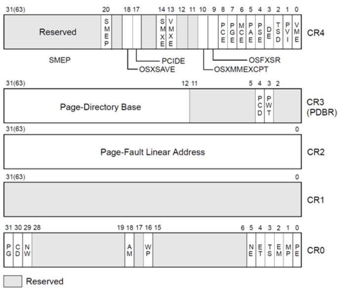

# 精简指令集 RISC

ARM属于精简指令集，大约100条左右的指令，先比较于x86汇编，arm不能直接操作内存的加减，只能控制寄存器，所以需要将内存ldr到寄存器中进行操作后返回内存。

## 比x86（CISC）快

RISC指令集允许通过缩短时钟周期来加速代码执行

## 端序

arm3之前小端序，之后的架构支持大端序，可以手动设置，而x86和x64仅仅支持小端序。

# ARM 基本特性

## 特权模式

1、不同于x86架构的r0内核模式和r3用户模式，arm提供了更多的特权模式（命名用的是英文的缩写）。

- USR：用户模式 ---> R3：用户运行的层级
- FIQ：快速中断请求模式
- IRQ：中断请求模式
- SVC：管理模式（supervisor） ---> R0：一般操作系统内核运行的层级
- MON：监视模式
- ABT：终止模式
- UND：未定义指令模式
- SYS：系统模式

## thumb

都属于arm架构，只不过是指令的长度不同，一个arm程序中可以混用两种指令长度的模式，只需要在汇编代码后面标注就可以。

ARM指令为32位、Thumb为16或者32位。

### 执行状态选择

0、默认状态下是ARM模式，直到出现显示或者隐式的转换。

1、利用BX、BXL进行跳转的时候，目标寄存器最低位是1（奇数），会切换到thumb模式。

2、程序状态寄存器（CPSR）的T标志位被置起，则切换到thumb模式。

3、32位的thumb指令后面用`.W`进行标注。

### 版本问题

thumb-1 用于ARM v6及之前的体系结构，ARM v7只用thumb-2.

## 条件执行

arm支持 **条件执行** ：在指令中编码了算数条件，满足条件才会执行。

优点：

- 提高了代码密度
- 减少执行指令的数目

ARM 的每一个指令都支持 条件执行 ，但是默认都是无条件执行的。

## 桶式位移器

相当于指令的合并操作，在一个指令中包含多步操作。

```assembly
MOV R1, R0, LSL #1	;将r0寄存器左移一位后，传递给r1
```

# 运行ARM程序

## 运行

ubuntu1804环境，成功安装qemu，执行显示缺少ld-linux.so.3文件，通过命令

```shell
sudo find / -name "ld-linux.so.3"
```

找到对应的so文件，然后使用命令

```shell
qemu-arm -L /usr/arm-linux-gnueabihf/lib/ call_ret
```

运行arm文件。

或者编译的时候直接使用`-static`静态编译可以解决问题

避免每次运行的时候使用`qemu-***`的形式，可以下载

```shell
apt install binfmt*
```

## 调试

使用gdb远程调试的原理，先本机开一个运行端口，然后gdb远程访问。

# 数据类型 & 寄存器

ARM 的操作都是基于寄存器的操作，无法像x86那样可以直接操作内存中的内容。

## 换算

32bit = 4byte = 1word = 1/2dword。

16bit = 半字（half word），不知道为啥会单独出一个半字的数据类型。

16bit：扩展后缀为**-h**或者**-sh**对应着，

byte：**-b**或者**-sb**对应着字节

```c
ldr = 加载字，宽度四字节
ldrh = 加载无符号的半字，宽度两字节
ldrsh = 加载有符号的半字，宽度两字节
ldrb = 加载无符号的字节
ldrsb = 加载有符号的字节
str = 存储字，宽度四字节
strh = 存储无符号的半字，宽度两字节
strsh = 存储有符号的半字，宽度两字节
strb = 存储无符号的字节
strsb = 存储有符号的字节
```

## 寄存器

定义了16个32bit通用寄存器（R0-R15）r0一般也用来放返回值，最后三个有特殊用处，0-12是通用的。

### r11：栈帧寄存器

栈帧寄存器，相当于是rbp

### r13：栈寄存器

栈指针寄存器，SP。相当于x86架构中的rsp寄存器，永远指向栈顶端。

### r14：连接寄存器

连接寄存器，LR。在函数调用中保存返回地址。在BL的时候会把返回地址保存在这个寄存器中，x86会保存在栈顶。

### r15：计数寄存器

程序计数寄存器，每次执行一个+8或者+4，类似于rip指令，但是他是支持arm程序直接读写的，并且会执行并跳转，也就是说他并不会一直指向下一条指令，

### CPSR：程序状态寄存器

类似于x86里的EFLAG或者RFLAG寄存器，保存程序的一些状态。

#### E

大小端标志位，0-->小端

#### T

thumb标志位，thumb状态为1

#### M

模式标志位，确定当前特权模式。

# 系统级控制设置

arm利用 **协处理器** 来支持额外的指令和系统级设置。

以 MMU（内存 管理 单元） 为例。如果系统是支持的，那么就要要向内核或者启动代码提供对应的**接口**，在x86架构中，这些接口会放在CR0-CR4寄存器中。

在ARM中， 有16个协处理器，CP0-CP15（P0-P15），每个协处理器有16个寄存器和对应的8个操作码。

协处理器只能通过`MRC`读和`MCR`写这俩指令来访问。这俩指令的参数一般是编号的形式，例如：读出转换基址寄存器并保存到CR0中。读出p15中的c2和c0保存在r0中。

这些东西常用在固件中，或者嵌入式开发之类的。

```
MRC p15, 0, r0, c2, c0, 0
```


## x86中的控制寄存器

CPU架构中共有CR0、CR1、CR2、CR3、CR4、CR8共6个控制寄存器，如下图。



CR0：包含当前处理器运行的控制标志。

CR1：保留。

CR2：包含发生**页面错误时的线性地址**。

CR3：页面目录表（Page Directory Table）的**物理地址**。

CR4：包含处理器扩展功能的标志位。

CR8：提供对任务优先级寄存器（Task Priority Register）的读写（仅在64位模式下存在）。

对控制寄存器的读写是通过MOV CRn指令来实现。

# ARM 指令集

1、连续横杠间断逗：

```assembly
PUSH    {R11,LR}  ;将R11和LR寄存器的值push到栈中。
PUSH    {R11,R15} ;将R11 到 R15中的值push到栈中。
```

2、更新基址用叹号：

```assembly
STM R1, {R3-R10}   ; R1 = 数组
STM R1!, {R3-R10}  ; R1 = 数组+1，将R1的地址更新为R10元素之后的一个
```

## 数据加载 & 保存

### LDR & STR

ldr：从内存向寄存器中加载数据

str：从寄存器中向内存加载数据

从内存中加载和保存1，2，4字节的数据。

```assembly
LDR R3, [R0]	;取R0地址里的内容给R3寄存器指向的地址 -- R3 = *R0
STR R3, [R0]	;取R3寄存器的值给R0指向的地址 -- R0 = *R3
```

这里也涉及到了ARM中的9种寻址方式。

- 立即寻址
- 寄存器寻址
- 寄存器间接寻址
- 寄存器移位寻址
- 基址变址寻址
- 相对寻址
- 多寄存器寻址
- 堆栈寻址（块拷贝寻址）

实际运用的时候不需要直到是什么方式寻址，能看懂就行了。

### LDM & STM

这个和上面的指令一样，区别是操作的数据大小不同，r结尾的是1，2，4字节，m结尾的是操作数据块。

存在四种模式：

- IA：后递增，写回最后一个地址+4字节地址的地址。
- IB：前递增，把数据存储在基地址+4的地址，写回最后一个地址。
- DA：后递减，最后的地址是基地址，写回最低地址-4。
- DB：前递减：最后的地址是基地址-4，写回最低地址。

类似于x86架构下的rep和movs指令，比如c语言里的memcpy（有时会直接以内联汇编的形式将其附加到代码中，而不是显示的调用这个函数）的功能。

### push & pop

这俩个x86架构下的没啥区别，就是x86一般一次一个，这个可以push很多一起进栈。一般用作函数边界的确定。

## 函数调用

函数调用涉及到了

- 局部变量
- 分支跳转
  - 每一次跳转都可以选择thumb和arm
- 返回值
  - 默认使用r0寄存器
- 返回地址
  - 可以用栈也可以用LR寄存器，但是用栈的话需要显示的将地址pop到PC寄存器中，否则默认LR寄存器。
- 调用约定
  - 前4个32位参数放到r0-r3寄存器，其余的用栈。

这几个方面的内容。

### 跳转指令

### B：branch

1、很少遇到的一种无条件跳转，类似于jmp指令。通常用于循环或者判断中，或者调用永不返回的函数

2、只能使用偏移量（当前地址）作为参数，不能跳转寄存器,`b R0`是非法的

### BX：branch exchange

跳转并交换，可以在跳转的时候选择arm或者thumb模式（X结尾的指令），根据目标地址最低位是不是1确定。可以用来跳转寄存器`BX R0`是合法的。

`BX LR` 类似于 `RET`指令

### BL：branch and link

跳转并连接指令，类似于call指令，在跳转之前先将返回地址保存到LR寄存器中。

作用和B指令一样，只能跳偏移，不能跳寄存器

### BLX：branch linke exchange

如果目的地在32mb之内，使用BL指令较多，跳转地址未知或者不确定，使用BLX指令

arm下调用库函数使用BL

thumb下调用库函数使用BLX

## 计算

- LSL , (LSR ASR)：左移和右移
- ROR , ROL：循环左右移
- ADD , SUB：加减
- MUL,：乘法，arm中没有原生除法。会截断结果为32位
- AND , ORR , EOR：与或非

## 分支跳转 & 条件执行

主要依赖于一些标志寄存器的值，记不住，到时候现查就行。

### 一些后缀编码

| EQ   | =          | Z==1           |
| ---- | ---------- | -------------- |
| NE   | !=         | Z==0           |
| MI   | -          | N==1           |
| PL   | +, 0       | N==0           |
| HI   | unsigned > | C==1 && Z==1   |
| LS   | unsigned < | C==0 \|\| Z==1 |
| GE   | >=         | N=V            |
| LT   | <          | N!=V           |
| GT   | >          | Z==0 && N=V    |
| LE   | <=         | Z==1 \|\| N!=V |

跳真不跳假。比如`BLT`这个指令：如果LT为真，则跳转。默认情况下不会更新标志位，除非使用了S后缀。

比较指令会自动更新标志位。

# JIT和SMC

just-in-time：即时编译

SMC：自修改代码（逆向中的一种反调试技巧）。

arm支持这些玩意。
