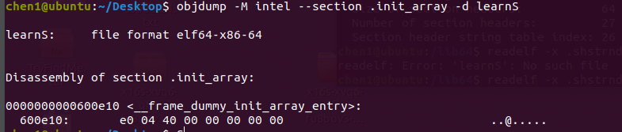

PE是Windows下的文件，elf是linux下的文件。学习网络前端Windows是主要市场，后端服务端则是linux的天下。学习pe文件结构也要学习elf文件结构。前端的Windows病毒来势凶猛，后端的linux攻击也是防不胜防。挖矿病毒肆虐；僵尸网络横行，不懂elf文件结构怎能进入网络安全这一大主题的门槛。

当时在进行pwn入门的时候，没有学习elf的文件结构，只是知道了怎么用，在哪里用，现在了解了文件结构，对以往的pwn知识有了更加深入的理解。

# 结构综述

ELF文件由四部分组成：ELF头、程序头、节、节头


本文以一个简单的C语言文件当作例子

```c
#include<stdio.h>
int main()
{
	printf("hello world\n");
	return 0;
}
```

为了方便正常人的思路，记录顺序做了一下调整。

# ELF头

可以在文件：`/usr/include/elf.h`中找到定义

```c
#define EI_NIDENT (16)
typedef struct
{
  unsigned char e_ident[EI_NIDENT];     /* Magic number and other info */
  Elf32_Half    e_type;                 /* Object file type */
  Elf32_Half    e_machine;              /* Architecture */
  Elf32_Word    e_version;              /* Object file version */
  Elf32_Addr    e_entry;                /* Entry point virtual address */
  Elf32_Off     e_phoff;                /* Program header table file offset */
  Elf32_Off     e_shoff;                /* Section header table file offset */
  Elf32_Word    e_flags;                /* Processor-specific flags */
  Elf32_Half    e_ehsize;               /* ELF header size in bytes */
  Elf32_Half    e_phentsize;            /* Program header table entry size */
  Elf32_Half    e_phnum;                /* Program header table entry count */
  Elf32_Half    e_shentsize;            /* Section header table entry size */
  Elf32_Half    e_shnum;                /* Section header table entry count */
  Elf32_Half    e_shstrndx;             /* Section header string table index */
} Elf32_Ehdr;

typedef struct
{
  unsigned char e_ident[EI_NIDENT];     /* Magic number and other info */
  Elf64_Half    e_type;                 /* Object file type */
  Elf64_Half    e_machine;              /* Architecture */
  Elf64_Word    e_version;              /* Object file version */
  Elf64_Addr    e_entry;                /* Entry point virtual address */
  Elf64_Off     e_phoff;                /* Program header table file offset */
  Elf64_Off     e_shoff;                /* Section header table file offset */
  Elf64_Word    e_flags;                /* Processor-specific flags */
  Elf64_Half    e_ehsize;               /* ELF header size in bytes */
  Elf64_Half    e_phentsize;            /* Program header table entry size */
  Elf64_Half    e_phnum;                /* Program header table entry count */
  Elf64_Half    e_shentsize;            /* Section header table entry size */
  Elf64_Half    e_shnum;                /* Section header table entry count */
  Elf64_Half    e_shstrndx;             /* Section header string table index */
} Elf64_Ehdr;
```

存在32和64两种类型，基本一样的。

> Elf64_Half和Elf64_Word是uint16_t uint32_t的预定义


在里面挑了几个重要的，记录一下，其他的不重要的就让他在书上吧。

## e_ident数组

该数组首先以特定的4字节字符串开头`\x7fELF`，这可以让文件加载器快速的认出来他是一个二进制文件，

通过命令`readelf -h learnS`


如果在编译的时候不添加`-no-pie`，这里的entry point addtress就是一个偏移。

## e_type

这个多字节数组指定了elf文件的类型，一般有三种类型

- ET_REL: 可重定位的对象文件
- ET_EXEC：可执行的二进制文件
- ET_DYN：共享对象文件（共享库）

例如下面的这个so.2程序


## e_phoff和e_shoff

e_shoff：section header offset,另一个同理是程序段的偏移，根据这两个值可以找到**程序头**和**节头**，一个是64字节，一个是6632字节。

**注意：**这里可以设置为0，意味着程序不包含程序头表和节头表；这里的地址不是虚拟地址，而是偏移量。

## e_ehsize

该字段阐述了elf头部的大小，对于64位程序来说，大小就是64字节；对于32位的程序来说，elf头部的大小是52字节

## e_shstrndx

该字段中包含一个名为`.shstrndx`的和特殊字符串表节相关的头索引。

这个`.shstrtab`在节头表中，这是一个专用节，包含一个以NULL值结尾的一个ascii数组。一个节一个名称。

```shell
readelf -x .shstrtab learnS
```


通过这个可以用16进制的形势查看内容。

在该头里其他的部分看起来对于逆向分析没有什么作用。

# 节头表

1.节：elf文件中代码和数据在逻辑上被分为连续的非重叠块，称为节（section）。

2.对于节的描述：没有任何预设的结构体，每个节的结构体取决于内容。每个节由节头描述，节头指定了节的属性。二进制中所有的节的节头都在节头表中。

3.节只是为链接器提供视图，因此是可选部分，不需要链接的二进制文件就不需要节头表，没有节头表，就将e_shoff的值设为 **0**.当二进制文件创建进程开始执行的时候，并不是所有的节都会载入内存，比如符号信息或者重定位信息。

## 段和节

二进制文件制定了另一种逻辑组织，称为段，段在文件执行的时候被使用；而节在连接时被使用。

同样在上述目录中，可以找到关于节头的定义

```c
/* Section header.  */

typedef struct
{
  Elf32_Word    sh_name;                /* Section name (string tbl index) */
  Elf32_Word    sh_type;                /* Section type */
  Elf32_Word    sh_flags;               /* Section flags */
  Elf32_Addr    sh_addr;                /* Section virtual addr at execution */
  Elf32_Off     sh_offset;              /* Section file offset */
  Elf32_Word    sh_size;                /* Section size in bytes */
  Elf32_Word    sh_link;                /* Link to another section */
  Elf32_Word    sh_info;                /* Additional section information */
  Elf32_Word    sh_addralign;           /* Section alignment */
  Elf32_Word    sh_entsize;             /* Entry size if section holds table */
} Elf32_Shdr;

typedef struct
{
  Elf64_Word    sh_name;                /* Section name (string tbl index) */
  Elf64_Word    sh_type;                /* Section type */
  Elf64_Xword   sh_flags;               /* Section flags */
  Elf64_Addr    sh_addr;                /* Section virtual addr at execution */
  Elf64_Off     sh_offset;              /* Section file offset */
  Elf64_Xword   sh_size;                /* Section size in bytes */
  Elf64_Word    sh_link;                /* Link to another section */
  Elf64_Word    sh_info;                /* Additional section information */
  Elf64_Xword   sh_addralign;           /* Section alignment */
  Elf64_Xword   sh_entsize;             /* Entry size if section holds table */
} Elf64_Shdr;
```

## sh_name

这是节头的第一个字段，如果被设置，则在字符串表中包含索引；如果索引是0，则该节没有名称。


这里存在一个大致这样的流程。

## sh_type

该字段阐述了节的类型，存在多种类型，在链接时会用到，内容不重要。

## sh_flags

关于节的其他信息，其中最重要的有三种：SHF_WRITE、SHF_ALLOC 、SHF_EXECINSTR。

### SHF_WRITE

在运行时可写，可以用来区分包含静态数据的节和包含变量的节。

### SHF_ALLOC 

指示在执行二进制文件的时候将该节的内容加载到虚拟内存，虽然在执行时是按照段视图。

### SHF_EXECINSTR

指示该节包含可执行指令。

## sh_addr、sh_offset、sh_size

描述该节的虚拟地址、文件偏移、节大小。

当设置sh_addr的值为0时，表示节不会加载到虚拟内存中。

## 其他

其他字段都不重要了

# 节


通过命令`readelf --sections --wide learnS`来查看节信息。可以看到节头表第一项由一个NULL项，这是标准的。

```
Section Headers:
  [Nr] Name              Type            Address          Off    Size   ES Flg Lk Inf Al
  [ 0]                   NULL            0000000000000000 000000 000000 00      0   0  0
  [ 1] .interp           PROGBITS        0000000000400238 000238 00001c 00   A  0   0  1
  [ 2] .note.ABI-tag     NOTE            0000000000400254 000254 000020 00   A  0   0  4
  [ 3] .note.gnu.build-id NOTE            0000000000400274 000274 000024 00   A  0   0  4
  [ 4] .gnu.hash         GNU_HASH        0000000000400298 000298 00001c 00   A  5   0  8
  [ 5] .dynsym           DYNSYM          00000000004002b8 0002b8 000060 18   A  6   1  8
  [ 6] .dynstr           STRTAB          0000000000400318 000318 00003f 00   A  0   0  1
  [ 7] .gnu.version      VERSYM          0000000000400358 000358 000008 02   A  5   0  2
  [ 8] .gnu.version_r    VERNEED         0000000000400360 000360 000020 00   A  6   1  8
  [ 9] .rela.dyn         RELA            0000000000400380 000380 000030 18   A  5   0  8
  [10] .rela.plt         RELA            00000000004003b0 0003b0 000018 18  AI  5  22  8
  [11] .init             PROGBITS        00000000004003c8 0003c8 000017 00  AX  0   0  4
  [12] .plt              PROGBITS        00000000004003e0 0003e0 000020 10  AX  0   0 16
  [13] .text             PROGBITS        0000000000400400 000400 000182 00  AX  0   0 16
  [14] .fini             PROGBITS        0000000000400584 000584 000009 00  AX  0   0  4
  [15] .rodata           PROGBITS        0000000000400590 000590 000010 00   A  0   0  4
  [16] .eh_frame_hdr     PROGBITS        00000000004005a0 0005a0 00003c 00   A  0   0  4
  [17] .eh_frame         PROGBITS        00000000004005e0 0005e0 000100 00   A  0   0  8
  [18] .init_array       INIT_ARRAY      0000000000600e10 000e10 000008 08  WA  0   0  8
  [19] .fini_array       FINI_ARRAY      0000000000600e18 000e18 000008 08  WA  0   0  8
  [20] .dynamic          DYNAMIC         0000000000600e20 000e20 0001d0 10  WA  6   0  8
  [21] .got              PROGBITS        0000000000600ff0 000ff0 000010 08  WA  0   0  8
  [22] .got.plt          PROGBITS        0000000000601000 001000 000020 08  WA  0   0  8
  [23] .data             PROGBITS        0000000000601020 001020 000010 00  WA  0   0  8
  [24] .bss              NOBITS          0000000000601030 001030 000008 00  WA  0   0  1
  [25] .comment          PROGBITS        0000000000000000 001030 000029 01  MS  0   0  1
  [26] .symtab           SYMTAB          0000000000000000 001060 0005b8 18     27  43  8
  [27] .strtab           STRTAB          0000000000000000 001618 0001cc 00      0   0  1
  [28] .shstrtab         STRTAB          0000000000000000 0017e4 000103 00      0   0  1
```

## .init和.fini节

### .init

.init节中包含可执行代码，用来初始化程序。在程序将控制权移动到main函数之前，由init里的代码掌握。可以看作是构造函数。

### .fini节

在程序执行结束之后执行的，和析构函数一样。

## .text节

该节包含了程序的主要代码。

一般来说，可执行的节是不可写的，可写的是不可执行的（出于安全考虑）

在本例中（标准gcc编译的程序）中text节中包含多个开始任务和结束任务的标准函数：

`_start  register_tm_clones  frame_dummy`这仨比较重要。

### _start 函数


通过`objdump -M intel -d learnS`可以看到不同函数的反汇编。

在地址0x400424的地址处，调用了__libc_start_main函数，这里查看rdi寄存器，可以看到是程序main函数的地址。

> 这就是为什么gdb里下断点会下在这里，查看rdi的值获得main函数的地址

### .bss和.data还有.rodata 

因为代码节不可写，所以变量会保存在多个可写的专用节中。

#### .rodata 

read only data代表**.rodata **，用来存储常量。

#### .data

初始化变量的默认值存放在这个节里。因为变量会被修改，所以标记为可写的节。

#### .bss

为了未初始化变量保留的空间，该节不会占用磁盘上的空间，只在二进制文件创建执行环境的时候为没有初始化的变量分配内存。该节是可写的。

### 延迟绑定plt、got

- plt表：（过程链接表）Procedure Linkage Table；

- got表：（全局偏移表）Gobal Offset Table；

为什么要延迟绑定：保证了动态链接器不会在重定位上浪费时间，只在需要的时候执行。

注意：若程序有实时性能的要求，则可以通过在bash中`exportLD_BIND_NOW=1`来取消动态绑定。

- .got.plt（GOT表）这是一个单独的节，是**运行时可写的**，如果程序开启了RELRO（重定位只读）防御got表覆盖攻击，那么got表不可写，这时就将会变化的值放在了这个表中，方便运行时改变。
- .plt.got（PLT表）这是一个备用的plt表，他的大小是8字节，在开启got不可写之后该表会代替16字节的plt表。
- got节用于引用数据项，got,plt节用来存放通过plt访问（已经解析的）的库函数地址

#### 执行流程


```assembly
00000000004003e0 <.plt>:
  4003e0:	ff 35 22 0c 20 00    	push   QWORD PTR [rip+0x200c22] # 601008 <_GLOBAL_OFFSET_TABLE_+0x8>
  4003e6:	ff 25 24 0c 20 00    	jmp    QWORD PTR [rip+0x200c24] # 601010 <_GLOBAL_OFFSET_TABLE_+0x10>
  4003ec:	0f 1f 40 00          	nop    DWORD PTR [rax+0x0]

00000000004003f0 <printf@plt>:
  4003f0:	ff 25 22 0c 20 00    	jmp    QWORD PTR [rip+0x200c22] # 601018 <printf@GLIBC_2.2.5>
  4003f6:	68 00 00 00 00       	push   0x0
  4003fb:	e9 e0 ff ff ff       	jmp    4003e0 <.plt>

```

通过命令`objdump -M intel --section .plt -d learnS`可以看到上面的汇编结构。

- 地址4003e0处作为 “默认存根”
- 地址4003f0处作为“函数存根”

plt存根以间接跳转指令开头，这导致他跳转到存储在.got.plt节中的地址（4003f0处的行为）。

在延迟绑定之前，该地址是函数存根下一条（push）指令的地址，间接跳转将控制权交给地址4003f6.

将0x0压入栈中（这是plt存根的标识符）。

4003fb地址的行为跳转到所有plt函数存根之间共享的通用默认存根。

默认存根push另一个标识符（从got中获得）表示可执行文件自身。间接的通过got跳转到动态链接器。

#### 标识符

通过push plt存根的标识符，动态链接器可以确定puts函数的位置，并且这样还代表main函数已经加载到内存中了。

重要的是：同一个进程中会加载多个库，每一个库都有自己的PLT和GOT，动态链接器会寻找puts函数的地址，将函数的地址插入与`put@plt`相关的got条目中，完成延迟绑定。

### GOT存在的意义

1. 对于每个进程来说，相同的库代码也会映射到不同的虚拟地址中，所以不能直接将解析库函数的地址修补到程序中。因为该地址只在该进程的上下文起作用。但是每个进程都有got表的专用副本，这就可以了。
2. 安全问题。

### .dynamic节

充当的是操作系统和动态链接器的“路线图”，具体内容我觉的没啥用，不写了。

### .init_array 节

包含一个指向构造函数的指针数组，在main函数被调用前会执行的一系列的构造函数。

- init节包含可执行代码
- init_array节是一个包含了“所需数量的函数指针”的数据节，也包括了指向自定义构造函数的指针，

在GCC中，可以通过

```c
__attribute__((constructor))
```

来修饰函数，将其标记为构造函数。

通过命令`objdump -M intel --section .init_array -d learnS `,看到该程序中的构造函数只有一个



验证得到：


​	地址正好指向了<frame_dummy>函数，这是一个默认的初始化函数，在ida中查看该函数


###  .fini_array 节

作用和上述`.init_array`节相反，存放的是一些“析构函数”的指针。


这个程序的析构函数是0x4004b0地址处的函数。


另外：这两个节区的指针很容易被修改，所以是一个方便下钩子（hook）的地方。钩子将初始化甚至结束代码添加到二进制程序中并修改他的行为。

### .shstrtab和.dynsym还有.dynstr节区

**.shstrtab**：一个以NULL结尾的字符串数组，包含了二进制文件中所有节的名称，并根据节头进行索引。可以帮助readelf之类的工具找到节的名称。

**.dynsym还有.dynstr**：包含了动态链接需要的符号和字符串，所以是不能去掉的。

可以用`strip filename`的形式去除表中的符号。

# 程序头

从相同的文件中找到关于elf程序头的定义

```c
typedef struct
{
  Elf32_Word    p_type;                 /* Segment type */
  Elf32_Off     p_offset;               /* Segment file offset */
  Elf32_Addr    p_vaddr;                /* Segment virtual address */
  Elf32_Addr    p_paddr;                /* Segment physical address */
  Elf32_Word    p_filesz;               /* Segment size in file */
  Elf32_Word    p_memsz;                /* Segment size in memory */
  Elf32_Word    p_flags;                /* Segment flags */
  Elf32_Word    p_align;                /* Segment alignment */
} Elf32_Phdr;

typedef struct
{
  Elf64_Word    p_type;                 /* Segment type */
  Elf64_Word    p_flags;                /* Segment flags */
  Elf64_Off     p_offset;               /* Segment file offset */
  Elf64_Addr    p_vaddr;                /* Segment virtual address */
  Elf64_Addr    p_paddr;                /* Segment physical address */
  Elf64_Xword   p_filesz;               /* Segment size in file */
  Elf64_Xword   p_memsz;                /* Segment size in memory */
  Elf64_Xword   p_align;                /* Segment alignment */
} Elf64_Phdr;
```

程序头表提供的是**段**的视图

通过命令`readelf --wide --segments learnS`可以看到程序中的程序头


通过下的描述可以发现，段是由节简单的捆绑组成的。

对于重要的字段进行说明。

```
Program Headers:
  Type           Offset   VirtAddr           PhysAddr           FileSiz  MemSiz   Flg Align
  PHDR           0x000040 0x0000000000400040 0x0000000000400040 0x0001f8 0x0001f8 R   0x8
  INTERP         0x000238 0x0000000000400238 0x0000000000400238 0x00001c 0x00001c R   0x1
      [Requesting program interpreter: /lib64/ld-linux-x86-64.so.2]
  LOAD           0x000000 0x0000000000400000 0x0000000000400000 0x0006e0 0x0006e0 R E 0x200000
  LOAD           0x000e10 0x0000000000600e10 0x0000000000600e10 0x000220 0x000228 RW  0x200000
  DYNAMIC        0x000e20 0x0000000000600e20 0x0000000000600e20 0x0001d0 0x0001d0 RW  0x8
  NOTE           0x000254 0x0000000000400254 0x0000000000400254 0x000044 0x000044 R   0x4
  GNU_EH_FRAME   0x0005a0 0x00000000004005a0 0x00000000004005a0 0x00003c 0x00003c R   0x4
  GNU_STACK      0x000000 0x0000000000000000 0x0000000000000000 0x000000 0x000000 RW  0x10
  GNU_RELRO      0x000e10 0x0000000000600e10 0x0000000000600e10 0x0001f0 0x0001f0 R   0x1
```

## p_type

标识了段的类型，该字段存在三个重要的类型：

- PT_LOAD
- PT_DYNAMIC
- PT_INTERP

### PT_LOAD

具有该表示的段在创建进程 时候会加载到内存中去，在上述代码中可以看到有两个具有 **LOAD**标识的段，一个包含了可写数据节（off:0x000e10），一个包含不可写数据节(off:0x000000)。

### PT_INTERP & PT_INTERP

该段包含了`.INTERP`节，该节提供了加载二进制文件解释器的名称；PT_INTERP段包含了`.dynamic`节，该节通知解释器如何运行该二进制文件。

其他的就不重要了。
