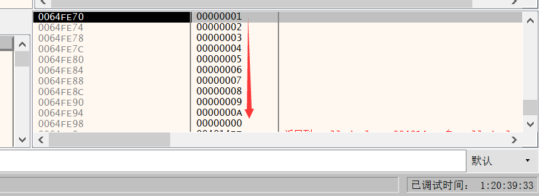

# 调用约定

定义子过程从调用处接受参数以及返回结果的方法的约定，在常见的许多调用约定中，就是为了解决如下几个问题：

- 参数和返回值的位置
- 参数传递的顺序
- 调用前后的栈清理工作

常见的调用约定有

- stdcall
- cdecl
- fastcall
- thiscall
- naked call

## 参数传递

### 32-bit

#### Windows

#### linux

无论是Windows还是linux，在32位程序下都是使用的 **栈** 来传递，先将参数push到栈，然后将返回地址push进去，然后jmp到函数地址。

### 64-bit

#### Windows

默认是使用fastcall的调用约定，前4个参数使用：

```
rcx, rdx,r8, r9
```

来传递参数，多余的参数放到栈中传递

#### linux

linux下的前六个参数都是使用寄存器来传递，多余的参数放到栈上执行。

```
rdi, rsi, rdx, rcx, r8, r9
```


## stdcall

这是win32 API和WinMain还有CAllBACK函数的默认的调用约定，在C语言中可以使用前缀关键字的方式来规定采用何种调用约定

- 参数**从右向左**压入堆栈
- 函数自身修改堆栈
- 函数的装饰名(decoration name/mangling name)为函数名自动加前导的下划线, 后面紧跟一个@符号, 其后紧跟着参数的尺寸

```c
int __stdcall add(int a, int b, int c, int d, int e, int f, int g, int h, int i, int j, int k)
```

上述函数从栈结构可以清楚的看到



## cdecl

cdecl调用约定又称为C调用约定, 是C语言缺省的调用约定, 它的定义语法是:

1. ```c
   int function(int a, int b) //不加修饰默认就是C调用约定
   int __cdecl function(int a, int b) //明确指定C调用约定
   ```

- 参数**从右向左**压入堆栈
- 函数**的调用者**修改堆栈

## fastcall

这是win64位下的默认调用方式

- 通过rcx、rdx和r8，r9传递, 其他参数通过从右向左的顺序压栈
- 浮点数参数在 XMM0L、XMM1L、XMM2L 和 XMM3L 中传递
- 被调用函数清理堆栈
- 修饰名为函数名前加上一个“@”符号，后面也是一个“@”符号和其参数的字节数

# 断点类型

常见断点类型分为

- 软件断点
- 硬件断点
- 内存断点

## 软件断点

又称为`int3`断点，这种实现方式就是将当前的指令修改成`0xcc`，程序运行到这里会触发异常，调试器捕获到这个异常，实现断点的功能

### 缺点

上述断点会修改程序的内存，如果程序本身有完整性检查的话就会出问题。病毒程序经常检测程序在内存中运行的代码的 CRC 值是否相同。如果不同，说明数据被修改，则自动杀掉自己。

## 硬件断点

### 缺点

只能设置4个，而且需要内存对其（1，2，4，8）字节的断点类型，都需要对其（1字节的不需要）。

### 使用

一个CPU一般有8个调试寄存器（DR0 ~ DR7 寄存器），用于管理硬件断点

- DR0 ~DR3： 存储硬件断点地址。
- DR4 和 DR5： 保留。
- DR6：调试状态寄存器，用于向调试器报告事件的详细信息，以供调试器判断发生的是何种事件。
- DR7：调试控制寄存器，用于定义断点的中断条件。

软件断点是int3断点，硬件断点是int1断点。

- 在 CPU 每次执行代码之前，都会先确认当前将执行的代码的地址是否是硬件断点的地址，同时也要确认是否有代码要访问被设置了硬件断点的内存区域。

上述俩断点都只能在有限的区域内下断点，不能大面积下断点。在脱壳的时候会用到硬件断点。

### gdb

在gdb中可以使用命令

```
hbreak
```

下一个硬件断点

## 内存断点

### 原理

将下断地址所在的内存页增加一个名为`PAGE_NOACCESS`的属性，这个属性会把当前内存页设为禁止任何形式的访问，如果进行访问会触发一个内存访问异常。在这同时，调试器捕获目标程序中的这个异常，并判断触发这个异常的位置是否跟你下断的地址相同，如果相同则内存断点触发，暂停被调试程序的运行，否则放行。

- 虽然内存断点的效率经常很不理想，但是因为仅仅是修改了一个内存属性，所以内存断点可以下数量非常多、单断点范围非常大。这是它的优势。
- 只在写入时断下的内存断点通常是将内存属性设为`PAGE_EXECUTE_READ`，也就是**不可写**来实现的。对这种属性的内存进行写操作将会触发异常。
  

### 优点

可以大范围的下断点，在脱壳的时候常用。

### 本质

他并不是修改某一个特定的指令，而是改变了内存中某个块或者页的权限。

- 一个内存页是操作系统处理的最小的内存单位。一个内存页被申请成功以后，就拥有了一个**权限集**，它决定了内存该如何被访问。
  - 可执行页：允许执行但不允许读或写，否则抛出访问异常。
  - 可读页：只允许从页面中读取数据，其余的则抛出访问异常。
  - 可写页：允许将数据写入页面。

一般来说可执行的页不会具有写权限。