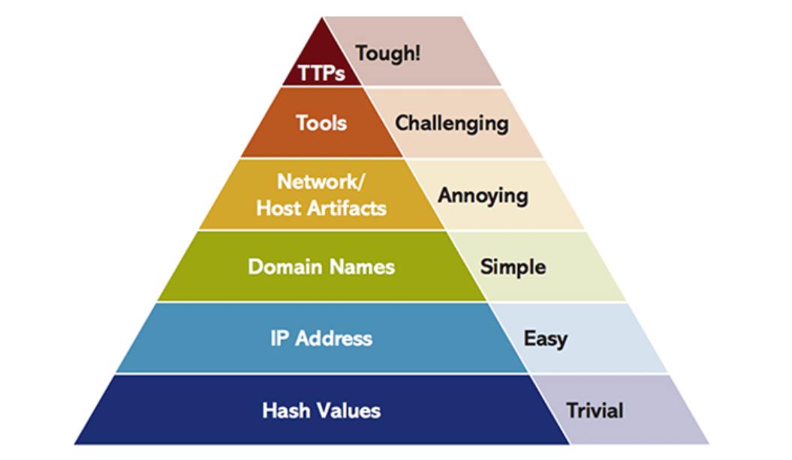
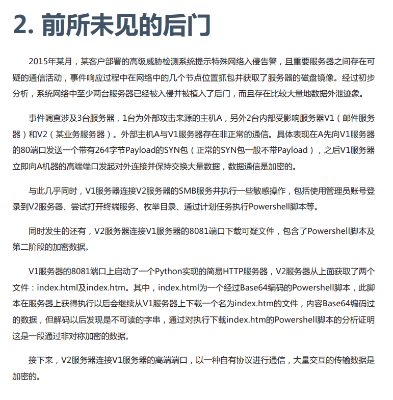

痛苦金字塔简单，主要是学习如何学习一篇一次攻击的分析报告。利用一个中长篇的分析报告来学习

[Bvp47-美国NSA方程式组织的顶级后门](https://www.pangulab.cn/post/the_bvp47_a_top-tier_backdoor_of_us_nsa_equation_group/)

从报告中各取所需

# 报告分析

## 1、分类

首先根据目录和简介对报告进行按照内容进行分类。

分类之后根据所分的类进行归纳总结。

### 事件层面

统述了事情发展的开始-中间-结束。主要的目标是这个事件

- 谁是攻击者
- 为什么攻击（目标、目的）
- 是如何发现并归因的（可能不公开）

结合到痛苦金字塔，这些内容是基于IOC信息上抽象总结出来的，在金字塔顶。

因为水平较高，所以在报告中并不是总能看见他，碰运气。

### 技术层面

主要针对的是事件中的主要样本，相当于ctf里的wp

- 样本是什么
- 样本用什么技术实现了什么目的
- 样本技术中有没有新颖的地方

## 2、威胁情报

以 前所未见的后门 为例；

读完之后需要构建大体的流程图或者框架图。

上述流程过于概况，一般的攻击流程基本大差不差，根据内容继续精进细节

>  威胁情报应该具备这样的特质：**具体**且**独特**

## 3、情报处理

从报告中将ioc提取出来，方便聚类分析，需要注意两个问题

- 是否有效（易变？个性化？）
- 能否提取（太抽象）

#### 样本hash

每个hash对应一个样本，可信度很高，放心提取。

#### 私钥

一般各个程序中的私钥不会相同，因为私钥的位数太多，如果私钥一样考虑是否为恶意模仿或者同组织或者下属机构……。可以提取，置信度高，不会轻易变化。

#### 标识码

可能某些特殊的样本会存在标识码，可以提取当作ioc，但是因为少见和格式多样，不会一起列出

#### IP、Domain

这个时效性特别强，需要进行研判。作为一个重要的标志，准确性并不是特别高，尤其是上古样本

#### 文件列表

如果非常特殊且具有明显特色，可以作为特征，但是如果%temp%之类的常见目录就直接忽略即可

#### 函数处理技巧

有效。包括样本流程、整个文件结构、样本处理手法等等。虽然他们非常抽象，但很多信息都可以从这些抽象的内容中获取。像字段结构、环境校验方法等。可以对照着报告和样本来研判一下。

## 4、对应到金字塔

当填充完金字塔之后，就算是情报完整了。

## 5、注意的是

不是所有的情报都是有效的情报， 不是所有有效情报都可以被格式化提取的。

可以被批量提取的IOC们都会有一些特征，更方便于情报分析人员进行大批量、格式化的处理。

常见的IOC类型包括：IP、域名、哈希 等。

## 6、工程化流程

### 提取ioc工具

- [ioc_parser](https://github.com/armbues/ioc_parser)：Github 的开源项目，通过正则将常见的IOC类型从报告中提取出来。
- [yeti](https://github.com/yeti-platform/yeti)：开源的威胁情报平台，内部集成了一个非常友好的报告解析系统，但平台代码本身依然存在一些小小的问题，使用时候的流畅性无法保证。

### ioc来源

- [Alien Vault][https://otx.alienvault.com/]
  开放的威胁情报社区，有很多人将不同的国家不同地区的报告整理成一个个 pulse。可以根据报告搜索，也可以根据IOC进行搜索。
- [Covert.io][http://www.covert.io/threat-intelligence/]
  很多安全厂商会在发布自己报告的同时发布一份IOC列表，或者由他人二次加工后形成一个IOC库，我们通常将这种定期维护的IOC库称为Feed。有人会将各种Feed地址整理，做数据的二次集成，比方说下面的链接。
- twitter：这个也是很常用的一个情报来源，可以获得分享的情报，还有其他有意思的东西。

# 参考

- https://0x666.club/pyramidofpain2/
- https://0x666.club/pyramidofpain1/
- https://www.pangulab.cn/post/the_bvp47_a_top-tier_backdoor_of_us_nsa_equation_group/

