参考：《逆向工程核心原理》；chatgpt（一般都是胡扯的内容）,用gcc编译的程序怎么在Windows上安装gcc呢

直接安装https://github.com/Embarcadero/Dev-Cpp/releases/tag/v6.3 DEV-c++，然后在安装目录中就可以找到gcc的编译程序啦

# TEB

```c
  typedef struct _TEB {
    BYTE Reserved1[1952];
    PVOID Reserved2[412];
    PVOID TlsSlots[64];
    BYTE Reserved3[8];
    PVOID Reserved4[26];
    PVOID ReservedForOle;
    PVOID Reserved5[4];
    PVOID TlsExpansionSlots;
  } TEB;
```

thread Environment Block 线程环境块，这是一个结构体，包含了进程**运行线程的各种信息**，一个进程中的每一个线程都包括一个TEB结构体，在winternl.h中可以找到结构体的描述。给出的TEB的定义相当的简单啊，要是真这么简单就行了，通过windbg查看结构体的组成成员

## windbg查看

用计算器的进程来查看，首先attach上calc进程，然后输入`!teb`查看teb结构体的地址，然后定位到TEB，查看到详细信息

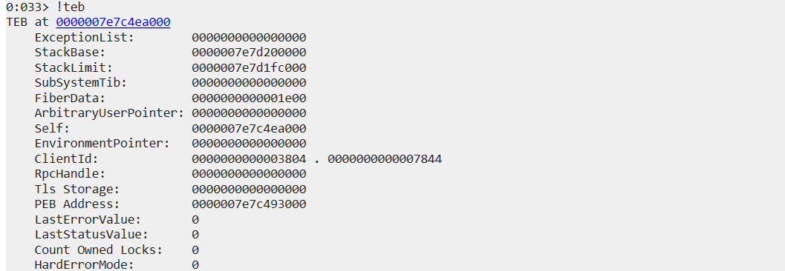

```
0:033> dt 0x0000007e7c4ea000 ntdll!_TEB
   +0x000 NtTib            : _NT_TIB
   +0x038 EnvironmentPointer : (null) 
   +0x040 ClientId         : _CLIENT_ID
   +0x050 ActiveRpcHandle  : (null) 
   +0x058 ThreadLocalStoragePointer : (null) 
   +0x060 ProcessEnvironmentBlock : 0x0000007e`7c493000 _PEB
   +0x068 LastErrorValue   : 0
   +0x06c CountOfOwnedCriticalSections : 0
   +0x070 CsrClientThread  : (null) 
   +0x078 Win32ThreadInfo  : (null) 
   +0x080 User32Reserved   : [26] 0
   +0x0e8 UserReserved     : [5] 0
   +0x100 WOW32Reserved    : (null) 
   +0x108 CurrentLocale    : 0x804
   +0x10c FpSoftwareStatusRegister : 0
   +0x110 ReservedForDebuggerInstrumentation : [16] (null) 
   +0x190 SystemReserved1  : [30] (null) 
   +0x280 PlaceholderCompatibilityMode : 0 ''
   +0x281 PlaceholderHydrationAlwaysExplicit : 0 ''
   +0x282 PlaceholderReserved : [10]  ""
   +0x28c ProxiedProcessId : 0
   +0x290 _ActivationStack : _ACTIVATION_CONTEXT_STACK
   +0x2b8 WorkingOnBehalfTicket : [8]  ""
   +0x2c0 ExceptionCode    : 0n0
   +0x2c4 Padding0         : [4]  ""
   +0x2c8 ActivationContextStackPointer : 0x0000007e`7c4ea290 _ACTIVATION_CONTEXT_STACK
   +0x2d0 InstrumentationCallbackSp : 0
   +0x2d8 InstrumentationCallbackPreviousPc : 0
   +0x2e0 InstrumentationCallbackPreviousSp : 0
   +0x2e8 TxFsContext      : 0xfffe
   +0x2ec InstrumentationCallbackDisabled : 0 ''
   +0x2ed UnalignedLoadStoreExceptions : 0 ''
   +0x2ee Padding1         : [2]  ""
   +0x2f0 GdiTebBatch      : _GDI_TEB_BATCH
   +0x7d8 RealClientId     : _CLIENT_ID
   +0x7e8 GdiCachedProcessHandle : (null) 
   +0x7f0 GdiClientPID     : 0
   +0x7f4 GdiClientTID     : 0
   +0x7f8 GdiThreadLocalInfo : (null) 
   +0x800 Win32ClientInfo  : [62] 0
   +0x9f0 glDispatchTable  : [233] (null) 
   +0x1138 glReserved1      : [29] 0
   +0x1220 glReserved2      : (null) 
   +0x1228 glSectionInfo    : (null) 
   +0x1230 glSection        : (null) 
   +0x1238 glTable          : (null) 
   +0x1240 glCurrentRC      : (null) 
   +0x1248 glContext        : (null) 
   +0x1250 LastStatusValue  : 0
   +0x1254 Padding2         : [4]  ""
   +0x1258 StaticUnicodeString : _UNICODE_STRING ""
   +0x1268 StaticUnicodeBuffer : [261]  ""
   +0x1472 Padding3         : [6]  ""
   +0x1478 DeallocationStack : 0x0000007e`7d100000 Void
   +0x1480 TlsSlots         : [64] (null) 
   +0x1680 TlsLinks         : _LIST_ENTRY [ 0x00000000`00000000 - 0x00000000`00000000 ]
   +0x1690 Vdm              : (null) 
   +0x1698 ReservedForNtRpc : (null) 
   +0x16a0 DbgSsReserved    : [2] (null) 
   +0x16b0 HardErrorMode    : 0
   +0x16b4 Padding4         : [4]  ""
   +0x16b8 Instrumentation  : [11] (null) 
   +0x1710 ActivityId       : _GUID {00000000-0000-0000-0000-000000000000}
   +0x1720 SubProcessTag    : (null) 
   +0x1728 PerflibData      : (null) 
   +0x1730 EtwTraceData     : (null) 
   +0x1738 WinSockData      : (null) 
   +0x1740 GdiBatchCount    : 0
   +0x1744 CurrentIdealProcessor : _PROCESSOR_NUMBER
   +0x1744 IdealProcessorValue : 0x1010000
   +0x1744 ReservedPad0     : 0 ''
   +0x1745 ReservedPad1     : 0 ''
   +0x1746 ReservedPad2     : 0x1 ''
   +0x1747 IdealProcessor   : 0x1 ''
   +0x1748 GuaranteedStackBytes : 0
   +0x174c Padding5         : [4]  ""
   +0x1750 ReservedForPerf  : (null) 
   +0x1758 ReservedForOle   : (null) 
   +0x1760 WaitingOnLoaderLock : 0
   +0x1764 Padding6         : [4]  ""
   +0x1768 SavedPriorityState : (null) 
   +0x1770 ReservedForCodeCoverage : 0
   +0x1778 ThreadPoolData   : (null) 
   +0x1780 TlsExpansionSlots : (null) 
   +0x1788 DeallocationBStore : (null) 
   +0x1790 BStoreLimit      : (null) 
   +0x1798 MuiGeneration    : 0
   +0x179c IsImpersonating  : 0
   +0x17a0 NlsCache         : (null) 
   +0x17a8 pShimData        : (null) 
   +0x17b0 HeapData         : 0
   +0x17b4 Padding7         : [4]  ""
   +0x17b8 CurrentTransactionHandle : (null) 
   +0x17c0 ActiveFrame      : (null) 
   +0x17c8 FlsData          : (null) 
   +0x17d0 PreferredLanguages : (null) 
   +0x17d8 UserPrefLanguages : (null) 
   +0x17e0 MergedPrefLanguages : (null) 
   +0x17e8 MuiImpersonation : 0
   +0x17ec CrossTebFlags    : 0
   +0x17ec SpareCrossTebBits : 0y0000000000000000 (0)
   +0x17ee SameTebFlags     : 8
   +0x17ee SafeThunkCall    : 0y0
   +0x17ee InDebugPrint     : 0y0
   +0x17ee HasFiberData     : 0y0
   +0x17ee SkipThreadAttach : 0y1
   +0x17ee WerInShipAssertCode : 0y0
   +0x17ee RanProcessInit   : 0y0
   +0x17ee ClonedThread     : 0y0
   +0x17ee SuppressDebugMsg : 0y0
   +0x17ee DisableUserStackWalk : 0y0
   +0x17ee RtlExceptionAttached : 0y0
   +0x17ee InitialThread    : 0y0
   +0x17ee SessionAware     : 0y0
   +0x17ee LoadOwner        : 0y0
   +0x17ee LoaderWorker     : 0y0
   +0x17ee SkipLoaderInit   : 0y0
   +0x17ee SpareSameTebBits : 0y0
   +0x17f0 TxnScopeEnterCallback : (null) 
   +0x17f8 TxnScopeExitCallback : (null) 
   +0x1800 TxnScopeContext  : (null) 
   +0x1808 LockCount        : 0
   +0x180c WowTebOffset     : 0n0
   +0x1810 ResourceRetValue : (null) 
   +0x1818 ReservedForWdf   : (null) 
   +0x1820 ReservedForCrt   : 0
   +0x1828 EffectiveContainerId : _GUID {00000000-0000-0000-0000-000000000000}
```

## 用户模式

在用户模式调试中，两个成员起到重要作用

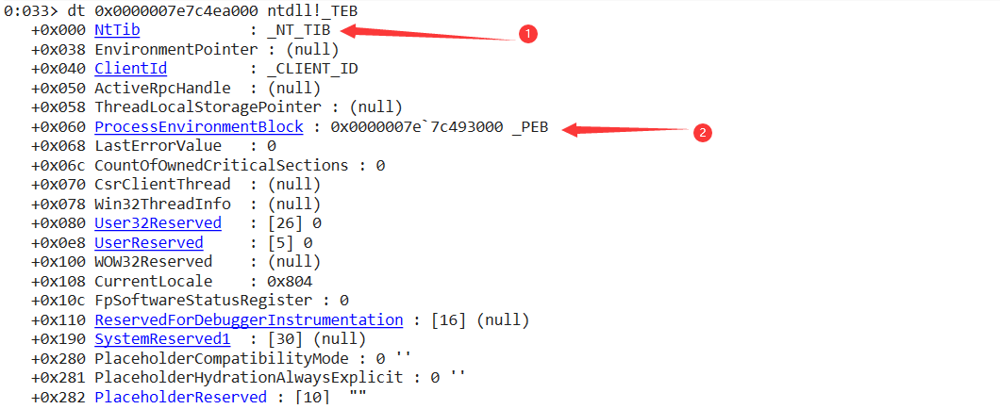

### NT_TIB

TEB结构体的第一个成员，Thread Infomation Block，线程信息块

```c
    typedef struct _NT_TIB {
      struct _EXCEPTION_REGISTRATION_RECORD *ExceptionList;
      PVOID StackBase;		// 线程堆栈顶 
      PVOID StackLimit;		// 线程堆栈底
      PVOID SubSystemTib;
      union {
	PVOID FiberData;
	DWORD Version;
      };
      PVOID ArbitraryUserPointer;
      struct _NT_TIB *Self;		// _NT_TIB结构体的自引用指针
    } NT_TIB;
```

#### ExceptionList

指向一个链表，由` _EXCEPTION_REGISTRATION_RECORD`结构体组成的链表。这个链表用于Windows的SEH

### ProcessEnvironmentBlock

指向PEB结构体

## TEB的访问

在用户模式通过特定的API进行访问

### Ntdll.NtCurrentTeb

返回当前线程的TEB结构体的地址，但是我在win10中的calc进程中没有找到这个函数，在win7也没有找到这个函数，用的是x64dbg。

但是通过ollydbg就可以找到这个函数，这是为什么呢？

我懂了，只有32位的程序才会用到这个函数，64位的程序不会，这是为什么呢？

chatgpt说64位的程序使用`__readgsqword`函数

```c
#include <intrin.h>

void *GetCurrentTeb()
{
    void *teb;
    __readgsqword((unsigned long long*)&teb);
    return teb;
}
```

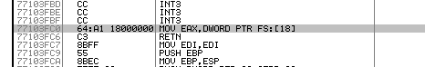

这个函数的作用就是访问并返回FS寄存器的0x18的位置。

这个地址存放的内容是当前线程TEB的地址，而且等于FS段寄存器所指的段内存的基址

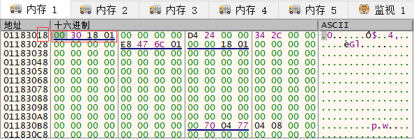

## FS寄存器

FS寄存器用来借助SDT索引指示当前线程的TEB结构体（32位操作系统4G虚拟内存，但是这个寄存器只有16位，所以要借助SDT索引）

SDT：位于内核内存区域，其地址存储在寄存器GDTR寄存器中，这个区域有实际的TEB地址。

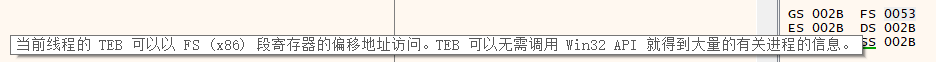

这是x64dbg给的解释，但是不知道怎么查看FS寄存器😅。

用命令`disasm fs:[0]`命令来查看FS寄存器，也可以用带的计算器查看

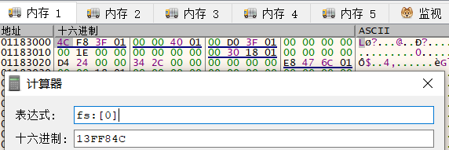

根据《逆向工程核心原理》给出的流程图

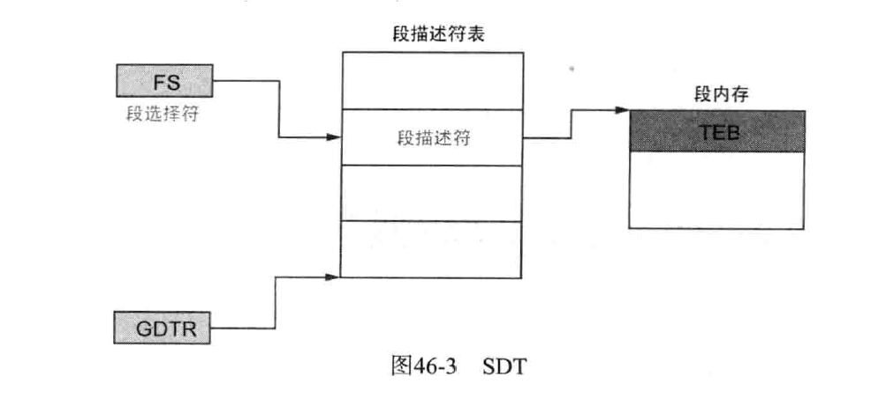

- 段选择符：因为FS寄存器中实际存储的是SDT的索引，所以称为段选择符（Segment Selector）

  - FS:[18] = TEB的起始地址，还是计算器好用

    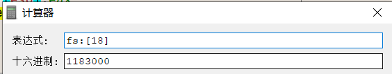

  - FS:[30] = PEB的起始地址

    


借用《逆向工程核心原理》的等式

FS:[18] = TEB.NtTib.Self = TIB的地址 = TEB的地址

FS:[0] = TEB.NtTib.ExceptionList = SEH的地址 

> SEH是Windows的结构化异常处理机制

# PEB

```c
  typedef struct _PEB {
    BYTE Reserved1[2];
    BYTE BeingDebugged;
    BYTE Reserved2[1];
    PVOID Reserved3[2];
    PPEB_LDR_DATA Ldr;
    PRTL_USER_PROCESS_PARAMETERS ProcessParameters;
    BYTE Reserved4[104];
    PVOID Reserved5[52];
    PPS_POST_PROCESS_INIT_ROUTINE PostProcessInitRoutine;
    BYTE Reserved6[128];
    PVOID Reserved7[1];
    ULONG SessionId;
  } PEB,*PPEB;
```

进程环境块（process environment block），每个进程都对应一个PEB

PEB内容很多，这里就记录几个书上写的吧。

## PEB.BeingDebugger

函数原型：

```cpp
BOOL IsDebuggerPresent();
```

这个 api函数在kernel32.dll中，用于判断当前进程是否处于调试状态，通过检测`PEB.BeingDebugger`成员来检测是否在调试进程，是返回1。

### 原理

通过调试这个函数，发现他的定义在kernelbase.dll中，这是因为Windows的版本问题

下图是64位的程序：

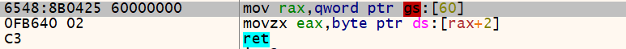

这是32位的程序

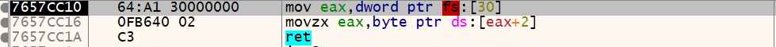

## PEB.ImageBaseAddress

表示进程的ImageBase，一般用GetModuleHandle()函数来获取imagebase，返回值就是加载的基址。其实就是把PEB.BeingDebugger的内容放在eax寄存器中

## PEB.Ldr

通过该成员可以直接获得该模块加载的基地址，但是我对他不感兴趣，但是他也可以应用于反调试技术。

根据书上说的，在进程被调试的时候，未使用的堆内存中全部填充着0xFEEEFEEE，证明正在被调试

【只在XP系统中有，Vista之后的系统没有这种标志】所以就无所谓了，要绕过就直接把内存都改成null就行了。

而且附加调试的进程不会存在这个情况，反正挺鸡肋的东西

## PEB.ProcessHeap 和 NtGlobalFlag

这俩应用于反调试技术

### PEB.ProcessHeap 

指向HEAP结构体的指针

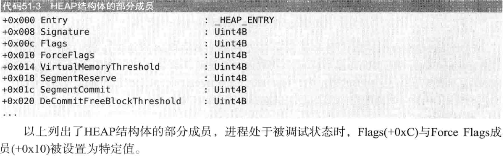

#### API查看

通过GetProcessHeap()这个api查看，这个api实现的思路和IsDebuggerPresent差不多

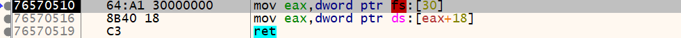

也是通过FS寄存器去定位。在正常职系那个的时候，Heap.Flags的值是2，Heap.ForceFlags的值是0。

反正patch的时候直接改回来就行。【这个东西仅限于winXP，win7就已经没了，而且附加的调试进程也不会】

### NtGlobalFlag

这玩意意义也不大了，现在都win10，win11了

# Windows系统异常

Structured Exception Handling：结构化 异常 处理机制；总是应用于基本的异常处理和反调试，反正学PEB和TEB，一起记录一下，

在C/C++的程序中，通过使用\__try、\_\_except和__finally关键字来实现

```c
#include <windows.h>
#include <stdio.h>

int main()
{
    __try
    {
        // 代码块，可能会抛出异常
    }
    __except(EXCEPTION_EXECUTE_HANDLER)
    {
        // 处理异常的代码
    }

    return 0;
}
```

## 注意

和c/c++中的try， catch异常处理是不同的，trycatch这个是C++语言的标准机制。SEH是Windows的机制

SEH仅在Windows平台上可用，而try catch可在多种平台上使用。

## 异常

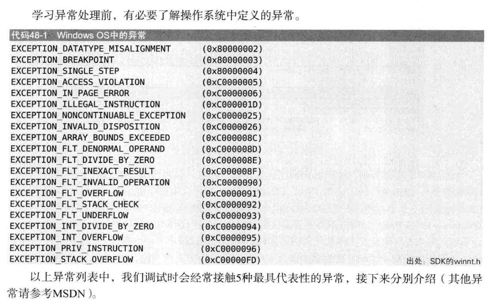

但是我没有找到这个winnt.h这个文件中没有这些内容啊好奇怪啊，找到了，就是定义不同罢了

```c
#define STATUS_WAIT_0                           ((DWORD   )0x00000000L) 
#define STATUS_ABANDONED_WAIT_0          ((DWORD   )0x00000080L)    
#define STATUS_USER_APC                  ((DWORD   )0x000000C0L)    
#define STATUS_TIMEOUT                   ((DWORD   )0x00000102L)    
#define STATUS_PENDING                   ((DWORD   )0x00000103L)    
#define DBG_EXCEPTION_HANDLED            ((DWORD   )0x00010001L)    
#define DBG_CONTINUE                     ((DWORD   )0x00010002L)    
#define STATUS_SEGMENT_NOTIFICATION      ((DWORD   )0x40000005L)    
#define STATUS_FATAL_APP_EXIT            ((DWORD   )0x40000015L)    
#define DBG_REPLY_LATER                  ((DWORD   )0x40010001L)    
#define DBG_TERMINATE_THREAD             ((DWORD   )0x40010003L)    
#define DBG_TERMINATE_PROCESS            ((DWORD   )0x40010004L)    
#define DBG_CONTROL_C                    ((DWORD   )0x40010005L)    
#define DBG_PRINTEXCEPTION_C             ((DWORD   )0x40010006L)    
#define DBG_RIPEXCEPTION                 ((DWORD   )0x40010007L)    
#define DBG_CONTROL_BREAK                ((DWORD   )0x40010008L)    
#define DBG_COMMAND_EXCEPTION            ((DWORD   )0x40010009L)    
#define DBG_PRINTEXCEPTION_WIDE_C        ((DWORD   )0x4001000AL)    
#define STATUS_GUARD_PAGE_VIOLATION      ((DWORD   )0x80000001L)    
#define STATUS_DATATYPE_MISALIGNMENT     ((DWORD   )0x80000002L)    
#define STATUS_BREAKPOINT                ((DWORD   )0x80000003L)    
#define STATUS_SINGLE_STEP               ((DWORD   )0x80000004L)    
#define STATUS_LONGJUMP                  ((DWORD   )0x80000026L)    
#define STATUS_UNWIND_CONSOLIDATE        ((DWORD   )0x80000029L)    
#define DBG_EXCEPTION_NOT_HANDLED        ((DWORD   )0x80010001L)    
#define STATUS_ACCESS_VIOLATION          ((DWORD   )0xC0000005L)    
#define STATUS_IN_PAGE_ERROR             ((DWORD   )0xC0000006L)    
#define STATUS_INVALID_HANDLE            ((DWORD   )0xC0000008L)    
#define STATUS_INVALID_PARAMETER         ((DWORD   )0xC000000DL)    
#define STATUS_NO_MEMORY                 ((DWORD   )0xC0000017L)    
#define STATUS_ILLEGAL_INSTRUCTION       ((DWORD   )0xC000001DL)    
#define STATUS_NONCONTINUABLE_EXCEPTION  ((DWORD   )0xC0000025L)    
#define STATUS_INVALID_DISPOSITION       ((DWORD   )0xC0000026L)    
#define STATUS_ARRAY_BOUNDS_EXCEEDED     ((DWORD   )0xC000008CL)    
#define STATUS_FLOAT_DENORMAL_OPERAND    ((DWORD   )0xC000008DL)    
#define STATUS_FLOAT_DIVIDE_BY_ZERO      ((DWORD   )0xC000008EL)    
#define STATUS_FLOAT_INEXACT_RESULT      ((DWORD   )0xC000008FL)    
#define STATUS_FLOAT_INVALID_OPERATION   ((DWORD   )0xC0000090L)    
#define STATUS_FLOAT_OVERFLOW            ((DWORD   )0xC0000091L)    
#define STATUS_FLOAT_STACK_CHECK         ((DWORD   )0xC0000092L)    
#define STATUS_FLOAT_UNDERFLOW           ((DWORD   )0xC0000093L)    
#define STATUS_INTEGER_DIVIDE_BY_ZERO    ((DWORD   )0xC0000094L)    
#define STATUS_INTEGER_OVERFLOW          ((DWORD   )0xC0000095L)    
#define STATUS_PRIVILEGED_INSTRUCTION    ((DWORD   )0xC0000096L)    
#define STATUS_STACK_OVERFLOW            ((DWORD   )0xC00000FDL)    
#define STATUS_DLL_NOT_FOUND             ((DWORD   )0xC0000135L)    
#define STATUS_ORDINAL_NOT_FOUND         ((DWORD   )0xC0000138L)    
#define STATUS_ENTRYPOINT_NOT_FOUND      ((DWORD   )0xC0000139L)    
#define STATUS_CONTROL_C_EXIT            ((DWORD   )0xC000013AL)    
#define STATUS_DLL_INIT_FAILED           ((DWORD   )0xC0000142L)    
#define STATUS_CONTROL_STACK_VIOLATION   ((DWORD   )0xC00001B2L)    
#define STATUS_FLOAT_MULTIPLE_FAULTS     ((DWORD   )0xC00002B4L)    
#define STATUS_FLOAT_MULTIPLE_TRAPS      ((DWORD   )0xC00002B5L)    
#define STATUS_REG_NAT_CONSUMPTION       ((DWORD   )0xC00002C9L)    
#define STATUS_HEAP_CORRUPTION           ((DWORD   )0xC0000374L)    
#define STATUS_STACK_BUFFER_OVERRUN      ((DWORD   )0xC0000409L)    
#define STATUS_INVALID_CRUNTIME_PARAMETER ((DWORD   )0xC0000417L)    
#define STATUS_ASSERTION_FAILURE         ((DWORD   )0xC0000420L)    
#define STATUS_ENCLAVE_VIOLATION         ((DWORD   )0xC00004A2L)    
#define STATUS_INTERRUPTED               ((DWORD   )0xC0000515L)    
#define STATUS_THREAD_NOT_RUNNING        ((DWORD   )0xC0000516L)    
#define STATUS_ALREADY_REGISTERED        ((DWORD   )0xC0000718L)    
```

这里书上就写了5个常见的异常，我也就学5个吧。

### EXCEPTION__ACCESS_VIOLATION

0xC0000005L

这个异常，确实最常见，当时就是在执行汇编指令`mov eax, dword ptr fs:[30]`的时候，或者是upx脱壳之后的问题。

在上述文件中记录的是这个错误：STATUS_ACCESS_VIOLATION

就是试图访问没有权限的内存，或者是不存在的内存，非法的内存访问

### EXCEPTION_BREAKPOINT

0x80000003L

记录的是这个STATUS_BREAKPOINT，这个非常常见，CPU执行到设置断点的位置的时候，就会发生这个异常，调试器的下断点的功能就是通过这个异常实现的《逆向工程核心原理》是这么说的啊。

通过下int3的断点（将该内存的指令改成了0xcc，但是调试器为了效率和可读性，并不显示）这里试验一下书上的办法

#### 测试

一个exe文件

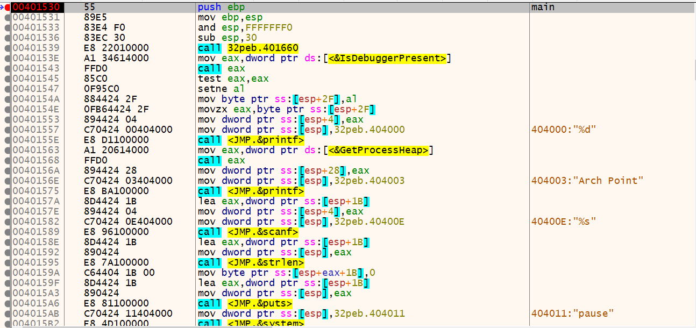

我现在把他dump出来，没有啥工具，直接用任务管理器把他dump出来

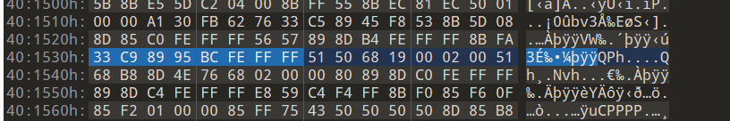

看到对应的地址，内存中的数值已经发生了改变，测试成功。

成功个p，这压根就不是那个内存，通过排查发现，并没有找到目标代码。确实找不到。

### STATUS_ILLEGAL_INSTRUCTION

0xC000001D

遇到非法指令就会触发这个异常，比如执行到cpu不认识的指令

### STATUS_INTEGER_DIVIDE_BY_ZERO

0xC0000094

分母为零就会触发这个异常，这个我觉得有意思可以实验一下

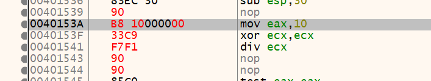

三行小代码，尝试一下触发异常

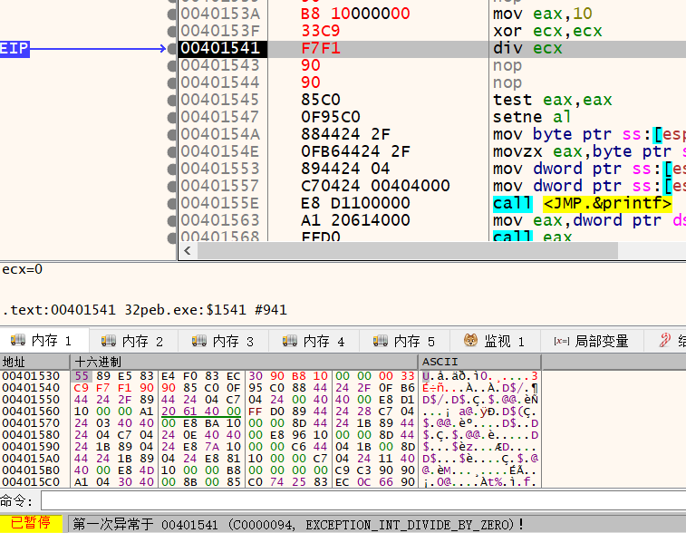

成功触发异常啊，调试器已经卡死了，这个地方就可以作为一个shellcode的触发点，这个视频里也讲过https://www.bilibili.com/video/BV1uY4y1q76L/?spm_id_from=333.880.my_history.page.click

### STATUS_SINGLE_STEP

0x80000004L

单步：SINGLE_STEP。执行一条指令然后暂停，cpu进入单步模式，每执行一条指令就触发这个异常，暂停运行。

将TF寄存器设置成1可以做到。

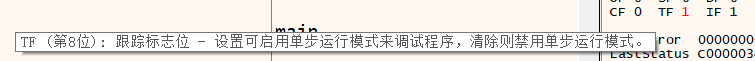

## SEH链

SEH(Structured Exception Handling)以链的形式存在【由_EXCEPTION_REGISTRATION_RECORD结构体组成的链表】。第一个异常处理器中如果没有处理响应的异常，就按次序传递给下一个异常处理器，一个一个往下走，直到得到处理。

给出的定义是

```c
typedef struct _EXCEPTION_REGISTRATION_RECORD
{
    struct _EXCEPTION_REGISTRATION_RECORD *Next;	//指向下一个结构的指针
    PEXCEPTION_ROUTINE Handler;						//当前异常处理函数的地址
}EXCEPTION_REGISTRATION_RECORD;
```

如果Next的值是一串f，那就是到头了。根据《逆向工程核心原理》给出的图，我看还是通用的。

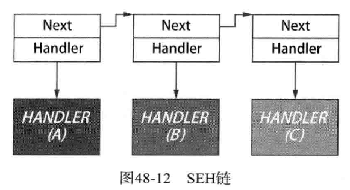

异常触发的时候，异常会按照 ABC的顺序传递，直到被解决

### Handler

异常处理函数（异常处理器）的定义，《逆向工程核心原理》给出了描述

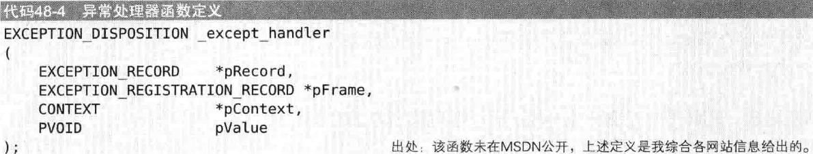

接收四个参数（保存着异常的相关信息），然后返回一个枚举类型，这是由系统调用的，属于是回调函数。

#### 参数1：

指向EXCEPTION_RECORD结构体的指针，

```c
typedef struct _EXCEPTION_RECORD {
  DWORD                    ExceptionCode;	 // 异常代码
  DWORD                    ExceptionFlags;
  struct _EXCEPTION_RECORD *ExceptionRecord;
  PVOID                    ExceptionAddress;	// 异常发生的地址
  DWORD                    NumberParameters;
  ULONG_PTR                ExceptionInformation[EXCEPTION_MAXIMUM_PARAMETERS];
} EXCEPTION_RECORD;
```

#### 参数3：

指向CONTEXT结构体的指针，这个结构体用来在多线程情况下备份CPU结构体的值。

```c
typedef struct _CONTEXT {
  DWORD64 P1Home;
  DWORD64 P2Home;
  DWORD64 P3Home;
  DWORD64 P4Home;
  DWORD64 P5Home;
  DWORD64 P6Home;
  DWORD   ContextFlags;
  DWORD   MxCsr;
  WORD    SegCs;
  WORD    SegDs;
  WORD    SegEs;
  WORD    SegFs;
  WORD    SegGs;
  WORD    SegSs;
  DWORD   EFlags;
  DWORD64 Dr0;
  DWORD64 Dr1;
  DWORD64 Dr2;
  DWORD64 Dr3;
  DWORD64 Dr6;
  DWORD64 Dr7;
  DWORD64 Rax;
  DWORD64 Rcx;
  DWORD64 Rdx;
  DWORD64 Rbx;
  DWORD64 Rsp;
  DWORD64 Rbp;
  DWORD64 Rsi;
  DWORD64 Rdi;
  DWORD64 R8;
  DWORD64 R9;
  DWORD64 R10;
  DWORD64 R11;
  DWORD64 R12;
  DWORD64 R13;
  DWORD64 R14;
  DWORD64 R15;
  DWORD64 Rip;
  union {
    XMM_SAVE_AREA32 FltSave;
    NEON128         Q[16];
    ULONGLONG       D[32];
    struct {
      M128A Header[2];
      M128A Legacy[8];
      M128A Xmm0;
      M128A Xmm1;
      M128A Xmm2;
      M128A Xmm3;
      M128A Xmm4;
      M128A Xmm5;
      M128A Xmm6;
      M128A Xmm7;
      M128A Xmm8;
      M128A Xmm9;
      M128A Xmm10;
      M128A Xmm11;
      M128A Xmm12;
      M128A Xmm13;
      M128A Xmm14;
      M128A Xmm15;
    } DUMMYSTRUCTNAME;
    DWORD           S[32];
  } DUMMYUNIONNAME;
  M128A   VectorRegister[26];
  DWORD64 VectorControl;
  DWORD64 DebugControl;
  DWORD64 LastBranchToRip;
  DWORD64 LastBranchFromRip;
  DWORD64 LastExceptionToRip;
  DWORD64 LastExceptionFromRip;
} CONTEXT, *PCONTEXT;
```

每一个线程内部都独立拥有这样一个结构体，当CPU取执行其他线程的时候，当前的值就会存储在这个结构体中，当cpu再回来运行的时候 ，这个结构体就将cpu重新赋值，这里也是线程劫持注入法的一个基本原理。

**当异常发生时，此时的系统会把context结构体转交给异常处理函数的对应的参数。在异常处理函数中，将参数传来的context.eip（rip）的值设置为其他地址，然后返回异常处理函数，这样程序流就被劫持到了新的程序**

#### 返回值：

出处：https://www.nirsoft.net/kernel_struct/vista/EXCEPTION_DISPOSITION.html

```c
typedef enum _EXCEPTION_DISPOSITION
{
         ExceptionContinueExecution = 0,	// 继续执行异常代码
         ExceptionContinueSearch = 1,		// 运行下一个异常处理器
         ExceptionNestedException = 2,
         ExceptionCollidedUnwind = 3
} EXCEPTION_DISPOSITION;
```

### 访问SEH

通过TEB结构体的NtTib成员进行访问。

windbg：

```
> dt _teb
> dt _NT_TIB
```

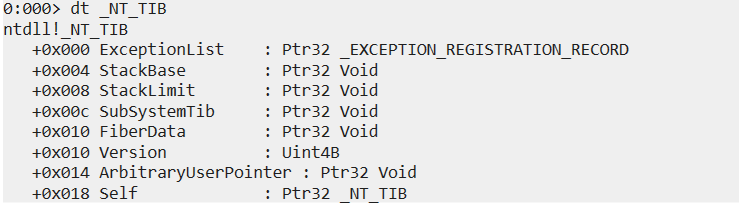

### 安装SEH

C语言中使用`__try`, `__except`,  `__finally`关键字可以直接添加seh，或者直接在汇编中添加。

