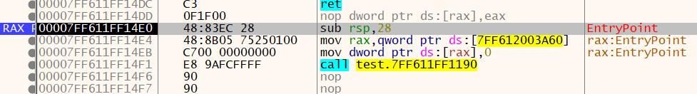

官方文档说明：https://yara.readthedocs.io/en/v3.7.0/index.html

官方的github库地址：https://github.com/VirusTotal/yara/releases

bilibili学习分享：https://www.bilibili.com/video/BV1dt4y12753/

# Yara是什么

YARA is a tool aimed at (but not limited to) helping malware researchers to identify and classify malware samples. With YARA you can create descriptions of malware families (or whatever you want to describe) based on textual or binary patterns. Each description, a.k.a rule, consists of a set of strings and a boolean expression which determine its logic.【https://virustotal.github.io/yara/】

# yara用处

- 样本分类
- 快速筛选
- 过滤文件
- 自定义CTF题目类型
- 完成任务
- 识别漏洞

# 安装

## windows

直接下载之后解压，在path变量里写入路径，可以在终端直接`yara`

## Mac

```shell
brew install yara
```

# 使用

## 命令解释

```shell
> yara --help
YARA 4.2.2, the pattern matching swiss army knife.
Usage: yara [OPTION]... [NAMESPACE:]RULES_FILE... FILE | DIR | PID

Mandatory arguments to long options are mandatory for short options too.

       --atom-quality-table=FILE           path to a file with the atom quality table
  -C,  --compiled-rules                    加载已经编译的规则
  -c,  --count                             显示中标的样本个数
  -d,  --define=VAR=VALUE                  定义外部变量
       --fail-on-warnings                  出现警告时运行失败
  -f,  --fast-scan                         快速匹配模式
  -h,  --help                              显示帮助并退出
  -i,  --identifier=IDENTIFIER             只显示名为IDENTIFIERd
       --max-process-memory-chunk=NUMBER   设置扫描进程的最大值 (default=1073741824)
  -l,  --max-rules=NUMBER                  扫描达到设定值后退出
       --max-strings-per-rule=NUMBER       设定每个进程的最大字符串匹配数(default=10000)
  -x,  --module-data=MODULE=FILE           将FIle的内容作为额外的数据传递给MOUDLE
  -n,  --negate                            只显示不满足的规则 (negate)
  -N,  --no-follow-symlinks                扫描时不跟随符号连接
  -w,  --no-warnings                       禁用警告
  -m,  --print-meta                        打印元数据
  -D,  --print-module-data                 打印模块数据
  -e,  --print-namespace                   显示规则的命名空间
  -S,  --print-stats                       打印规则的统计信息
  -s,  --print-strings                     打印匹配的字符串
  -L,  --print-string-length               打印匹配字符串的长度
  -g,  --print-tags                        打印标签
  -r,  --recursive                         递归扫描目录
       --scan-list                         扫描FILE中列出的文件，每行显示以一个
  -z,  --skip-larger=NUMBER                跳过目录中size大于设置size的文件
  -k,  --stack-size=SLOTS                  设置最大堆栈的大小 (default=16384)
  -t,  --tag=TAG                           只打印标记为tag的规则
  -p,  --threads=NUMBER                    使用指定的线程数扫描目录
  -a,  --timeout=SECONDS                   在达到给定的时间（s）之后跳出扫描
  -v,  --version                           显示yara的当前版本信息

Send bug reports and suggestions to: vmalvarez@virustotal.com.
向 vmalvarez@virustotal.com 发送建议和bug
```

## 一般结构

banker.yara文件：

```
rule silent_banker : banker
{
    meta:
        description = "This is just an example"
        thread_level = 3
        in_the_wild = true
    strings:
        $a = {6A 40 68 00 30 00 00 6A 14 8D 91}
        $b = {8D 4D B0 2B C1 83 C0 27 99 6A 4E 59 F7 F9}
        $c = "UVODFRYSIHLNWPEJXQZAKCBGMT"
    condition:
        $a or $b or $c
}
```

规则一般写在后缀为yara的文件里。利用`yara banker.yara`来执行

第一行：对于该yara规则的说明。指出这是一个banker类型的样本匹配规则

第三行：meta关键字后面跟一些面描述信息。

第七行：strings关键字后：定义了三个变量，利用`{}`的形式写16进制字符串

第十一行：condition关键字后：利用`or`关键字表示如果匹配文件中了其中一个，则算为banker malware。

可以看到：

### 16进制 ==》 {}

#### 通配符

使用`?`作为通配符，可以代表任何内容，大小是一个半个字节。

```
rule WildcardExample
{
    strings:
        $hex_string = { E2 34 ?? C8 A? FB }

    condition:
        $hex_string
}
```

#### 跳转

利用`[n-n+x]`的方式进行跳转，指的是跳过一定数量的字节。如下程序是跳过4-6个字节

```
rule JumpExample
{
    strings:
        $hex_string = { F4 23 [4-6] 62 B4 }

    condition:
        $hex_string
}
```

`[-]`代表无限制跳转，不限制跳转个数

### 字符串 ==》 “str”

> nocase：不区分大小写，适用于字符串
>
> base64：base64字符串
>
> xor：异或字符串
>
> wide：宽字符

#### wide

如果字符串“Borland”显示为编码为每个字符两个字节（即 ），则以下规则将匹配：`B\x00o\x00r\x00l\x00a\x00n\x00d\x00`

```
rule WideCharTextExample1
{
    strings:
        $wide_string = "Borland" wide

    condition:
        $wide_string
}
```

#### xor

搜索应用于字符串“ ”（包括纯文本字符串）的每个字节 XOR形式：

```
rule XorExample5
{
    strings:
        $xor_string = "This program cannot" xor(0x01-0xff)
    condition:
        $xor_string
}
```

这就等效于

```
rule XorExample2
{
    strings:
        $xor_string_00 = "This program cannot"
        $xor_with_1 = "Uihr!qsnfs`l!b`oonu"
        $xor_with_2 = "Vjkq\"rpmepco\"acllmv"
        ……
    condition:
        any of them
}
```

#### base64

```
rule Base64Example1
{
    strings:
        $a = "This program cannot" base64

    condition:
        $a
}
```

支持自定义的base码表

```
rule Base64Example2
{
    strings:
        $a = "This program cannot" base64("!@#$%^&*(){}[].,|ABCDEFGHIJ\x09LMNOPQRSTUVWXYZabcdefghijklmnopqrstu")

    condition:
        $a
}
```

#### 字符串计数

该字符串在文件或进程内存中出现了多少次。每个字符串的出现次数由一个变量表示，该变量的名称是字符串标识符，**但用 # 字符代替 $ 字符**

```
rule CountExample
{
    strings:
        $a = "dummy1"
        $b = "dummy2"

    condition:
        #a == 6 and #b > 10
}
```

从YARA 4.2.0开始，可以在整数范围内表示字符串的计数

```
#a in (filesize-500..filesize) == 2
```

代表了文件最后500字节的数据内必须存在a字符串两次

#### 字符串集

命中多个字符串的其中一个就可以

```yara
rule OfExample1
{
    strings:
        $a = "dummy1"
        $b = "dummy2"
        $c = "dummy3"

    condition:
        2 of ($a,$b,$c)
}
```

文件中必须至少存在集合中的**两个字符串**（$a，$b，$c）。

也可以使用通配符来写：

```
rule OfExample2
{
    strings:
        $foo1 = "foo1"
        $foo2 = "foo2"
        $foo3 = "foo3"

    condition:
        2 of ($foo*)
}

rule OfExample3
{
    strings:
        $foo1 = "foo1"
        $foo2 = "foo2"

        $bar1 = "bar1"
        $bar2 = "bar2"

    condition:
        3 of ($foo*,$bar1,$bar2)
}
```

甚至也可以写成

```
condition:
     1 of them 
```

从YARA 4.2.0开始，可以在整数范围内表示一组字符串，如下所示：

```
all of ($a*) in (filesize-500..filesize)
any of ($a*, $b*) in (1000..2000)
```


## 添加过滤

### size过滤

在从大量的文件中获取样本时，可能需要根据样本的大小特征进行过滤；否则会对每一个文件都进行匹配

```yara
condition:
	filesize > 200KB and filesize < 300KB
```

### 入口点过滤

yara3.0之前可以用`entry_point`来获得程序入口点；yara3.0之后通过`pe.entry_point`变量来获得入口点

注意：入口点的地址需要写offset（File Offset），并不是在ida中看到的entry_point。[这个是自动获取的，不需要预先定义]。

```yara
condition:
	pe.entry_point == 0x990
```

### at取值

同样适用于匹配入口点.

```yara
string:
	$entry = {48 83 EC 28}
condition:
	$entry at pe.entry_point
```

这里利用的是匹配入口点地址对应的数据



## 文件头判断

利用uint16(0) 的方式取文件的前两个字节，可以判断一般文件的文件头。

```yara
condition:
	unit16(0) == 0x4D5A and uint32(uint32(0x3C)) == 0x00004550
```

0x4D5A是一般PE文件的开头 ”MZ“ .

ps: uint16是16位无符号整型，就是两个字节

之上提到的所有condition都可以通过`and`进行连接

### 访问给定位置的数据

使用下列函数之一从给定偏移量的文件读取数据：

```yara
int8(<offset or virtual address>)
int16(<offset or virtual address>)
int32(<offset or virtual address>)

uint8(<offset or virtual address>)
uint16(<offset or virtual address>)
uint32(<offset or virtual address>)

int8be(<offset or virtual address>)
int16be(<offset or virtual address>)
int32be(<offset or virtual address>)

uint8be(<offset or virtual address>)
uint16be(<offset or virtual address>)
uint32be(<offset or virtual address>)
```

函数从<偏移或虚拟地址>读取 8、16 和 32 位有符号整数，而函数读取无符号整数。16 位和 32 位整数都被视为小端序。

## 迭代器

`for..of`

```
for any section in pe.sections : ( section.name == ".text" )
相当于是
for any i in (0..pe.number_of_sections-1) : ( pe.sections[i].name == ".text" )
```

迭代字典时，必须提供两个变量名称，用于保存字典中每个条目的键和值

```
for any k,v in some_dict : ( k == "foo" and v == "bar" )
```

## 规则条件

> and：与  

> or：或 

> not：非

[all of them]：所有条件匹配即告警

[any of them]：有一个条件匹配即告警

[a and b and $c]：abc同时匹配即告警

[(a and b) or $c]：匹配a和b或c即告警

## 引用其他规则

利用规则集的形式引用其他规则

```yara
rule Rule1
{
    strings:
        $a = "dummy1"

    condition:
        $a
}

rule Rule2
{
    strings:
        $a = "dummy2"

    condition:
        $a
}

rule MainRule
{
    strings:
        $a = "dummy2"

    condition:
        any of (Rule*)
}
```


# 演示

## cs启用

一个压缩包包含了服务端和客户端

在服务端用sudo运行`./teamserver 服务器ip 密码`，vps注意提前打开端口

客户端运行start.bat，直接按照刚才的方式连接就行。用户名随意

到这里就可以用了。

打开attack


这里可以生成一个很简单的malware


然后在指定目录生成一个rat。**注意关闭杀毒软件，不然直接杀**

## 提取特征工具

- 010editor：查看文件类型、文件对比、HEX查看
- 调试器：查找特征值
- CFF、PEstudio等pe工具分析PE文件

[一些文件格式的总结](https://github.com/corkami/pics)

# 运用

## 自动化工具

- yargen：是一个自动化提取yara规则的工具，可以提取strings和opcodes特征，其原理是先解析出样本集中的共同的字符串，然后经过白名单库的过滤，最后通过启发式、机器学习等方式筛选出最优的yara规则。[访问地址](https://github.com/Neo23x0/yarGen)

## 更加高效

- 避免创建常见的导入导出表的规则，因为相同编译器的结果基本一样
- 通过文件头之类的文件特征进行初筛
- 设定大小，防止耗尽资源本机蓝屏
- 匹配互斥体、注册表值、PDB路径、硬编码的密钥或者密文、C2地址

