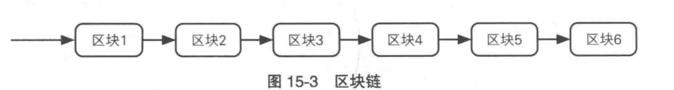

作为一个能直接影响密码学、硬件价格、驱动开发、黑客攻击、经济市场的货币，bitcoin确实是22年之前最火的一种虚拟货币。

# 简介

1、bitcoin一般用来形容比特币本身，当出现Bitcoin的时候，大概率是在谈论比特币的技术形式。

最小的bit币单位是`0.00000001`。

2、比特币本身作为一种去中心化的货币，不存在类似中央银行一样的中心节点，所以银行卡丢失可以补办，但是比特币密钥丢失那就寄了。

3、比特币的去中心化技术依托于P2P网络，这是一种端到端的网络模式，《图解密码技术》将其归结为“基于p2p网络的支付结算系统”，比特币用户通过使用这一结算系统实现了价值转移。

4、比特币交易是在**比特币地址**之间完成的，而且每一次成交的地址一般不同，但是捐赠场景会使用同一个地址。

# 地址生成

讲DSA的公钥输入SHA-256和RIPEDM-160这俩单项散列算法生成散列值，附加一些必要信息，通过base58check进行编码成字符串（不使用0O，Il）。

生成的地址一般是以“1”开头的base编码字符串。

钱包：比特币用户使用的客户端

# 区块链

保存比特币全部交易的公共账本，讲交易以区块为单位进行的存储

作用：记录所有地址的所有交易（A地址-1，B地址+1这种形式），可以在任意一个地址计算出当前所拥有的比特币数量。

## 添加区块

比特币以“交易”为单位进行，若干条交易会组成一个区块，当P2P网络确认区块的添加之后，相应的交易就成立了。

其中头部组成为：

- 上一个区块区块头的hash（H2）
- 本区块所有交易的hash值（T2）
- nonce：一个任意数值
- 一个时间戳

如果一个节点的任意一个数据发生变化，该节点之后的所有数据都需要随之变化。

# 交易

从一个地址向另一个地址支付比特币的行为。

s:商店；c:顾客

- s和c先通过社交或者其他手段确定身份 --->
- 商店s创建 公钥B-密钥b对 并利用B生成地址B·，发给顾客c。
- 顾客c创建 公钥A-密钥a对  并利用A生成地址A· --->
- 顾客c创建交易过程 “A·向B·支付1bitcoin” 并利用a对交易进行签名（DSA算法） --->
- 顾客c将交易发布到P2P网络（向所有的比特币用户广播消息，这需要一定的手续费）。
- 这条交易信息和其他的信息合并到一个区块中，区块添加到区块链中。
- P2P网络确认了区块，这时交易成立。   

# 挖矿

## 挖矿的由来：

1、将新的区块添加到区块链 --相当于--> 创造新的比特币余额 --相当于--> 从bit矿中挖出bitcoin

2、最初，比特币协议规定每个区块奖励为50个比特币，但在减半周期结束后，这个奖励会减半为25个比特币。到2020年，这个奖励已经减半到6.25个比特币。当所有的比特币都被挖出来后，就不再产生新的比特币了。

3、矿工还可以从交易费中获得收入。每当一个比特币交易被广播到网络中时，交易发起人需要支付一定的交易费，这些费用将被添加到区块中，并成为矿工的收入之一。因此，即使区块奖励减少到零，矿工仍然可以通过收取交易费来获得收入。

## 奖励

因为比特币区块链称为单链，所以同一时间只能由一人进行添加，成功添加的人会获得奖励和该区块进行交易的手续费

## PoW

工作量证明（Proof of Work），矿工必须证明自己的工作量以此证明区块不是被伪造的，通过散列值来证明。

添加新的区块首先需要一个合法的区块头，区块头中的“前一个区块的散列值”拥有特定格式，他的前面的若干位必须为0

为了达到这个目的就需要上面提到的那个随机数，矿工需要不断的尝试这个随机数以此达到产生合法散列值的要求。

这就可以用来证明矿工的工作量，计算的难度是由前面0的个数进行控制的。

# P2P的确认

有可能同一时间多个节点计算出了正确的区块，因为p2p网络的局限性，无法得知哪一个区块先到达节点（a区块先到了张三的节点，但是b区块先到达了Mike先生的节点），具体将哪一个添加到区块链中需要p2p网络的确定。

最终选择的是计算量大的分析（假设是正义的矿工的资源大于邪恶矿工的资源）

# 匿名性

这里的匿名并非是绝对匿名，虽然不用每一笔交易都带上自己的电话身份证户口本，但是基于网络的交易会暴露你的ip，同时会暴露本次交易的地址（因为你向公众进行了广播），同时交易信息也是摆在明面上的。

# 安全性（信任）

## 交易安全

- 你给对面钱了之后，对面跑路了，没辙，因为没有中心无法追责
- 虽然没有中心，但是为了减少时间差和方便流通，依旧存在各种交易所，交易所卷钱跑路 --》没辙

## 系统安全

你的钱包被盗了，或者安装了木马性质的软件导致密钥丢失，活该没辙

# 参考

《图解密码技术》

chatgpt

https://www.8btc.com/books/834/masterbitcoin2cn/_book/ch10.html

https://www.blockchain.com/