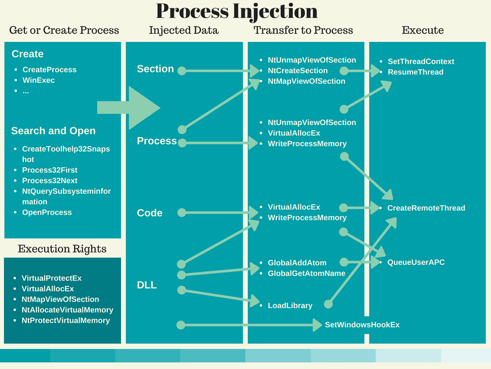
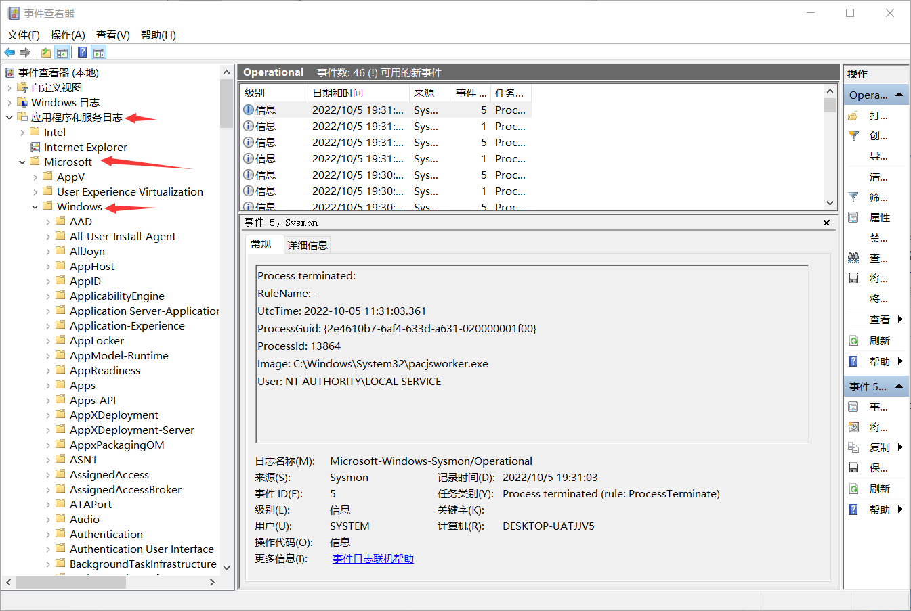
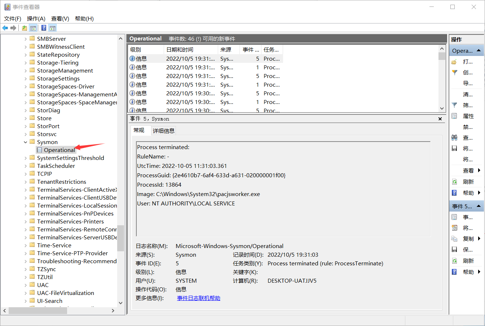
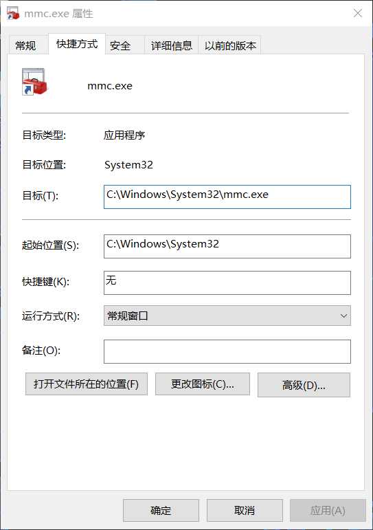
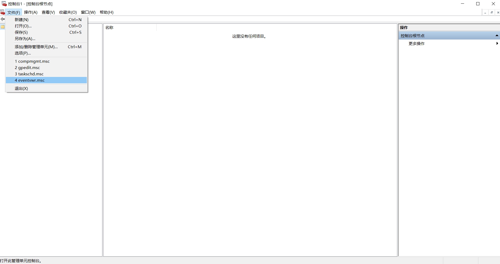

# 进程注入

在进程内存空间中执行任意代码的技术方法。通过一定方法将dll，shellcode等代码数据写入其他进程执行。这里为几个具有实战意义的注入手法。

# 原理

## 大致步骤

- 确定目标进程（新创建的或者打开已有进程）。
- 向目标进程中写入数据。
- 令被写入进程执行我们写入的代码数据。

## 相关api调用



可以注入的东西包括：一个节区，一进程，一段代码（shellcode，PE文件）或者一个dll文件。

# 利用Sysmon

## 介绍

微软中文文档：https://learn.microsoft.com/zh-cn/sysinternals/downloads/sysmon

sysmon：*系统监视器* (*Sysmon*) 是一种 Windows 系统服务和设备驱动程序，一旦安装在系统上，在系统重新启动后仍保持驻留状态，以监视系统活动并将系统活动记录到 Windows 事件日志。 它提供有关进程创建、网络连接和文件创建时间更改的详细信息。 通过收集它使用 [Windows 事件收集](https://msdn.microsoft.com/library/windows/desktop/bb427443(v=vs.85).aspx) 或 [SIEM](https://en.wikipedia.org/wiki/security_information_and_event_management) 代理生成的事件，然后对其进行分析，可以识别恶意活动或异常活动，并了解入侵者和恶意软件在网络上的操作方式。

下载之后解压得到：

```
             LastWriteTime         Length Name

2022/9/29     20:25           7490 Eula.txt
2022/9/29     20:25        8188688 Sysmon.exe
2022/9/29     20:25        4419344 Sysmon64.exe
```

**这里注意给的是安装文件，双击不能运行的**

## sysmon安装

```shell
sysmon64 -i 	#安装
sysmon64 -c [<configfile>]	 	#更新配置
默认配置用：sysmon64 -c --
sysmon64 -u 	#卸载
```

安装32位就不能安装64位了，所以直接安装sysmon64.

## sysmon使用

win+r输入：eventvwr打开事件管理器



下面找到Sysmon里的



这里就可以用了。

方便起见直接在桌面设一个快捷方式：



打开之后就可以使用这各种管理器了



# ShellCode

Windows的shellcode是什么，和linux的pwn里的shellcode一样是一段可执行汇编的字节码形式，一般以`\x00\x11`之类的形式存在，且有特殊目的的代码。一般是可以在目标机器上直接执行的一串机器码。

## 困难

shellcode定义是可以直接执行的，所以编写的时候就需要用汇编直接去写，这是人类不友好的。

还可以从已有程序中直接提取，但是会涉及到地址的问题，尤其是在现代操作系统普遍开启地址随机化之后，这是困难的。

再就是一些字符串并不在text段中，但是shellcode只包括text段的代码，所以说shellcode是有困难的。

通过loadlibrary的方式调用api函数，但是如何获得loadlibrary的地址呢？

## FS寄存器

### 局限性

FS寄存器通常用于指向当前线程的线程本地存储（TLS）段。 TLS段是一段内存，用于存储与特定线程相关的信息。主要针对的就是32位的程序。64位的程序可以使用GS寄存器来替代。

值得注意的是，在高级语言生成的程序中例如python和C#，FS寄存器是不可用的，这是因为他们运行在虚拟机上而不是真实的CPU环境中。代码无法直接访问物理CPU的寄存器。

C#程序可以使用System.Threading命名空间中的ThreadLoca\<T\>类来存储与特定线程相关的信息。这个类提供了一个可以为每个线程存储单独值的机制，而无需使用TLS段。例如

```c#
using System.Threading;

ThreadLocal<int> threadLocalInt = new ThreadLocal<int>();

// 在线程A中设置threadLocalInt的值
threadLocalInt.Value = 42;

// 在线程B中访问threadLocalInt的值
int value = threadLocalInt.Value;

```

值得注意的是，rust语言被认为是一种高级语言，因为它提供了许多方便的高级功能，如泛型、模式匹配、闭包和枚举类型。同时提供了许多低级控制和系统级功能，如直接访问内存和线程、使用底层指针和原生数据类型等。

## 内联汇编

### gcc/clang编译器

以下代码可以将eax的值赋值给变量`LoadLibrary`，但是下面的程序在第五行就会发生异常无法执行，原因是FS寄存器的检索失败导致的。

```c
	int LoadLibrary;
	printf("arch point########");
	
	__asm__(
		  "mov eax, fs:[0x30]\n"
		  "mov eax, [eax+0xc]\n"
		  "mov eax, [eax+0x14]\n"
		  "mov eax, [eax]\n"

		  "mov eax, [eax+0x10]\n"
          "mov %0, eax"				// 通过这种方式利用"=r"的形式将eax的值赋给变量
		  :"=r"(LoadLibrary)
			);
    printf("0x%08X\n", LoadLibrary);
```

不论是gcc还是clang编译器，在编译的时候使用参数`-masm=intel`可以允许intel语体的汇编通过编译。默认at&t语体

### vs

vs在编译的时候会有各种的优化和安全措施，在调试的时候比较困难，所以需要先关一下各种优化和安全检查.

[(5条消息) shellcode编写_天问_Herbert555的博客-CSDN博客_shellcode编写](https://blog.csdn.net/qq_44657899/article/details/124990667?spm=1001.2101.3001.6650.6&utm_medium=distribute.pc_relevant.none-task-blog-2~default~BlogCommendFromBaidu~Rate-6-124990667-blog-12853121.pc_relevant_default&depth_1-utm_source=distribute.pc_relevant.none-task-blog-2~default~BlogCommendFromBaidu~Rate-6-124990667-blog-12853121.pc_relevant_default&utm_relevant_index=7)

主要区别是针对内联汇编的语法格式问题和最后的将值赋值给变量的问题。

## 测试shellcode - 32bit

这是用来被注入的进程

```c
#include<stdio.h>
#include<windows.h>
#include<stdlib.h>

int GetKernel32BaseAddress()
{
	int AddrOfKernel;
	__asm__(
		  "mov eax, fs:[0x30]\n"
		  "mov eax, [eax+0xc]\n"
		  "mov eax, [eax+0x18]\n"
		  "mov eax, [eax]\n"
		  "mov eax, [eax+0x8]\n"
		  :"=r"(AddrOfKernel)
			);
	
	return AddrOfKernel;
}

int main(char argc[], char argv)
{
	char str[128];
//	printf("Current proc id :  %d\n", GetCurrentProcessId());

	// get baseaddress of kernel32.dll
	printf("kernel32.dll : 0x%p",GetKernel32BaseAddress());
	
	// get LoadLibraryA() base address
	printf("loadlibraryA : 0x%p\n", LoadLibraryA);
	
	// get WinExec() base address
	printf("WinExec : 0x%p\n", WinExec);
	
	// get ExitProcess() base address
	printf("ExitProcess() : 0x%p\n", ExitProcess);
	
	printf("hello world\n");
	printf("input something or waiting\n");
	scanf("%s", str);
	puts(str);
	return 0;
}
```

shellcode，调用**winexec和exitprocess函数来弹出计算器**。可以用来注入**32位**的进程，因为地址都是硬编码写死的，所以用的时候要注意注意。

```c
unsigned char shellcode[] = "\x55\x89\xE5\x33\xC0\x50\xB8\x2E\x64\x6C\x6C\x50\xB8\x65\x6C\x33\x32\x50\xB8\x6B\x65\x72\x6E\x50\x8B\xC4\x50\xB8"
							"\xA0\x12\xed\x76"
							"\xFF\xD0\x33\xC0\x50\xB8\x2E\x65\x78\x65\x50\xB8\x63\x61\x6C\x63\x50\x8B\xC4\x6A\x05\x50\xB8"
							"\xF0\xE1\xF0\x76"
							"\xFF\xD0\x33\xC0\x50\xB8"
							"\x80\x59\xed\x76"
							"\xFF\xD0\x90\x90\xC3";
```

## 64-bit shellcode-失败

```
"\x55\x48\x8B\xEC\x90\xC7\x04\x24\x2E\x64\x6C\x6C\xC7\x44\x24\xFC\x65\x6C\x33\x32\xC7\x44\x24\xF8\x6B\x65\x72\x6E\x48\x8B\xCC\x90\x90\x48\xB8\xA0\x8C\xC7\xA7\xFE\x7F\x00\x00\xFF\xD0\xBA\x05\x00\x00\x00\xC7\x04\x24\x65\x78\x65\x2E\xC7\x44\x24\xFC\x63\x6C\x61\x63\xC7\x44\x24\xF8\x00\x00\x00\x00\x48\x8B\xCC\x90\x48\xB8\xD0\x77\x41\xA8\xFE\x7F\x00\x00\x90\x90\x90\xC3"
```

## donut

将exe转换为shellcode的一个工具([GitHub - TheWover/donut：生成 x86、x64 或 AMD64+x86 与位置无关的外壳代码，从内存加载 .NET 程序集、PE 文件和其他 Windows 有效负载，并使用参数运行它们](https://github.com/TheWover/donut))

# Nt和Rt开头的api

- 以 Nt 开头的函数是 Windows NT 内核提供的 Native API，是系统内部使用的函数。

- 以 Rt 开头的函数是通过封装 Nt 开头函数来实现的，提供给开发人员使用。

对于以 Nt 开头的函数，可能更难使用和访问，并且它们往往没有直接对应的文档说明，但它们通常具有更高的性能。
