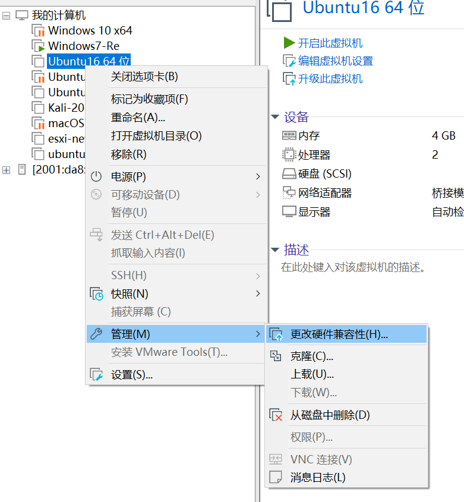
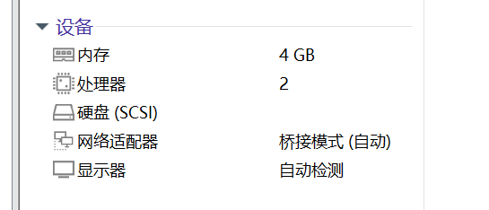
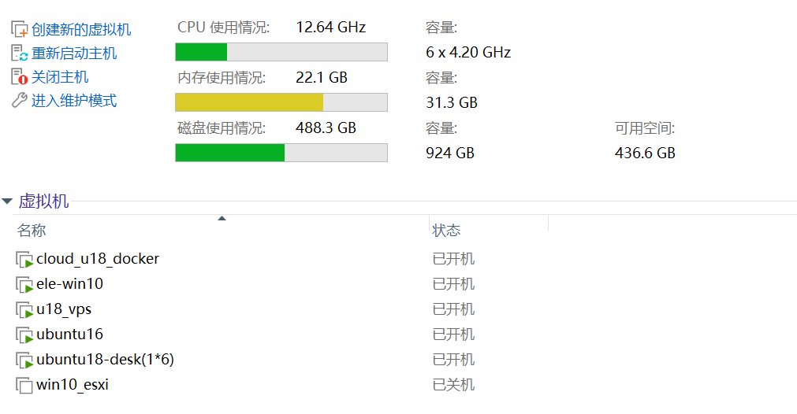

因为之前的vps到期的原因，续费太贵，于是利用ipv6将本机的一个虚拟机作为vps来使用，实测可以通过ssh正常连接访问和scp服务

```
ssh usrname@###:###:####:####:####
scp local/file usrname@[###:###:####:####:####]
```

# 获得ipv6

在学校，没有猫，路由器直接连网线，ipv4的公网ip枯竭，ipv6的多如牛毛。直接打开路由器的ipv6功能，tplink可以，sb水星路由器不行，营业厅送的电子垃圾。

打开路由器的ipv6功能之后，现代电脑默认开启ipv6服务了，使用ipv6[测试网站](https://test-ipv6.com/index.html.zh_CN)试一下,然后直接ipconfig看一下就可以了。公网ipv6一般是2开头的


一般这个暂时ipv6是公网ip，这个就允许外网访问了。

# 配置虚拟机

用的vmware，安装一个ubuntu serve，desktop太占资源了，安装好之后改成桥接模式


然后ifconfig看一下ipv6，还有一个问题就是ipv6是会变的，所以需要在变化的时候通知你

## ipv6会变

1. 动态分配：网络服务提供商（ISP）通常会采用动态IPv6地址分配，因此您的IPv6地址可能会随着时间的推移而更改。这是为了确保网络资源的有效使用和管理。
2. 重启路由器或重新连接：如果您的路由器或网络设备重新启动或重新连接到网络，它可能会被重新分配一个新的IPv6地址。
3. 网络安全：某些ISP会定期更改其客户的IPv6地址以增强网络安全性。这是为了防止攻击者使用旧的地址来攻击网络。

# 通知方式

要不就ddns绑定域名，有成本，放弃。

通过邮件通知

check_ip.sh内容如下

```shell
ifconfig > ip.txt
```

就直接运行下面这个脚本就可以

```python
import os
import time
import smtplib
from email.header import Header
from email.mime.text import MIMEText

def sendEmail(new_addr):
    message = MIMEText("new ipv6 addr --> "+new_addr)  # 邮件内容
    message['From'] = Header('Ubuntu-VPS')  # 邮件发送者名字
    message['To'] = Header('rootkit')  # 邮件接收者名字
    message['Subject'] = Header('ipv6 has changed!')  # 邮件主题

    mail = smtplib.SMTP()
    mail.connect("smtp.qq.com")  # 连接 qq 邮箱
    mail.login("1621043986@qq.com", "$$$$$$$$$$$$$$$$$$$")  # 账号和授权码
    mail.sendmail("1621043986@qq.com", ["1621043986@qq.com"], message.as_string())  # 发送账号、接收账号和邮件信息


addr = '240e:3a1:2095:7100:20c:29ff:fe9b:64f'
ipv6 = ''
while 1:
    os.system("./check_ip.sh")
    with open("ip.txt", 'r')as file:
        content = file.readlines()
    ip6 = []
    for c in content:
        if "inet6" in c:
            ip6.append(c)
            # print(' sss '+c)
    tmp = ip6[-3].split(' ')
    # print(tmp)
    for i in tmp:
        if len(i) > 24:
            ipv6 = i
    # ip 已经更新
    # print(ipv6)
    if ":" not in ipv6 and len(ipv6)<20:
        sendEmail("wrong script in crootkit ")
        break
    if addr != ipv6:
        sendEmail(ipv6)
        print("ATTENTION ----> " + time.strftime("%Y-%m-%d %H:%M:%S", time.localtime()) + "already send updata information")
    print(time.strftime("%Y-%m-%d %H:%M:%S", time.localtime()) + "no updata")
    time.sleep(60 * 5)
```


腾讯邮箱的登录密钥直接去网页，设置，账户，下面就能找到


# 主机配置

CPU：5600g

主板：TUF B550m-e

memory :  3200 ddr4 英睿达 8*2

电源：长城铜牌500W

1T的希捷酷鱼机械硬盘，装esxi系统；

1T的SN570装win10系统

机箱：嘉航 暗影猎手5 + 仨风扇

散热：AMD原装 / 雅俊 b3-pro

除了电源，都来自pdd。总共2049￥

# 系统

- win10

用来正常使用，为以后正常使用做准备

- esxi6.7

用来当服务器的系统，需要提前打包好网卡驱动，不然只能往服务器上装

# 使用

## 直通

AMD的核显直通不太理想，会失败

N卡GPU尚未购买

## 网络

没有多余配置，开启了路由器的ipv6功能，实现公网访问。

条件有限，没法配置多网卡，比较遗憾。

## 起虚拟机

### 直接启

上传iso文件，然后直接在虚拟机界面创建就行

### 上传

利用本地的VMware先修改虚拟机兼容性



然后导出之后把磁盘合并一下（vmware自带的磁盘合并工具，注意参数就行）。把一些不需要的硬件支持删除掉，不然上传esxi会报错



留下这些就可以了。

通过esxi的界面上传到磁盘，然后ssh连接到esxi，找到磁盘的路径，需要使用自带的工具去修改vmdk的格式去适合esxi，注意thin参数，

```
vmkfstools -i 原始vmdk文件名 新vmdk文件名 -d thin
```

然后在虚拟机界面进行注册，不要在磁盘界面注册虚拟机，会导致虚拟机无效。

# 效果

