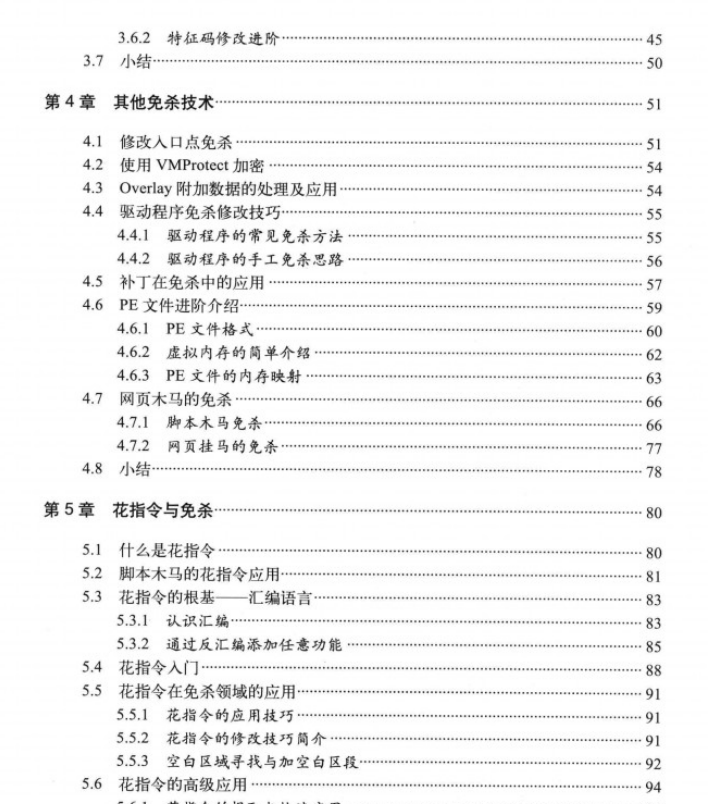
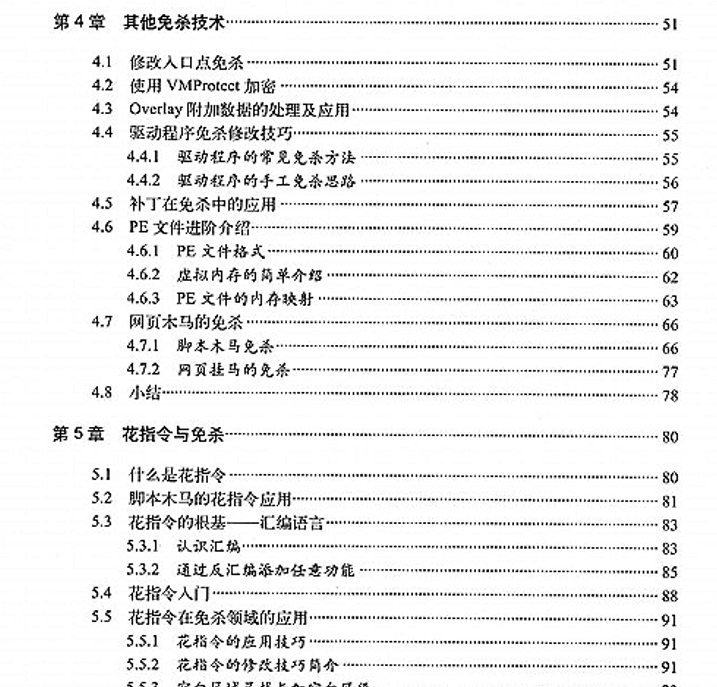
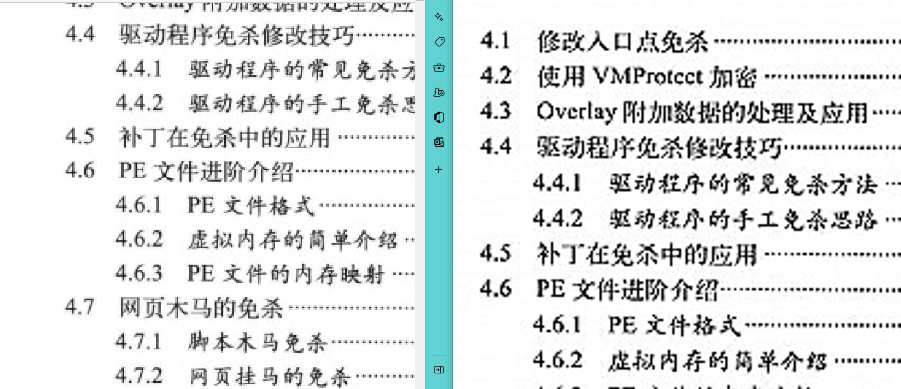

在网上下载了一个扫描版的pdf电子书，但是书籍看起来不清楚，很模糊。于是想到通过将pdf里的每一页的图片提取出来然后经过锐化，最后再组成pdf的一个形式来使图片里的文字变的清晰。通过python来实现。

因为这是一本绝版书，淘宝上买的高于原价不少，所以决定直接操作pdf。网上找了很多pdf，大小都是一样的（60多MB），所以判定为这是唯一pdf版本，其他版本很难找了。

# 原画质



文字模糊，给人一种神秘感，通过一定手段来进行锐化处理。

```python
import fitz
import glob
import os
import cv2
import numpy as np

def pdf2img():
    doc = fitz.open("test.pdf")
    pages = 20
    for i in range(0, pages):
        page=doc.load_page(i)
        pix = page.get_pixmap()
        pix.save("img\\pdf"+str(i)+".png")

# 将图片进行锐化
def changes():
    img_dir = "C:\\Users\\rootkit\\Desktop\\pyclean\\img"
    for img in sorted(glob.glob("{}/*".format(img_dir))):  # 读取图片，确保按文件名排序
        print(img)
        image = cv2.imread(img)
        kernel = np.array([[0, -1, 0], [-1, 5, -1], [0, -1, 0]], np.float32)
        dst = cv2.filter2D(image, -1, kernel=kernel)
        cv2.imshow("custom_blur_demo", dst)
        path = img+"_c.png"
        print(path)
        cv2.imwrite(path, dst)
        # print("success")

# 将锐化之后的图片重新组合成为pdf
def img2pdf():
    img_dir = "C:\\Users\\rootkit\\Desktop\\pyclean\\img"
    doc = fitz.open()
    for img in sorted(glob.glob("{}/*".format(img_dir))):  # 读取图片，确保按文件名排序
        if "_c" in img:
            print(img)
            imgdoc = fitz.open(img)  # 打开图片
            pdfbytes = imgdoc.convertToPDF()  # 使用图片创建单页的 PDF
            imgpdf = fitz.open("pdf", pdfbytes)
            doc.insertPDF(imgpdf)  # 将当前页插入文档

    if os.path.exists("allimages.pdf"):
        os.remove("allimages.pdf")
    doc.save("allimages.pdf")  # 保存pdf文件
    doc.close()
    print("######################")
    
# 先把pdf转图片，并存储在指定的目录中
pdf2img()

# 对图片进行锐化处理
changes()

# 图片转pdf
img2pdf()
```

# 新画质

经过锐化之后，看到图片的效果得到明显改进，黑白对照更加明显了



看上去好像是更像是扫描的了，实际上如下



😅更不清楚了，真他奶奶滴服气啦。

# 解决方案

去孔夫子旧书网淘本二手书，麻了还有10块的运费，操。