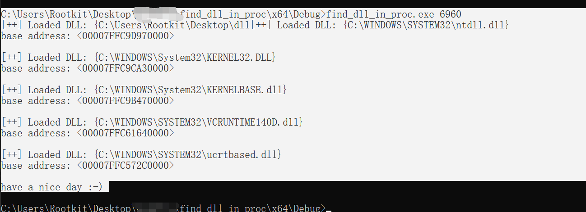

通过LDR结构体去观察已经载入的dll。如果想直到所有的用到的dll可以通过访问程序的导出表，这里的工具是利用LDR观察正在使用的dll。DLL 是在需要时动态加载的，因此有可能某些 DLL 尚未加载。

缺点：无法观察到通过loadlibrary载入的dll文件。

使用方式：

`fdip [pid] `

```c
#include<stdio.h>
#include<Windows.h>
#include<stdlib.h>
#include<winternl.h>
#include "struct.h"


typedef LONG(NTAPI* NtQueryInformationProcessPtr)(
	HANDLE ProcessHandle,
	DWORD ProcessInformationClass,
	PVOID ProcessInformation,
	ULONG ProcessInformationLength,
	PULONG ReturnLength
	);

int main(int argc, char* argv[])
{
	// 没有获取到参数的情况
	if (argc <= 1)
	{
		printf("Usage: %s <filename>\n", argv[0]);
		printf("Example: fdip32 [proc Id]\n");
		return 1;
	}
	DWORD ProcID = atoi(argv[1]);

	//DWORD ProcID = 32956;

	HANDLE hProcess = OpenProcess(PROCESS_ALL_ACCESS, FALSE, ProcID);

	HMODULE hNtdll = LoadLibraryA("ntdll.dll");
	if (hNtdll == NULL)
	{
		printf("无法加载 ntdll.dll 库\n");
		return 1;
	}

	NtQueryInformationProcessPtr NtQueryInformationProcess = (NtQueryInformationProcessPtr)GetProcAddress(hNtdll, "NtQueryInformationProcess");

	//find base addr by peb
	PROCESS_BASIC_INFORMATION pbi;
	ULONG ReturnLength;
	NTSTATUS status = NtQueryInformationProcess(hProcess, 0, &pbi, sizeof(pbi), &ReturnLength);
	if (status != 0)
	{
		printf("NtQueryInformationProcess 失败，错误码 %lu\n", status);
		return 1;
	}

	PEB peb;
	ReadProcessMemory(hProcess, pbi.PebBaseAddress, &peb, sizeof(peb), NULL);

	PPEB_LDR_DATA ldrr = peb.Ldr;

	PLIST_ENTRY pListEntry = ldrr->InMemoryOrderModuleList.Flink;

	if (!strcmp(argv[1], "-a") || !strcmp(argv[1], "--a"))
	{
		while (pListEntry != &ldrr->InMemoryOrderModuleList)
		{
			PLDR_DATA_TABLE_ENTRY pEntry = CONTAINING_RECORD(pListEntry, LDR_DATA_TABLE_ENTRY, InMemoryOrderLinks);

			printf("[+^+] Loaded DLL: LLLLL\tbase address: <%p>\n", pEntry->FullDllName.Buffer, pEntry->DllBase);

			pListEntry = pListEntry->Flink;
		}
	}
	else
	{
		while (pListEntry != &ldrr->InMemoryOrderModuleList)
		{
			PLDR_DATA_TABLE_ENTRY pEntry = CONTAINING_RECORD(pListEntry, LDR_DATA_TABLE_ENTRY, InMemoryOrderLinks);
			printf("[++] Loaded DLL: LLLLL\nbase address: <%p>\n\n", pEntry->FullDllName.Buffer, pEntry->DllBase);
			pListEntry = pListEntry->Flink;
		}
	}

	printf("have a nice day :-)\n");
	CloseHandle(hProcess);

	return 0;
}
```

上述代码的

```c
printf("[++] Loaded DLL: LLLLL\nbase address: <%p>\n\n", pEntry->FullDllName.Buffer, pEntry->DllBase);
```

里面的LLLLL应该是{%ws}，但是md识别有问题。

思路：通过PEB定位到LDR，然后通过利用`InMemoryOrderModuleList`访问到`LDR_DATA_TABLE_ENTRY`结构体，然后通过里面的`DllBase` `FullDllName`来访问基址和模块名称。

```c
typedef struct _LDR_DATA_TABLE_ENTRY {
    PVOID Reserved1[2];
    LIST_ENTRY InMemoryOrderLinks;
    PVOID Reserved2[2];
    PVOID DllBase;
    PVOID Reserved3[2];
    UNICODE_STRING FullDllName;
    BYTE Reserved4[8];
    PVOID Reserved5[3];
#pragma warning(push)
#pragma warning(disable: 4201) // we'll always use the Microsoft compiler
    union {
        ULONG CheckSum;
        PVOID Reserved6;
    } DUMMYUNIONNAME;
#pragma warning(pop)
    ULONG TimeDateStamp;
} LDR_DATA_TABLE_ENTRY, *PLDR_DATA_TABLE_ENTRY;
```

使用效果

