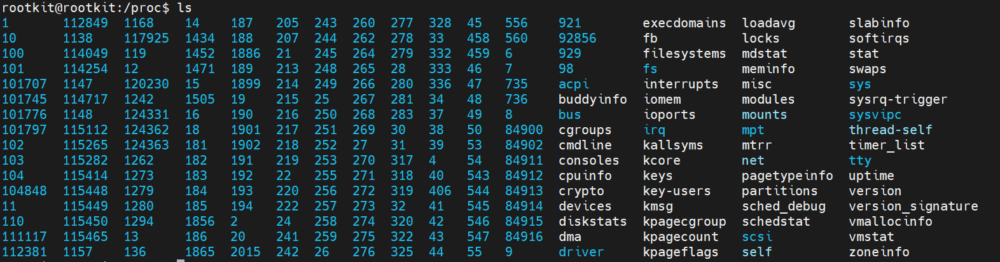
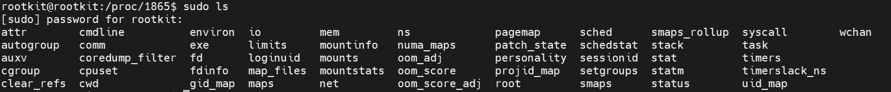

# 原理

Windows下运行一个程序他的父进程一般都是explore，linux下一般是bash，因为是从shell界面直接起的。

实现方式很多，基本思路就是：

- 获得父进程的pid
- 利用pid查找proc name

# windows

## C#

```c#
using System;
using System.Diagnostics;
using System.Management;
using System.Windows.Forms;

namespace Check_Father
{
    class check_father_proc
    {
        static bool if_proc = true;
        static void Main(string[] args)
        {
            // 获取当前进程对象
            try
            {
                Process currentProcess = Process.GetCurrentProcess();
                if (GetParentProcess(currentProcess).ProcessName.Equals("explore"))
                {
                    if_proc = true;
                }
                else
                {
                    Console.WriteLine($"{GetParentProcess(currentProcess).ProcessName}");
                }
            }
            catch
            {
                Environment.Exit(0);
            }
        }
        private static Process GetParentProcess(Process process)
        {
            // 获取指定进程的父进程 ID
            int parentProcessId = 0;
            ManagementObjectSearcher searcher = new ManagementObjectSearcher($"SELECT ParentProcessId FROM Win32_Process WHERE ProcessId = {process.Id}");
            ManagementObjectCollection collection = searcher.Get();
            foreach (ManagementObject obj in collection)
            {
                parentProcessId = Convert.ToInt32(obj["ParentProcessId"]);
                break;
            }
            // 获取父进程对象
            Process parentProcess = null;
            if (parentProcessId > 0)
            {
                try
                {
                    parentProcess = Process.GetProcessById(parentProcessId);
                }
                catch (Exception)
                {
                    parentProcess = null;
                }
            }
            return parentProcess;
        }
    }
}

```

1. 调用 GetCurrentProcess() 方法获取当前进程对象。
2. 调用 GetParentProcess() 方法获取当前进程的父进程对象。
3. 判断父进程对象的 ProcessName 属性是否为 "explorer"，以确定父进程是否为 Windows Explorer。

其中，步骤 2 主要是通过 WMI (Windows Management Instrumentation) 查询获取当前进程的父进程 ID，然后通过调用 Process.GetProcessById() 方法来获取父进程对象。具体实现是：

- 调用 ManagementObjectSearcher 对象的 Get() 方法来执行 WMI 查询，查询条件为获取父进程 ID，查询语句为 $"SELECT ParentProcessId FROM Win32_Process WHERE ProcessId = {process.Id}"。
- 遍历查询结果，获取父进程 ID。
- 调用 Process.GetProcessById() 方法根据父进程 ID 获取父进程对象。


## C

```c
#include <windows.h>
#include <stdio.h>
#include <tchar.h>
#include <tlhelp32.h>
#include <psapi.h> //GetModuleFileNameEx

int main()
{
    // 获取当前进程句柄
    HANDLE currentProcess = GetCurrentProcess();
    // 获取当前进程 ID
    DWORD currentProcessId = GetProcessId(currentProcess);
    // 获取进程快照
    HANDLE snapshot = CreateToolhelp32Snapshot(TH32CS_SNAPPROCESS, 0);
    if (snapshot == INVALID_HANDLE_VALUE)
    {
        printf("CreateToolhelp32Snapshot failed, error code %d\n", GetLastError());
        return 0;
    }

    PROCESSENTRY32 processEntry;
    processEntry.dwSize = sizeof(PROCESSENTRY32);

    // 遍历进程快照，查找父进程
    if (Process32First(snapshot, &processEntry))
    {
        do 
        {
            if (processEntry.th32ProcessID == currentProcessId)
            {
                // 获取当前进程的父进程 ID
                DWORD parentProcessId = processEntry.th32ParentProcessID;
                // 根据父进程 ID 获取父进程句柄
                HANDLE parentProcess = OpenProcess(PROCESS_QUERY_INFORMATION | PROCESS_VM_READ, FALSE, parentProcessId);
                if (parentProcess != NULL)
                {
                    // 获取父进程的名称
                    TCHAR parentProcessName[MAX_PATH];
                    if (GetModuleFileNameEx(parentProcess, NULL, parentProcessName, MAX_PATH))
                    {
                        // 判断父进程名称是否为 explorer.exe
                        if (_tcsicmp(parentProcessName, _T("explorer.exe")) == 0)
                        {
                            printf("The parent process is explorer.exe.\n");
                        }
                        else
                        {
                            printf("The parent process is %ws.\n", parentProcessName);
                        }
                    }
                    else
                    {
                        printf("GetModuleFileNameEx failed, error code %d\n", GetLastError());
                    }
                    CloseHandle(parentProcess);
                }
                else
                {
                    printf("OpenProcess failed, error code %d\n", GetLastError());
                }
                break;
            }
        } while (Process32Next(snapshot, &processEntry));
    }
    else
    {
        printf("Process32First failed, error code %d\n", GetLastError());
    }

    CloseHandle(snapshot);
    return 0;
}
```

1. 使用  `GetCurrentProcess()` 获取当前进程的句柄。
2. 使用 `GetProcessId()` 获取当前进程的 ID。
3. 使用  `CreateToolhelp32Snapshot()` 创建进程快照。
4. 遍历进程快照，查找父进程。使用 `Process32First()` 获取第一个进程的信息，然后使用 `Process32Next()` 遍历下一个进程，直到找到当前进程。
5. 获取当前进程的父进程 ID，并使用 `OpenProcess()` 函数打开父进程的句柄。
6. 使用 `GetModuleFileName


# Linux

因为linux是基于文件的，所以需要通过文件来获得进程名称，但是linux有现成的函数可以直接得到父进程的pid，各有千秋。

进程对应的进程号在`/proc`目录下存在一个对应pid的目录。



随便进去一个可以看到很多文件



comm文件里面存放的就是进程的名称

## C

```c
#include <stdio.h>
#include <stdlib.h>
#include <unistd.h>
#include <sys/types.h>
#include <string.h>

int main() 
{
    pid_t pid = getpid();
    pid_t ppid = getppid();

    char filename[256];
// 获取当前进程名称 
    snprintf(filename, sizeof(filename), "/proc/%d/comm", pid);  // 构造文件名
    FILE* fp = fopen(filename, "r");  	// 打开文件
    if (fp) 
    {
        char name[256];
        fgets(name, sizeof(name), fp);  // 读取进程名称
        name[strcspn(name, "\n")] = 0;  // 去除换行符
        printf("current process name: %s\n", name);
        fclose(fp);  					// 关闭文件
    }
    else 
    {
        printf("failed to open file: %s\n", filename);
    }

// 获取父进程的进程名称
    snprintf(filename, sizeof(filename), "/proc/%d/comm", ppid);  // 构造文件名
    fp = fopen(filename, "r");  		// 打开文件
    if (fp) 
    {
        char name[256];
        fgets(name, sizeof(name), fp);  // 读取进程名称
        name[strcspn(name, "\n")] = 0;  // 去除换行符
        printf("current process parent name: %s\n", name);
        fclose(fp);  					// 关闭文件
    } 
    else 
    {
        printf("failed to open file: %s\n", filename);
    }
   
    return 0;
}
```

