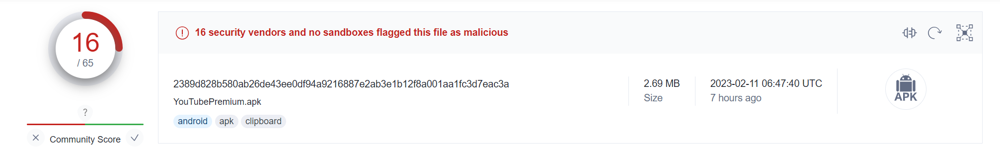
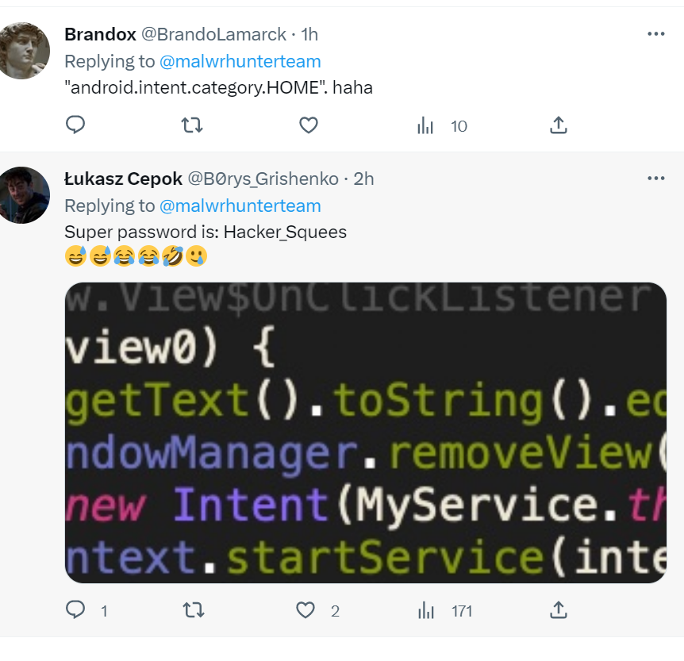
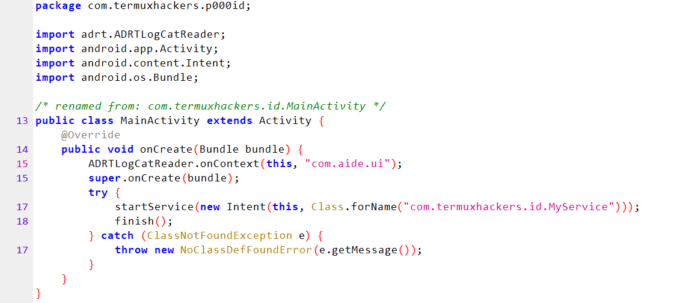
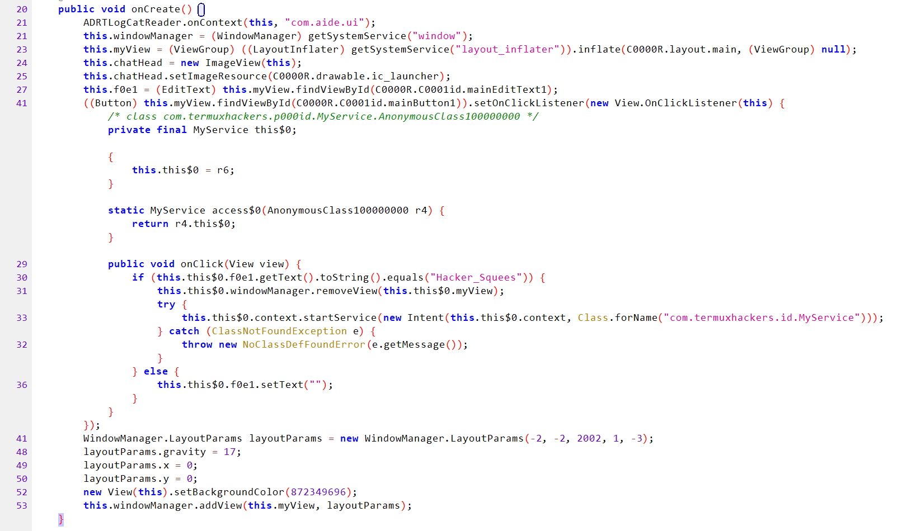

# 概述

这是一个锁机apk



在twitter上看到的

https://twitter.com/malwrhunterteam/status/1624366684092997634



这是推友的描述，甜品级别的


apk图片就存放在res里的二级目录，基本都一样


显示这么一个东西，同时点击操作失效，在重新启动设备之后，可以缓解，没有什么含金量。

# 具体分析

解压之后内容很简单，签名目录，资源目录和一个dex文件还有AndroidManifest.xml文件

## xml文件分析

先查看应用清单（AndroidManifest.xml）

```xml
  <uses-sdk android:minSdkVersion="8" android:targetSdkVersion="21" />
  <uses-permission android:name="android.permission.SYSTEM_ALERT_WINDOW" />
创建顶层窗口
  <uses-permission android:name="android.permission.RECEIVE_BOOT_COMPLETED" />
接收系统完成引导后广播 ：开机启动
  <uses-permission android:name="android.permission.SET_WALLPAPER" />
允许设置应用墙纸
  <uses-permission android:name="android.permission.READ_EXTERNAL_STORAGE" />
允许读取外部存储
  <uses-permission android:name="android.permission.WRITE_EXTERNAL_STORAGE" />
允许写外部存储
  <uses-permission android:name="android.permission.READ_CONTACTS" />
读取用户的联系人数据
  <uses-permission android:name="android.permission.READ_SMS" />
读取短信权限
  <uses-permission android:name="android.permission.ACCESS_FINE_LOCATION" />
获得精确的位置信息
  <uses-permission android:name="android.permission.WAKE_LOCK" />
让CPU一直工作不能停。
  <uses-permission android:name="android.permission.INTERNET" />
允许应用程序打开网络套接字。
  <uses-permission android:name="android.permission.REQUEST_INSTALL_PACKAGE" />
允许程序安装包
  <uses-permission android:name="android.permission.CAMERA" />
允许常规应用程序与“相机”类型一起使用
```

该软件虽然没有啥危害，但是要的权限还不少。根据权限来推测可能会存在socket连接，指令接收，发包，收集短信、相册、位置、联系人信息。

> [清单权限|安卓开发者 (android.com)](https://developer.android.com/reference/android/Manifest.permission#FOREGROUND_SERVICE_MEDIA_PLAYBACK)

## dex分析

没有lib文件，直接查看dex文件，查看仅有五个有用类。


### MainActivity

先看主类，代码及其简单



首先使用`ADRTLogCatReader`记录软件运行期间所产生的日志，根据其他分析报告发现大多数的锁机软件会使用这个来记录日志，不知道为啥，说是因为方便。

下面就是正常的oncreate方法创建一个窗口，通过startService利用Class.forName隐式的跳转Activity，然后传入活动，并启动intent跳转，所以这里就定位到了另一个类MyService

### MyService

主要功能集中在这个类中



大体浏览可以发现缓解措施，因为程序有一个按钮，所以可以定位到onClick方法


可以看到这个if判断，没有任何加密，只要密码是他，就删除当前界面，手机恢复正常。


这里设置了窗口的格式，17代表了居中，通过`this.windowManager.addView(this.myView, layoutParams);`来设置窗口置顶

```
整个Android的窗口机制是基于一个叫做 WindowManager，这个接口可以添加view到屏幕，也可以从屏幕删除view。它面向的对象一端是屏幕，另一端就是View，通过WindowManager的 addView方法创建View，这样产生出来的View根据
WindowManager.LayoutParams属性不同，效果也就不同了。比如创建 系统顶级窗口，实现悬浮窗口效果WindowManager的方法很简单，基本用到的就三addView，removeView，updateViewLayout
```

# 总结

这个玩意他要这么多敏感权限就实现了一个锁屏的功能，可能是谁的作业吧，他甚至还留下了他的tg，看来是小号。通过微步的关联分析看得出来这是一个成熟的锁机样本模板，本样本是基础版本，只有一层密码，而且密码直接硬编码在代码中，虽然需要了很多敏感权限，但是就锁机了。

从代码风格分析，这里的程序应该是一个相关专业的学生或者是朋友间开玩笑的应用样本。

