vmp壳一直是作为加密壳中的一个难啃的骨头，这次从工具使用角度学习一下这个脱壳的过程，本次尝试vmp3.4。3.x的系列都差不多

# 源码

```c
#include<stdio.h>
#include<stdlib.h>
#include<windows.h>
#include<string.h>

void get_promt()
{
    if(MessageBox(NULL,TEXT("context"),TEXT("title"),MB_OK))
    {
    	printf("1212121212\n");
	}
	else
	{
		printf("error");
	}
}

int main()
{
    printf("this is main func\n");
    char str_ptr[] = "please input a string: ";
    char str[128];
    char flag[15] = "aabbccddeeff";
    scanf("%s", str);
    if(strlen(str)<=10)
    {
    	printf("too late\n");
	}
	
	if(!strcmp(str, flag))
	{
		get_promt();
	}
	else
	{
		printf("too error\n");
	}
    
    return 0;
}

```

# 加壳

使用52破解上找到的vmp软件按照默认的配置对程序进行加壳

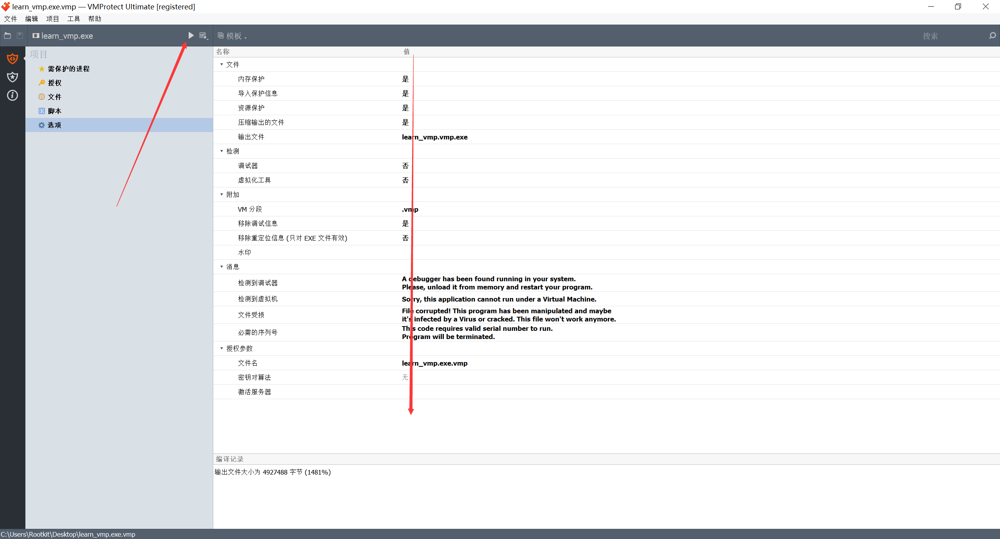

都是默认配置，模仿的是大多数的情况，也是常见的一种加密模式。实际上VMP强大之处在于它的虚拟功能，但是默认是关闭的。

得到加密后的程序。大小相比于源程序扩大20倍左右

# 调试

因为程序多次中断跑飞，所以这些截图可能不是来自同一次进程，所以辩证看待

## 调试器配置

### 断点

断点要求：如图

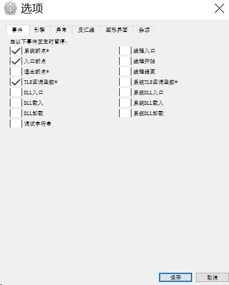

这也是调试器的默认配置，断点不宜太多，会触发vmp的完整性检测。

### 增强

使用插件sharpOD，这个和xdbg是通用的

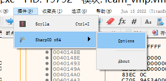

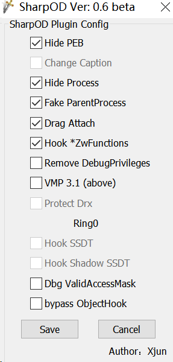

添加这些功能是为了防止vmp的一个检测，然后主要选这几个就行，主要是防止被检查调试器。

## 区段对比

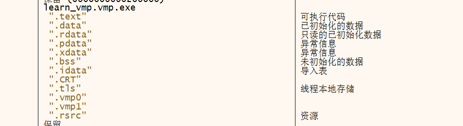

看到相较于正常程序，他出现了vmp0和1两个段。

这是正常的程序区段详情

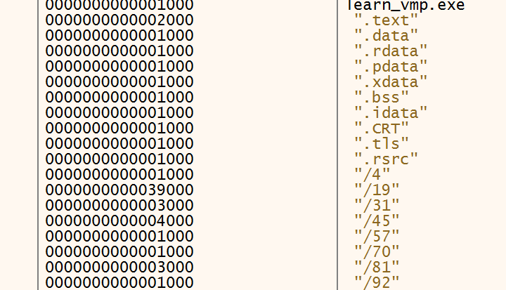

注意一下地址的范围。

## 进行调试

### 找入口点特征

利用gcc编译的，所以需要定位一下start函数的部分，同时需要看到函数入口点的位置特征

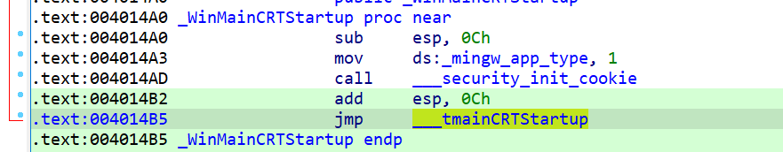

看到这个call和jmp的结构，类似于MSVC编译的结构。

```assembly
call    ___security_init_cookie
```

跟进这个函数，发现两个函数

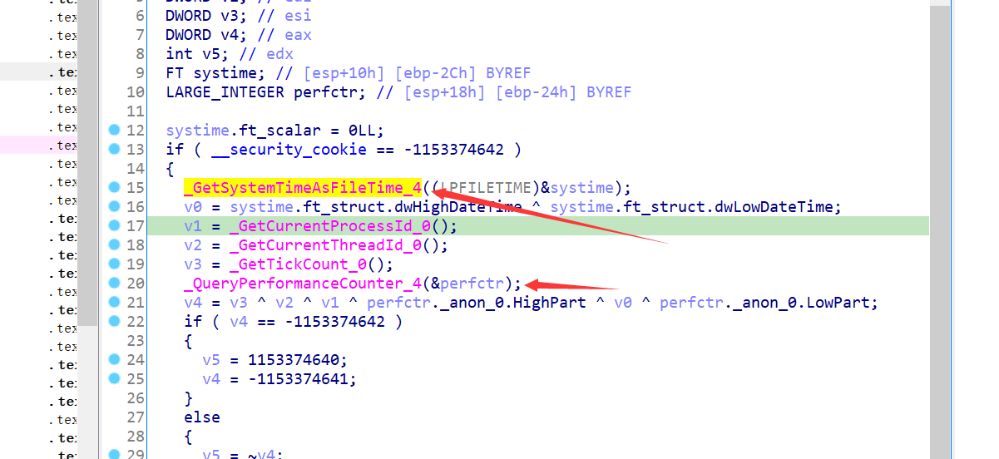

### 脱壳

直接在动态调试中找到这两个函数然后下断点，然后通过栈回溯的方式进行定位。

```
GetSystemTimeAsFileTime --> 在kernelbase中，直接在dll界面下断点就行
```

另一个同理，下好断点，断点下的要靠后一点，避免VMP的头部断点检测。

直接f9运行，程序断在如下图位置

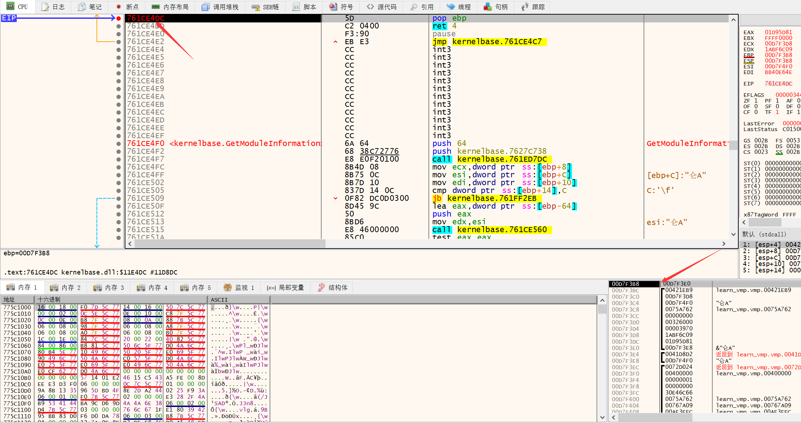

通过内存布局定位，发现还在vmp区段里，那就继续运行，可能是其他的地方也调用了同样的api函数

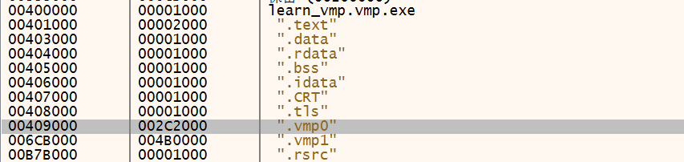

直接f9就可以，然后观察啊堆栈窗口

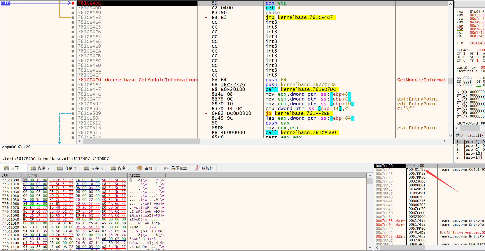

看到返回地址更新了。这一次程序已经来到text区段算是成功进来程序本身了。

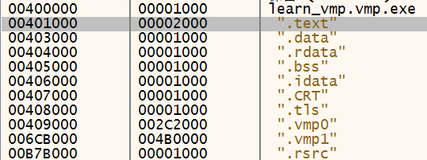

看到ida里的伪代码（未加壳的程序）如图

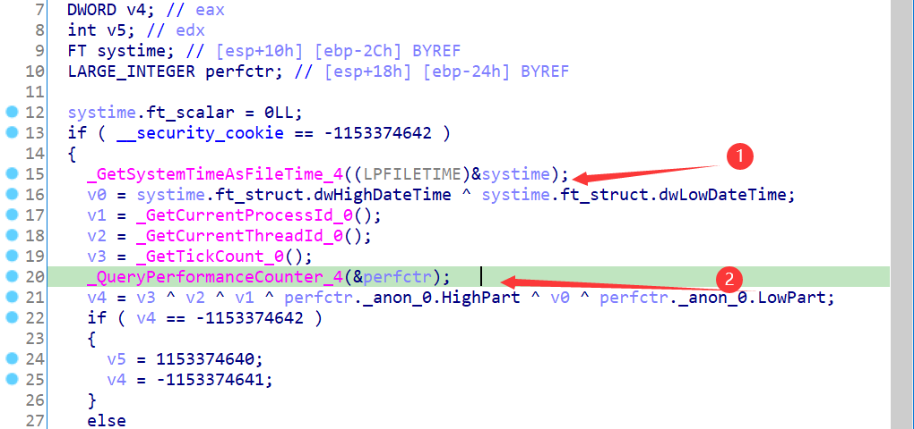

第一个函数已经断进程序本身了，继续运行断第二个api。

**需要注意的是，断点下载了kernelbase中，重新调试的时候会出现0xc000007b错误，这时候需要顶着错误进断点界面把俩kernelbse的断点删除，或者删除xdbg的缓存或者改个文件名。**

**还有需要注意的是，不要一载入程序就下断点，先运行一步到程序领空之后，再去下这个api断点。**


看到程序已经跳转到了正常的text段的一个程序里了。

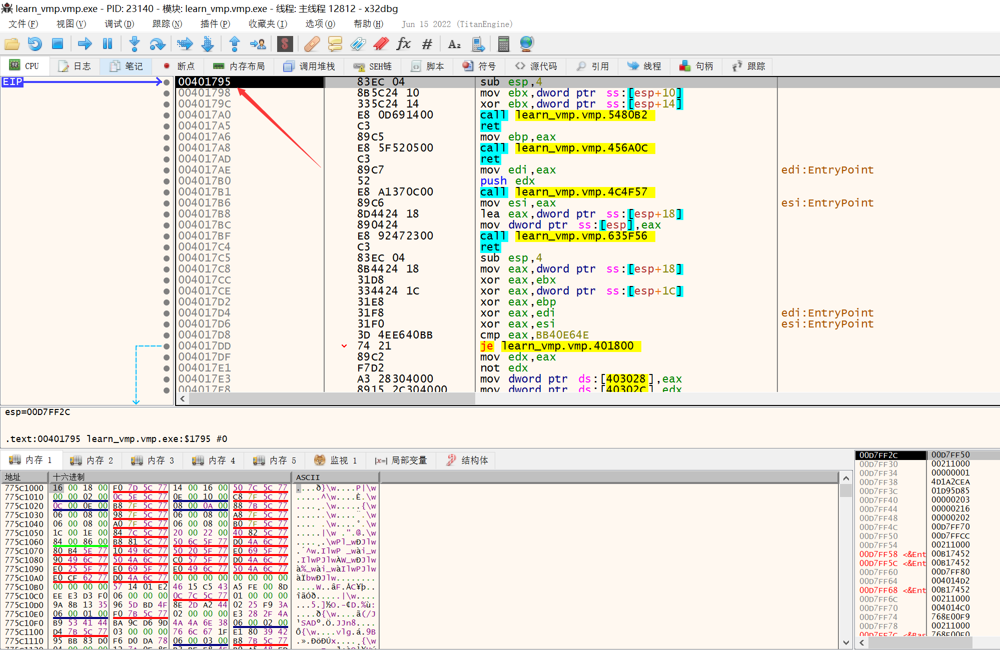

我们开始通过ida可以看到，程序的start函数的形式是一个call+jmp的形式

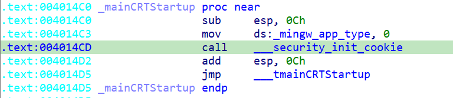

所以我们继续调试下去，当进入正常text段凌空之后就不要f9了，会直接跑飞，所以慢慢调试。

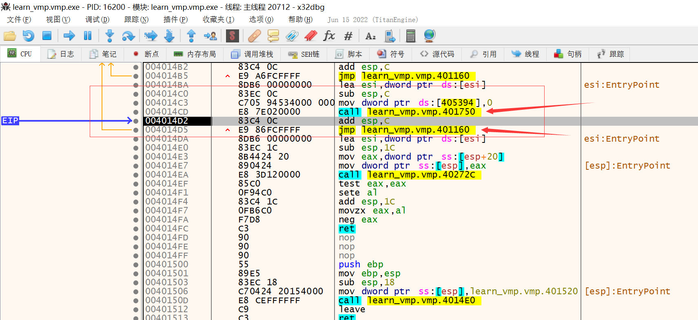

来到这里，看起来结构和没加科的入口点就很相似了，看了一下基本是一样的，然后直接把eip蹦到sub指令上，然后使用一个[github](https://github.com/woxihuannisja/vmp3-import-fix/releases/tag/v2.0)脚本恢复一下iat。

```shell
C:\Users\Rootkit\Desktop>vmp3-import-fix -p 16200
start emualte pattern address:00401238
start emualte pattern address:00401433
start emualte pattern address:00401555
start emualte pattern address:00401730
start emualte pattern address:0040178F
start emualte pattern address:004017A0
start emualte pattern address:004017A8
start emualte pattern address:004017B1
start emualte pattern address:004017BF
start emualte pattern address:00401860
start emualte pattern address:0040186F
start emualte pattern address:00401878
start emualte pattern address:0040188A
start emualte pattern address:00401B17
start emualte pattern address:00401B6D
start emualte pattern address:00401D5E
start emualte pattern address:0040207F
start emualte pattern address:00402091
start emualte pattern address:004020CC
start emualte pattern address:00402122
start emualte pattern address:00402141
start emualte pattern address:00402187
start emualte pattern address:004021C7
start emualte pattern address:00402247
start emualte pattern address:004022AC
start emualte pattern address:004026AD
start emualte pattern address:004026B5
start emualte pattern address:004026BC
start emualte pattern address:004026C4
start emualte pattern address:004026CC
start emualte pattern address:004026D4
start emualte pattern address:004026DD
start emualte pattern address:004026E5
start emualte pattern address:004026ED
start emualte pattern address:004026F4
start emualte pattern address:004026FC
start emualte pattern address:00402705
start emualte pattern address:0040270C
start emualte pattern address:00402714
start emualte pattern address:0040271D
start emualte pattern address:00402724
start emualte pattern address:0040272D
start emualte pattern address:00402734
start emualte pattern address:0040273C
start emualte pattern address:00402745
start emualte pattern address:0040274C
start emualte pattern address:00402754
start emualte pattern address:0040275C
start emualte pattern address:00402765
start emualte pattern address:0040276D
VirtualAlloc IAT address:00EB0000
```

完事之后可以去对应的地址看一下是不是真的被复原了。经过验证那些call确实已经被还原名称了。

利用xdbg自带的脚本进行dump，直接dump就可以，dump之后通过cff去观察一下文件的几个指标：

- 入口点（这里的入口点和源程序的出口点一样的，并没有发生改变）
- 是否重定位（关掉）

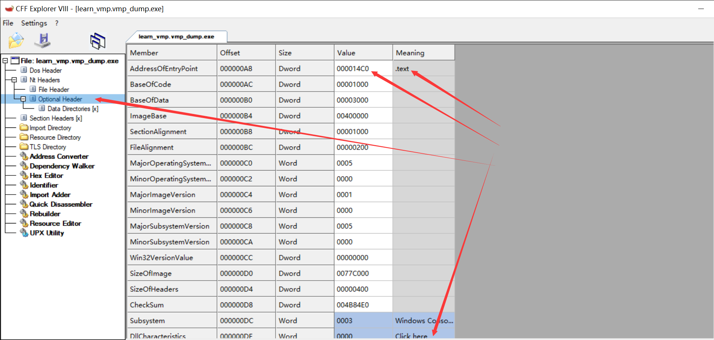

然后点击下面的东西，看一下重定位

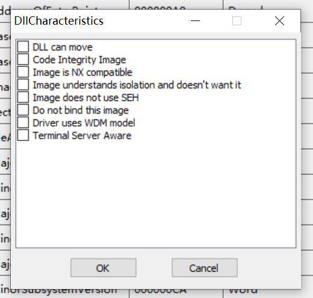

之后使用[UIF工具](https://bbs.kanxue.com/thread-88950.htm)进行IAT重建（针对这个进程）。

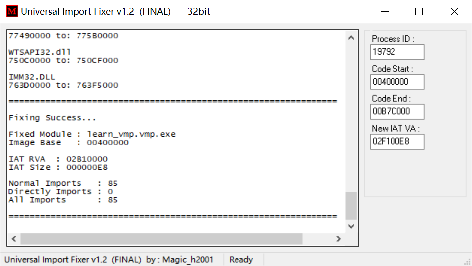

重建结束之后，使用另一个工具进行[fix dump][https://www.52pojie.cn/thread-66558-1-1.html]而不是xdbg去修复，这里要注意

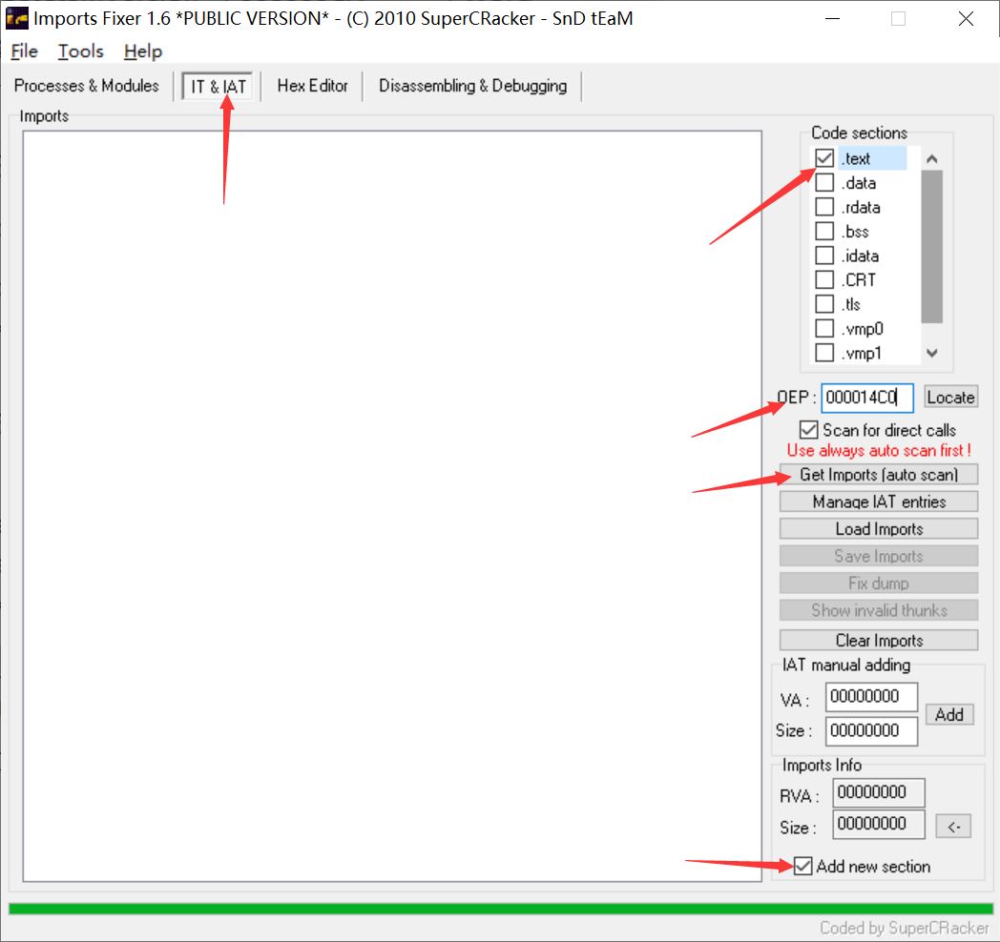

注意这些参数，防止出问题，然后点击那个get import，之后fixdump即可

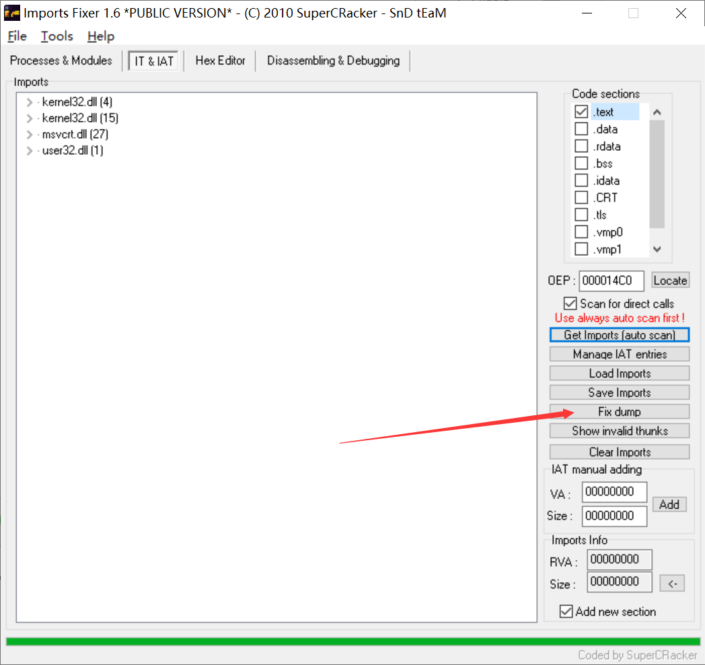

将得到的最后的文件放进ida进行查看，可以看到效果已经非常好了

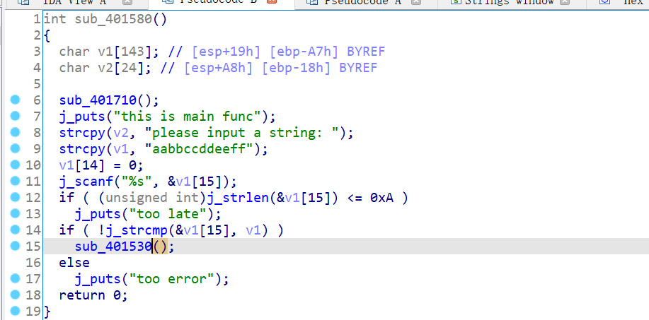

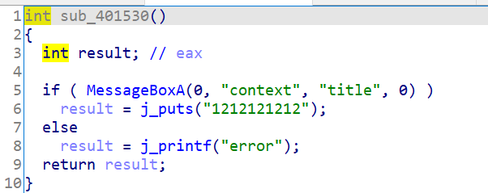

# 总结

面对一个默认配置加壳的vmp程序的整体的脱壳思路：

- 定位两个关键api（kernelbase的GetSystemTimeAsFileTime、ntdll的QueryProformanceCounter）。
- 在api尾部下断点，不要都下载ret之前，最好有一定的辨识度。
- 观察堆栈，在执行完QueryProformanceCounter的断点之后注意返回text领空的情况。
- 在text段向上寻找程序入口点，利用dos脚本进行修复。
- 利用xdbg自带的脚本进行dump。
- 检查dump文件。
- ufi修复进程，IF重建进程后修复dump文件。