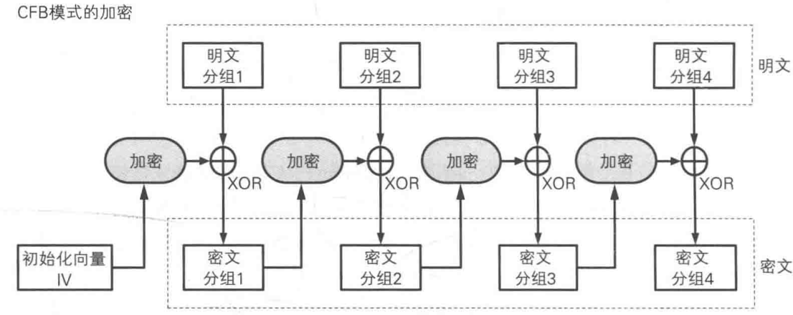

# 流密码

像流水一样，从头到尾的一种加密算法。

以一定的bit位数为分组进行加密，结束一个分组的加密就继续进行下一个分组的加密，需要内部保存一个当前的加密状态。对称加密算法基本都是基于分组加密的形式而不是流密码的形式。

# 分组密码

AES和DES还有3DES等等都是对称加密里的分组密码模式。

## 模式

因为分组密码对于每一组的加密的明文都是固定长度的，一般情况下都需要对加密算法进行迭代加密。为了解决这个迭代的问题，于是有了下面的常见的几种模式（常见）：

模式的名称都是他的全名的缩写，全名我记不住。

- ECB：电子密码本
- CBC：密码分组链接模式
- CFB：密文反馈模式
- OFB：输出反馈模式
- CTR：计数器模式

## ECB：电子密码本

最简单的、容易被攻击的一种模式，一般没人用。

### 过程

将明文按照指定的大小分组，然后每一组分别加密，密文按照顺序排列成最终密文。

对应的解密模式也是将密文分组之后分别解密得到明文。

因为11对应的关系，所以被称为电子密码本。

### 攻击方式

- 观察密文中的重复序列，可以对应出明文中的重复序列，可以推测明文。
- 修改密文顺序，直接控制明文顺序
- 密文替换，利用相同算法的密文替换原来密文中的密文

## CBC：密码分组链接

将前一个密文分组和当前明文分组混合起来加密，密文像链条一样相互连接。

### 过程

首先将本组明文和上一组的密文进行xor之后再进行加密，第一次明文用初始向量IV进行异或

解密过程：因为是xor，所以算法过程完全可逆

加密的链条就是通过xor进行连接的

### 攻击方式

- 反转IV中的bit位，通过观察第一组的变化可以达到攻击初始向量IV的效果

## CFB：密文反馈

前一个密文分组，会被当作输入，送回算法的输入端（这里体现的“反馈”）。

### 过程

该模式的加密并不体现在明文和密文的对应上，而是对前一组密文的加密上，当前组明文和前一组密文异或得到这一组的密文。

解密过程：

思路同上述模式

### 特点

使用分组密码的思想实现的流密码加密方式。初始向量IV相当于一个种子，每次的加密过程相当于产生随机数的过程，但是是伪的。

### 攻击方式

使用重放攻击。

取相同密钥和iv的两次加密，用第一次加密的后三项内容替换第二次的后三项内容，这样就会导致解密过程中第一组成功解密，第二组密文解密失败，因为被替换，无法通过xor还原，但是后面的可以成功解密达到攻击密文的效果。

## OFB：输出反馈

和CFB类似但是不同，也是加密的结果会当作输入再进行操作。但是在这种模式中，初始向量更加重要一下

### 与CFB模式的比较

OFB反馈的不是明文的密文，而是iv向量的密文

## CTR：计数器模式

将逐次累加的计数器进行加密，生成密钥流的流密码

### 计数器的生成

每次加密的时候先产生一个随机值当作初始值。该数字分为两部分，前面的一部分就是随机数本身，后面的字节就是分组的序号（1，2，3，4……之类的）比如：

### 与OFB

都属于是流密码，所以存在异同。

ofb利用的加密的输出当作输入，该模式利用的是计数器当作输入。

### 特点

可以用于并行计算。因为可以以任意顺序对分组进行加密和解密，计数器的值可以由随机数和序号计算得到。