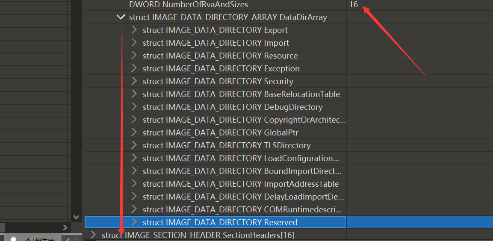
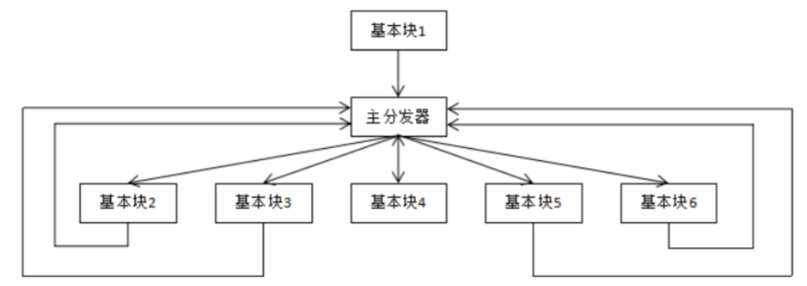
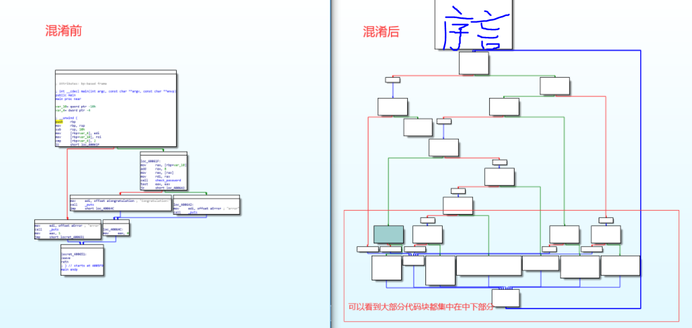

# （一）反调试

在攻击中，为了防止自己恶意代码的泄露，会对攻击样本本身进行反调试和混淆操作。

## 一、API反调试

### IsDebuggerPresent

```c
BOOL IsDebuggerPresent();
```

经典的反调试API，查询进程环境块(PEB)中的IsDebugged标志。

- 没有运行在调试器环境中，函数返回0；
- 调试附加了进程，函数返回一个非零值。

这个直接通过修改返回值可以绕过。或者直接利用“隐藏调试器”选项就可以

### CheckRemoteDebuggerPresent

和上述API实现过程基本一致

```c
BOOL CheckRemoteDebuggerPresent(
  [in]      HANDLE hProcess,	// 进程的句柄。
  [in, out] PBOOL  pbDebuggerPresent		// 进程被调试则返回TRUE
);
```

通过修改寄存器的值也可以绕过。比较简单。

### NtQueryInformationProcess

这是一个没有公开的在`ntdll.dll`中的api，可以用来获取程序中指定的结构体内容。

可以利用他读取一些程序中的内容来判断调试技术。直接利用“隐藏调试器”选项就可以

### GetLastError

这个需要和几个API搭配使用。

```
OutputDebugStringA 
SetLastError
GetLastError
```

如果没有调试进程的话，这个api就会报错，可以提前使用`SetLastError`来提前设置一个错误值。

```c
void OutputDebugStringA(
  [in, optional] LPCSTR lpOutputString
);
```

完事最后利用`GetLastError`来获取错误值，如果调试的话，这里就会出现问题。

常见搭配：

```c
BOOL IsDebugger()
{
	DWORD errorValue = 2234;
	SetLastError(errorValue);
	OutputDebugString("Test for debugger!");
	return (GetLastError() == errorValue)?TRUE:FALSE;
}
```

类似的模板也可以搭配其他的API函数来使用。

绕过也简单，这个不会直接修改程序，直接修改返回值就行。不能直接利用“隐藏调试器”选项了。

### ZwSetInformationThread

设置线程的优先级。通过为线程设置 **ThreadHideFromDebugger**，可以禁止线程产生调试事件。

```c
NTSYSAPI NTSTATUS ZwSetInformationThread(
  [in] HANDLE          ThreadHandle,
  [in] THREADINFOCLASS ThreadInformationClass,
  [in] PVOID           ThreadInformation,
  [in] ULONG           ThreadInformationLength
);
```

原理：调试进程就会被分离出来。该函数不会对正常运行的程序产生任何影响，但若运行的是调试器程序，因为该函数隐藏了当前线程，调试器无法再收到该线程的调试事件，最终停止调试

绕过方式：**第 2 个参数**为 ThreadHideFromDebugger，其值为 **0x11**。直接修改这个值就可以

### debugActiveProcessStop

停止调试器指定的进程

```c
BOOL DebugActiveProcessStop(
  [in] DWORD dwProcessId	// 想停止的调试进程的进程号
);
```

函数失败，则返回值为零

### 查找窗体信息

#### FindWindow

检索顶级窗口的句柄，该窗口的类名称和窗口名称与指定的字符串匹配。 此函数不搜索子窗口。 此函数不执行区分大小写的搜索。

```c
HWND FindWindowW(
  [in, optional] LPCWSTR lpClassName,
  [in, optional] LPCWSTR lpWindowName
);
```

直接用它和一些调试器的名称进行比较就行。绕过也是直接修改返回值或者是修改字符串。

#### EnumWindows

通过将句柄传递到应用程序定义的回调函数，枚举屏幕上的所有顶级窗口。 **枚举枚举** 到最后一个顶级窗口或回调函数返回 **FALSE** 为止。并将窗口句柄传送给应用程序定义的回调函数。

```c
BOOL EnumWindows(
  [in] WNDENUMPROC lpEnumFunc,
  [in] LPARAM      lParam
);
```

常用代码结构。

```c
BOOL CALLBACK EnumWndProc(HWND hwnd, LPARAM lParam)  
{  
	char cur_window[1024];
    GetWindowTextA(hwnd, cur_window, 1023);
	if (strstr(cur_window, "WinDbg")!=NULL || strstr(cur_window, "x64_dbg")!=NULL || strstr(cur_window, "OllyICE")!=NULL || strstr(cur_window, "OllyDBG")!=NULL || strstr(cur_window, "Immunity")!=NULL)
	{
		*((BOOL*)lParam) = TRUE;
	}
	return TRUE;
} 

```


### 查找进程信息

#### 遍历进程列表

通过进程快照来遍历进程列表，通过字符串比较来判断，绕过直接修改字符串就行

#### 查看父进程

Windows一般默认的父进程就是`explore`，同时`STARTUPINFO`结构体的信息也是0。

这个也好绕过，直接修改字符串或者是绕过就行了。

### 代码校验和检查

计算代码段的校验并实现与扫描中断相同的目的。与扫描0xCC不同，这种检查仅执行恶意代码中机器码CRC或者MD5校验和检查。

### 时钟检测

如下两种用时钟检测来探测调试器存在的方法。

- 记录一段操作前后的时间戳，然后比较这两个时间戳，如果存在滞后，则可以认为存在调试器。
- 记录触发一个异常前后的时间戳。如果不调试进程，可以很快处理完异常，因为调试器处理异常的速度非常慢。

#### rdtsc

这是一个汇编指令。

它返回至系统重新启动以来的时钟数，并且将其作为一个64位的值存入EDX:EAX中。恶意代码运行两次rdtsc指令，然后比较两次读取之间的差值。

#### QueryPerformanceCounter和GetTickCount

QueryPerformanceCounter：检索性能计数器的当前值，这是一个高分辨率 (<1us) 时间戳，可用于时间间隔度量。

```c
BOOL QueryPerformanceCounter(
  [out] LARGE_INTEGER *lpPerformanceCount	// 接收当前性能计数器值的变量的指针
);
```

GetTickCount：检索自系统启动以来已用过的毫秒数，最长为 49.7 天。

```c
DWORD GetTickCount();
```


## 二、手工反调试

### 手动检查相关结构

使用上述提到的检测调试的api很容易被发现绕过，所以可以手动的实现上述api的功能。

比如检查ProcessHeap位于PEB结构的0x18处。第一个堆头部有一个属性字段，它告诉内核这个堆是否在调试器中创建。

在不同的环境下会显示不同的值。

### 软件断点检查

恶意代码常用的一种反调试技术是在它的代码中查找机器码0xCC，来扫描调试器对它代码的INT 3修改。**repne scasb**指令用于在一段数据缓冲区中搜索一个字节。EDI需指向缓冲区地址，AL则包含要找的字节，ECX设为缓冲区的长度。当ECX=0或找到该字节时，比较停止。

### 硬件断点检查

在Windows下通过获取当前上下文信息`context`来获得到DR0-DR7这些寄存器的信息。如果没有硬件断点，则这几个寄存器的值都是0。

### 使用TLS回调

通过注册TLS回调函数在函数入口点之前执行代码，可以起到目的。但是可以将断点设置`TLS开始`的位置来断住，ida分析也很简单。

一般来说正常编译的程序会开启TLS功能，这时就可以找到`TLS表`，TLS的结构如下：

```c
typedef struct _IMAGE_TLS_DIRECTORY64 {
    ULONGLONG StartAddressOfRawData;
    ULONGLONG EndAddressOfRawData;
    ULONGLONG AddressOfIndex;         // PDWORD
    ULONGLONG AddressOfCallBacks;     // PIMAGE_TLS_CALLBACK *;
    DWORD SizeOfZeroFill;
    union {
        DWORD Characteristics;
        struct {
            DWORD Reserved0 : 20;
            DWORD Alignment : 4;
            DWORD Reserved1 : 8;
        } DUMMYSTRUCTNAME;
    } DUMMYUNIONNAME;

} IMAGE_TLS_DIRECTORY64;


typedef struct _IMAGE_TLS_DIRECTORY32 {
    DWORD   StartAddressOfRawData;
    DWORD   EndAddressOfRawData;
    DWORD   AddressOfIndex;             // PDWORD
    DWORD   AddressOfCallBacks;         // PIMAGE_TLS_CALLBACK *
    DWORD   SizeOfZeroFill;
    union {
        DWORD Characteristics;
        struct {
            DWORD Reserved0 : 20;
            DWORD Alignment : 4;
            DWORD Reserved1 : 8;
        } DUMMYSTRUCTNAME;
    } DUMMYUNIONNAME;

} IMAGE_TLS_DIRECTORY32;
typedef IMAGE_TLS_DIRECTORY32 * PIMAGE_TLS_DIRECTORY32;

```

可以通过在源代码中添加或者在二进制程序中手动添加。这个后续再说。

### 中断

调试器使用INT 3来设置软件断点，所以一种反调试技术就是在合法代码段中插入0xCC(INT 3)欺骗调试器，使其认为这些0xCC机器码是自己设置的断点。在CTF竞赛中时常会见到这个反调试手段。

```c
BOOL CheckDebug()
{
      __try
      {
            __asm int 3
      }
      __except(1)
      {
            return FALSE;
      }
      return TRUE;
}
```

上述代码中，程序正常执行的话，执行到`int3`的时候，会触发异常返回FALSE，但是在调试器存在的情况下，可能会返回TRUE。

按照 上述思路，还可以使用其他方式触发异常来控制程序流达到反调试的目的。

例如jmp到非法地址，除以0之类的方式。

### 陷阱标志位

EFLAGS寄存器的第八个比特位是陷阱标志位。如果设置了，就会产生一个单步异常。

这个异常就是f8和f7的实现原理。

```c
BOOL CheckDebug()
{
      __try
      {
            __asm
            {
                  pushfd     
                  or word ptr[esp], 0x100            
                  popfd
                  nop        
            }
      }
      __except(1)
      {
            return FALSE;
      }
      return TRUE;
}
```

### 修改文件结构

有些调试器比如OD，严格按照COFF的文件格式来读取文件的，所以可以修改程序的结构，进行变异来禁止调试器启动。

- 可选头的最后一项 - `NumberOfRvaAndSizes`

他标记了后面`DataDirectory`数组中的元素个数



当`NumberOfRvaAndSizes`大于0x10时，Windows加载器将会忽略`NumberOfRvaAndSizes`。

但是无论`NumberOfRvaAndSizes`是什么值，OllyDbg都使用它。因此，设置`NumberOfRvaAndSizes`为一个超过`0x10`的值，会导致在程序退出前，OllyDbg对用户弹出一个窗口。如图所示，使用LordPE打开可执行文件，修改RVA数及大小并保存，再用OllyDbg打开，会提示错误。

**这个在x32dbg系列中已经不存在这个错误了。**


## 三、静态混淆技术

### 加壳

压缩壳，加密壳，各种壳

### 控制流平坦化

这是在静态分析中最恶心的一种方式，因为没有完美的脚本可以完全去除混淆的影响

OLLVM中使用到的一种代码保护方式，它还有2个兄弟-虚假控制流和指令替换，这3种保护方式可以累加，对于静态分析来说混淆后代码非常复杂。

控制流平坦化的主要思想就是以基本块为单位，通过一个主分发器来控制程序的执行流程。类似于VMP保护的一种形式。



while+switch的结构，其中的switch可以理解为主分发器。通过ida观察可以很清楚的发现流程图都是正方形或者长方形。

通过简单代码的对比，不难发现混淆之后的区别

会看到出现了很多的while和switch，符合了开头那张图，主分发器进行程序控制，执行完一个小块后返回主分发器



下面就是主要的代码，剩下的就是各种分发器，控制程序执行流。

复原程序主要会用到的脚本是`deflat.py`其中的主要原理就是angr，这个之后再说

### SMC

在程序运行期间边解密边运行的一种保护，self-modifying code。

使用具有一定的代价，因为需要开辟新的执行空间。**开启固定基址，关闭随机基址，关闭数据保护**

### 类名混淆

这是在net程序中常见的一种混淆方式，对命名空间，类，方法，字段进行重命名以增加阅读难度。这也不算壳，分析起来也比较麻烦。

反混淆也很困难。

### 文件不落地技术

不向磁盘写入可执行文件，而是以**脚本形式存在计算机中的注册表子项目中**，以此来躲避杀软的检测，那么绕过了传统防病毒（AV）寻找被保存到磁盘上的文件并扫描这些文件以确定它们是否恶意的查杀方法。

# （二）沙箱对抗

降低自己的曝光率，防止过早暴露自己，所以需要一些技术对抗云沙箱。

## Sleep类

### 常规等待

出于性能考虑，沙箱在执行程序时不可能长时间等待程序执行，因此衍生出了 延时执行的反沙箱技术：利用Windows API sleep 实现休眠，致使沙箱不执行恶意程序，进而绕过沙箱检测。

同时，沙箱开发者也通过hook Api的方式，缩短或绕过sleep的时间，对抗此类反沙箱技术。

现如今也存在着五花八门的API调用实现延迟执行恶意代码的效果，如: WaitForSingleObject、NtWaitForSingleObject、SetTimer、SetWaitableTimer、CreateTimerQueueTimer、socket 中的select函数等

一个高级的沙箱往往会对这些个会造成等待的函数进行hook绕过，来促进程序执行到核心代码的位置。往往一个样本中会使用多个等待类api来对抗沙箱

### Beep

在新的攻击中出现了一种利用**蜂鸣器**来延时执行的目的。

```c
BOOL Beep(
  [in] DWORD dwFreq,  # 声音频率，赫兹为单位
  [in] DWORD dwDuration # 声音的持续时间，毫秒为单位
);
```

上述api在蜂鸣结束之前，不会释放程序的所有权，所以可以达到一个等待的目的，同时可以设置hz大小来绕过人耳检测

## Check

### 检查硬件环境

检查磁盘大小

检查CPU个数

### 软件环境

检查自己是否被注入沙箱相关的dll

检查网络环境

检查进程列表定位特殊进程

### 交互检查

主动探测人机交互的行为，在一定的时间间隔内，两次获取当前鼠标在屏幕上的位置坐标，比较两次位置是否变化。


**参考**：

>  [反调试技术](https://blog.csdn.net/qq_32400847/article/details/52798050)

>  张君涛,王轶骏,薛质. 基于angr的对抗恶意代码沙箱检测方法的研究[J]. 计算机应用与软件,2019,36(2):308-314. DOI:10.3969/j.issn.1000-386x.2019.02.054.

