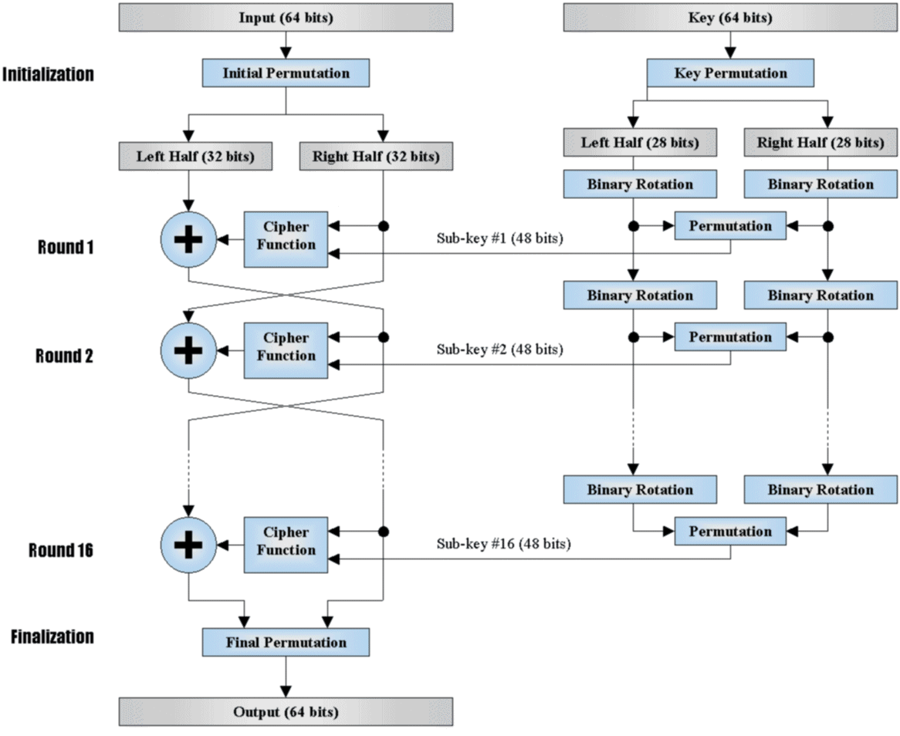

# rc4

利用rust实现的rc4算法，顺便熟练一下rust。

```rust
use std::io::{self, Write};

fn rc4(key: &[u8], plaintext: &[u8]) -> Vec<u8> 
{
    let mut s: [u8; 256] = [0; 256];
    let mut j = 0;
    
    for i in 0..256 {s[i] = i as u8;}
    
    for i in 0..256 
    {
        j = (j + s[i] + key[i % key.len()]) % 256;
        s.swap(i, j);
    }
    
    let mut i = 0;
    let mut j = 0;
    
    let mut ciphertext = Vec::with_capacity(plaintext.len());
    for &byte in plaintext 
    {
        i = (i + 1) % 256;
        j = (j + s[i]) % 256;
        s.swap(i, j);
        let k = s[(s[i] + s[j]) % 256];
        ciphertext.push(byte ^ k);
    }
    ciphertext
}

fn main() 
{
    let mut input = String::new();
    print!("Enter your key: ");
    io::stdout().flush().unwrap();
    io::stdin().read_line(&mut input).unwrap();
    let key = input.trim().as_bytes();

    input.clear();
    print!("Enter your text: ");
    io::stdout().flush().unwrap();
    io::stdin().read_line(&mut input).unwrap();
    let input = input.trim().as_bytes();

    let mut output = Vec::new();
    loop 
    {
        input.clear();
        print!("Do you want to encrypt (e) or decrypt (d) the text? ");
        io::stdout().flush().unwrap();
        io::stdin().read_line(&mut input).unwrap();
        let input = input.trim();
        if input == "e" 
        {
            output = rc4(key, input);
            println!("Encrypted text: {:?}", output);
            break;
        } 
        else if input == "d" 
        {
            output = rc4(key, input);
            println!("Decrypted text: {:?}", output);
            break;
        } 
        else 
        {
            println!("Invalid input!");
        }
    }
}
```

经典的对称加密的流密码，加密解密可以套用同一套公式。

## 密钥

真正参与运算加密的密钥是根据输入的密钥对数组进行初始化之后的数组数据，并未输入密钥直接参与运算。

## 密文

密文的产生是一个直接异或的结果，与明文进行异或的值是根据初始化之后的密钥数组进行位置交换、相加、定位后的值。

## 特征

- 对于s盒的初始化
- 相加定位后的异或
- %256
- ij位置的交换

# DES

参考：《图解密码技术》、https://www.ruanx.net/des/

对称密码、分组加密、基于 Feistel network （费斯妥网络：加密的各个步骤成为“轮”，整个加密过程就是若干次轮的循环）

分组长度：典型des加密分组长度为64位（8字节），不能整除用 PKCS7 / PKCS5 填充（一般）。基于这个网络的设计，可以重复足够多的轮次，而且可以保证解密）

密钥组成：长度64位，第8、16、24、32、40、48、56、64位是校验位，使得每个密钥都有奇数个1

流程图：



## 密钥

首先去掉特殊的8位，剩下的56位分成两组（28bit/组）

进行循环左移，按照一定的位数移动，两组都移动

## 密文


- 明文输入之后先进行分组，分为32+32bit的形式（一组64位，8字节）
- 一侧明文与【对应轮次产生的子密钥（局部密钥）和另一侧明文】产生的数组进行 xor
- 另一侧直接落下来

这样就组成了 “密文+明文” 这样的组合,这是一轮的加密，然后对于一个正常的加密就是将上述的结果交换左右，完事继续加密。


每次加密一半，第二次根据第一次加密的结果加密另一半。因为是通过的xor操作进行的加密，所以解密过程也很简单


## 3des

这个是为了防止des被短时间内爆破出来而做出的改进，就是将DES重复三次，所以他的密钥长度是168bit


这个3des可以在密钥相同的情况下等价于DES加密。

### 解密


利用相同位置的密钥，将加密和解密对调一下就可以。

# AES


