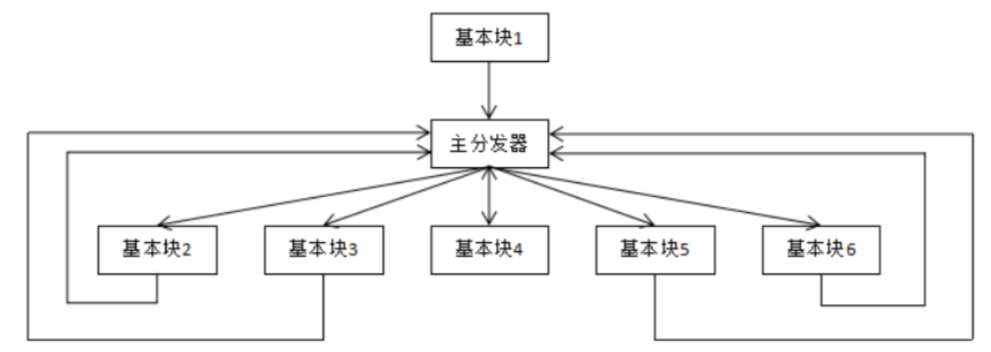
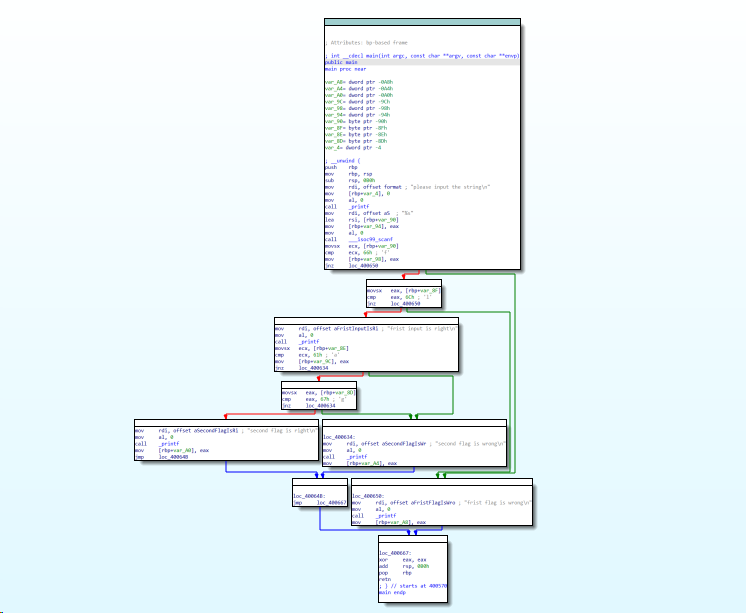
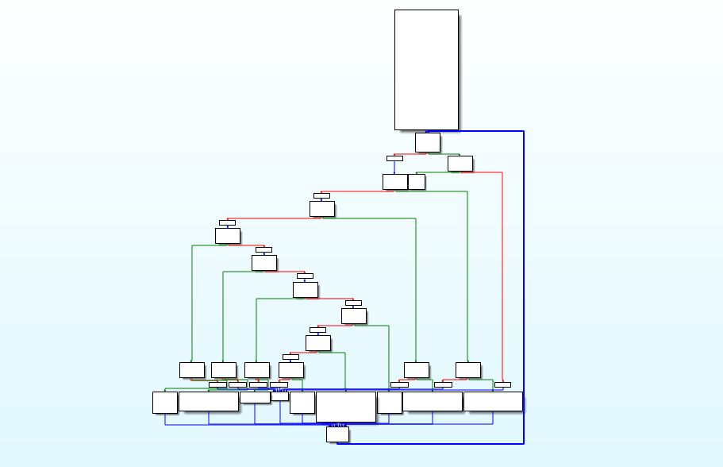
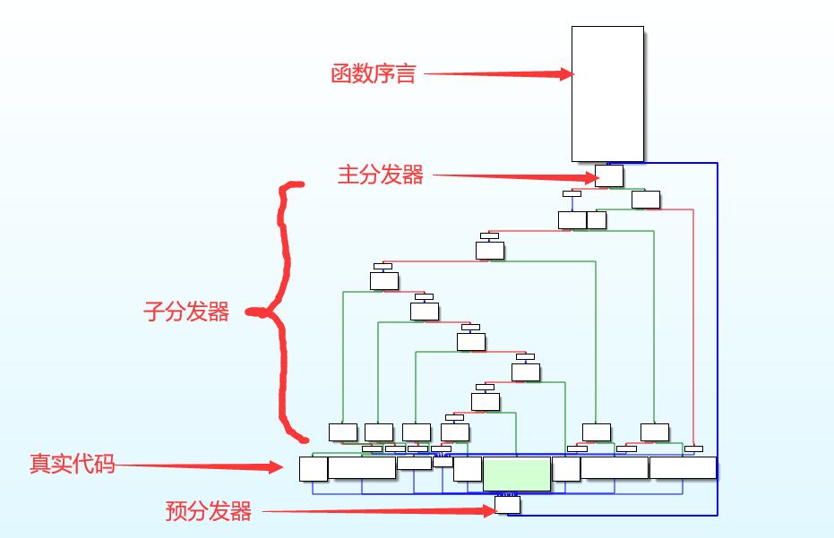

# 平坦化混淆

## 环境

- ubuntu18（Windows上尚未成功）
- `git clone https://github.com/obfuscator-llvm/obfuscator.git`
- 编译上述项目然后make all（耗时较长）
- `clang test.c -o test -mllvm -fla`

## 基本结构

这是在静态分析中最恶心的一种方式，因为没有完美的脚本可以完全去除混淆的影响

OLLVM中使用到的一种代码保护方式，它还有2个兄弟-**虚假控制流**和**指令替换**，这3种保护方式可以累加，对于静态分析来说混淆后代码非常复杂。

控制流平坦化的主要思想就是以**基本块**为单位，通过一个主分发器来控制程序的执行流程。类似于VMP保护的一种形式。这种保护的缺点是混淆之后的程序结构图格式非常固定，可以根据架构进行反推逆向。



while+switch的结构，其中的switch可以理解为主分发器。通过ida观察可以很清楚的发现流程图都是正方形或者长方形。

通过简单代码的对比，不难发现混淆之后的区别

会看到出现了很多的`while`和`if`，符合了开头那张图，主分发器进行程序控制，执行完一个小块后返回主分发器

## 测试代码

```c
#include<stdio.h>

int main()
{
	char input[128];
	printf("please input the string\n");
	scanf("%s", input);

	if(input[0] == 'f' && input[1] == 'l')
	{
		printf("frist input is right\n");
		if(input[2] == 'a' && input[3] == 'g')
		{
			printf("second flag is right\n");
		}
		else
		{
			printf("second flag is wrong\n");
		}
	}
	else
	{
		printf("frist flag is wrong\n");
	}

	return 0;
}
```

利用clang分别进行正常编译和混淆编译

- 正常编译



- 混淆编译



看到经过混淆的程序的CFG图已经很方正了


# deflat.py

复原程序主要会用到的脚本是`deflat.py`其中的主要原理就是angr。

## 脚本分析

这种脚本有很多的版本，这里随便找了一个版本来做，每一个版本的基本原理基本一致。这个是python3版本。

为了方便分析，已经把主要结构和会用到的函数合并到同一个代码里了。

```python
#!/usr/bin/env python3

import sys
sys.path.append("..")

import argparse
import angr
import pyvex
import claripy
import struct
from collections import defaultdict

import am_graph
from util import *

import logging
logging.getLogger('angr.state_plugins.symbolic_memory').setLevel(logging.ERROR)
# logging.getLogger('angr.sim_manager').setLevel(logging.DEBUG)
    

def get_relevant_nop_nodes(supergraph, pre_dispatcher_node, prologue_node, retn_node):
    # 创建 相关列表 和 nop列表 并且这俩列表返回到主函数
    relevant_nodes = []
    nop_nodes = []
    # 遍历超图中的每一个节点
    for node in supergraph.nodes():
        # 检查当前节点到pre_dispatcher_node是不是存在边，判断节点是否在关键执行路径上
        # 通过对节点的大小是不是大于8，来二次判断是不是有意义的节点，还是虚假的节点
        if supergraph.has_edge(node, pre_dispatcher_node) and node.size > 8:
            # XXX: use node.size is faster than to create a block
            relevant_nodes.append(node)
            continue

        # 对于不是相关节点的点，检查是否是应该排除的节点（与关键执行路径无关的代码）
        if node.addr in (prologue_node.addr, retn_node.addr, pre_dispatcher_node.addr):
            continue

        # 不是上述节点，则当作是可以进行nop的节点
        nop_nodes.append(node)
    return relevant_nodes, nop_nodes


def symbolic_execution(project, relevant_block_addrs, start_addr, hook_addrs=None, modify_value=None, inspect=False):

    def retn_procedure(state):
        # 删除先前使用 project.hook() 设置的挂钩。这里通过一个没有修改的hook达到遇见call直接返回的目的
        ip = state.solver.eval(state.regs.ip)
        project.unhook(ip)
        return

    # 在符号执行期间检查处于 angr 状态的语句
    def statement_inspect(state):
        # 提取正在检查的语句的表达式组成列表放到expressions中
        expressions = list(state.scratch.irsb.statements[state.inspect.statement].expressions)

        # 表达式列表的长度不为零且第一个表达式的类型为 pyvex.expr.ITE（表示 VEX 中间语言中的 if-then-else 表达式）
        if len(expressions) != 0 and isinstance(expressions[0], pyvex.expr.ITE):
            # 将 modify_value 分配给表示 angr 状态下的条件表达式的临时变量。来达到修改条件表达式的值的目的
            state.scratch.temps[expressions[0].cond.tmp] = modify_value
            # 删除为正在检查的语句设置的断点，以便将来不会对同一语句再次进行检查
            state.inspect._breakpoints['statement'] = []

    # 判断是否存在hook地址，默认不存在
    if hook_addrs is not None:
        # 根据不同的架构选择不同的长度
        skip_length = 4
        if project.arch.name in ARCH_X86:
            skip_length = 5

        # hook表中所有的跳转地址
        for hook_addr in hook_addrs:
            # 程序运行到这里跳转到hook
            project.hook(hook_addr, retn_procedure, length=skip_length)
    # 在起始地址 start_addr 处初始化空白状态并删除 LAZY_SOLVES 选项
    
    state = project.factory.blank_state(addr=start_addr, remove_options={angr.sim_options.LAZY_SOLVES})

    # 如果 inspect 为 True，则在每个语句处设置一个断点，以允许在每个语句处检查程序状态
    if inspect:
        # 当符号执行到达语句执行事件时，会调用statement_inspect函数；根据modify_value参数修改正在执行的语句中的ITE表达式
        state.inspect.b('statement', when=angr.state_plugins.inspect.BP_BEFORE, action=statement_inspect)
    
    # 从给定的 start_addr 开始执行符号执行
    sm = project.factory.simulation_manager(state)
    # 一步一步的来执行，方便控制
    sm.step()
    while len(sm.active) > 0:
        for active_state in sm.active:
            # 状态到达 relevant_block_addrs 中的地址之一，则返回该地址
            if active_state.addr in relevant_block_addrs:
                return active_state.addr
        sm.step()
    # 没有任何状态到达 relevant_block_addrs 中，则返回 None
    return None


def fill_nop(data, start_addr, length, arch):
    # 先判断程序架构是x86还是arm
    if arch.name in ARCH_X86:
        # 遍历地址，将nop指令转换成字节码写进去
        for i in range(0, length):
            data[start_addr + i] = ord(OPCODES['x86']['nop'])
    elif arch.name in ARCH_ARM | ARCH_ARM64:
        # 同上
        if arch.name in ARCH_ARM:
            nop_value = OPCODES['arm']['nop']
        else:
            nop_value = OPCODES['arm64']['nop']

        # 判断大小端序
        if arch.memory_endness == "Iend_BE":
            nop_value = nop_value[::-1]
        # arm架构的对其特性，x86就没这毛病
        for i in range(0, length, 4):
            data[start_addr+i] = nop_value[0]
            data[start_addr+i+1] = nop_value[1]
            data[start_addr+i+2] = nop_value[2]
            data[start_addr+i+3] = nop_value[3]


def ins_j_jmp_hex_x86(cur_addr, target_addr, j_cond):
    # 获得跳转指令的字节码
    if j_cond == 'jmp':
        j_opcode = OPCODES['x86']['jmp']
        j_ins_size = 5
    else:
        j_opcode = OPCODES['x86']['j'] + OPCODES['x86'][j_cond]
        j_ins_size = 6

    # 计算跳转的偏移
    jmp_offset = target_addr - cur_addr - j_ins_size
    # 计算跳转在程序中的真正偏移(计算上指令本身)
    patch_ins_hex = j_opcode + struct.pack('<i', jmp_offset)
    return patch_ins_hex


def ins_b_jmp_hex_arm(cur_addr, target_addr, b_cond):
    b_offset = (target_addr - cur_addr - 4*2) // 4
    patch_ins_hex = struct.pack('<i', b_offset)[:-1] + OPCODES['arm'][b_cond]
    return patch_ins_hex


def ins_b_jmp_hex_arm64(cur_addr, target_addr, b_cond):
    if b_cond == 'b':
        # reference: https://blog.csdn.net/qianlong4526888/article/details/8247219
        if cur_addr > target_addr:
            patch_ins_hex = struct.pack('<I', ((0x14000000 | 0x03ffffff) - (cur_addr - target_addr) // 4))
        else:
            patch_ins_hex = struct.pack('<I', ((0x14000000 & 0xfc000000) + (target_addr - cur_addr) // 4))
    else:
        offset = (((target_addr - cur_addr) // 4) << 5) & 0x00ffffe0
        # XXX: The oppisite cond should be used instead of the original cond for aarch64/arm64
        opcode = OPCODES['arm64']['b_cond'][b_cond.lower()]
        if opcode % 2 == 0:
            opcode += 1
        else:
            opcode -= 1
        patch_ins_hex = struct.pack('<I', 0x54000000 | offset | opcode)
    return patch_ins_hex


def patch_instruction(data, offset, value):
    for i in range(len(value)):
        data[offset+i] = value[i]


def calc_md5(file):
    return hashlib.md5(open(file,'rb').read()).hexdigest()


def main():
    # 获取参数列表，从得到要开始反平坦化的开始地址
    parser = argparse.ArgumentParser(description="deflat control flow script")
    parser.add_argument("-f", "--file", help="binary to analyze")
    parser.add_argument(
        "--addr", help="address of target function in hex format")
    args = parser.parse_args()

    if args.file is None or args.addr is None:
        parser.print_help()
        sys.exit(0)

    filename = args.file
    start = int(args.addr, 16)

    # angr常规起手式，创建project类，默认不载入库程序
    project = angr.Project(filename, load_options={'auto_load_libs': False})
    # 执行规范化以避免重叠块，禁用force_complete_scan以避免可能的“错误”块
    cfg = project.analyses.CFGFast(normalize=True, force_complete_scan=False)
    # 得到起始地址的函数块的函数对象
    target_function = cfg.functions.get(start)
    # 得到一个看起来像IDA Pro的CFG的图
    supergraph = am_graph.to_supergraph(target_function.transition_graph)
    # 向下舍入到最接近的4kb的倍数 （将低12位设置为0）
    base_addr = project.loader.main_object.mapped_base >> 12 << 12

    # 获取函数序言和函数尾声（push 和 ret）
    # 遍历图中的每个节点
    prologue_node = None
    for node in supergraph.nodes():
        # 找到函数序言的节点（函数执行的第一个基本块）
        # in_degree方法返回节点的“入边数”，没有入边，就是第一个块
        if supergraph.in_degree(node) == 0:
            prologue_node = node
        # 找到函数尾声
        # 检查块的出边，为0则说明是最后一个；检查有没有条件分支离开。同时满足为尾声
        if supergraph.out_degree(node) == 0 and len(node.out_branches) == 0:
            retn_node = node

    # 程序是否找到了开始节点；判断程序计算出来的函数序言和给出的地址是不是相等
    # 其实就是对输入的一个验证和对angr本身能不能跑的一个验证
    if prologue_node is None or prologue_node.addr != start:
        print("Something must be wrong...")
        sys.exit(-1)

    # 在平坦化中，首先要经过一个调度器去执行代码，所以这里检索紧跟在函数序言之后的节点列表，并得到其中的第一个作为调度节点
    main_dispatcher_node = list(supergraph.successors(prologue_node))[0]
    # 遍历 main_dispatcher_node 的每个前驱节点
    # 找到紧接在主调度程序节点之前的节点，该节点通常是根据输入状态为调度程序设置参数的节点。
    for node in supergraph.predecessors(main_dispatcher_node):
        # 检查节点的地址是否与函数序言的地址不同，用于排除可能由于不相关的分支而被包含的节点，获得预调度器
        if node.addr != prologue_node.addr:
            pre_dispatcher_node = node
            break

    # 得到路径块中的相关节点和可以nop的节点（虚假控制流块）
    relevant_nodes, nop_nodes = get_relevant_nop_nodes(supergraph, pre_dispatcher_node, prologue_node, retn_node)

    print('*******************relevant blocks************************')
    print('prologue: %#x' % start)  # 函数序言的地址
    print('main_dispatcher: %#x' % main_dispatcher_node.addr)   # 主分发器
    print('pre_dispatcher: %#x' % pre_dispatcher_node.addr)     # 预调度器
    print('retn: %#x' % retn_node.addr)                         # 返回地址        
    relevant_block_addrs = [node.addr for node in relevant_nodes]   # 相关节点块的地址
    print('relevant_blocks:', [hex(addr) for addr in relevant_block_addrs]) # 相关块地址显示

    # 符号执行
    print('*******************symbolic execution*********************')
    # 先创建一个相关节点的备份
    relevants = relevant_nodes
    # 将 prologue_node 和 retn_node 附加到 relevant_nodes 中
    relevants.append(prologue_node)
    relevants_without_retn = list(relevants)
    relevants.append(retn_node)
    # 使用 prologue_node 和 retn_node 的地址更新 relevant_block_addrs 列表。 该列表包含所有相关基本块的地址，包括 prologue_node 和 retn_node。
    relevant_block_addrs.extend([prologue_node.addr, retn_node.addr])

    # 流变量被初始化为 defaultdict 对象。 这是一个类似字典的对象，在第一次访问新键时会自动将它们初始化为一个空列表。该变量用于跟踪相关基本块之间的控制流。
    flow = defaultdict(list)
    patch_instrs = {}
    # 遍历相关节点中的所有节点，不包括返回函数尾声
    for relevant in relevants_without_retn:
        print('-------------------dse %#x---------------------' % relevant.addr)
        # 每一块当作一个block，创建一个工厂，设置地址和大小
        block = project.factory.block(relevant.addr, size=relevant.size)
        # 设置的一个标志位，检查当前块是否有分支
        has_branches = False
        # 设置一个需要hook地址字典
        hook_addrs = set([])
        # 遍历当前块中的指令，利用capstone将字节转为汇编代码
        for ins in block.capstone.insns:
            # 判断当前环境是x86还是arm
            # 基本指令块中是否有任何条件分支（如 cmov 或 mov）或函数调用（如 call 或 bl）
            if project.arch.name in ARCH_X86:
                if ins.insn.mnemonic.startswith('cmov'):
                    # 只记录第一个指令分支
                    if relevant not in patch_instrs:
                        patch_instrs[relevant] = ins
                        # 将标志 has_branches 设置为 True
                        has_branches = True
                # 将调用跳转指令的地址记录到hook元组中
                elif ins.insn.mnemonic.startswith('call'):
                    hook_addrs.add(ins.insn.address)
            # 判断当前环境是x86还是arm，三块代码的思路是一样的，只不过架构不同
            elif project.arch.name in ARCH_ARM:
                if ins.insn.mnemonic != 'mov' and ins.insn.mnemonic.startswith('mov'):
                    if relevant not in patch_instrs:
                        patch_instrs[relevant] = ins
                        has_branches = True
                elif ins.insn.mnemonic in {'bl', 'blx'}:
                    hook_addrs.add(ins.insn.address)
            # 判断当前环境是x86还是arm
            elif project.arch.name in ARCH_ARM64:
                if ins.insn.mnemonic.startswith('cset'):
                    if relevant not in patch_instrs:
                        patch_instrs[relevant] = ins
                        has_branches = True
                elif ins.insn.mnemonic in {'bl', 'blr'}:
                    hook_addrs.add(ins.insn.address)

        if has_branches:
            # relevant_block_addrs 参数是已经探索过的相关块地址的列表。 这用于避免重新探索已经探索过的块
            # claripy.BVV 参数表示用于指导符号执行的位向量值。 在这里，它用于指定分支的方向，0 表示正向，1 表示逆向执行。
            tmp_addr = symbolic_execution(project, relevant_block_addrs, relevant.addr, hook_addrs, claripy.BVV(1, 1), True)
            if tmp_addr is not None:
                flow[relevant].append(tmp_addr)
            tmp_addr = symbolic_execution(project, relevant_block_addrs, relevant.addr, hook_addrs, claripy.BVV(0, 1), True)
            if tmp_addr is not None:
                flow[relevant].append(tmp_addr)
        else:
            # 当前节点没有任何分支，它只使用节点地址和挂钩地址调用 symbolic_execution 一次。 生成的地址以当前节点为键添加到流字典中。
            tmp_addr = symbolic_execution(project, relevant_block_addrs, relevant.addr, hook_addrs)
            if tmp_addr is not None:
                flow[relevant].append(tmp_addr)

    print('************************flow******************************')
    for k, v in flow.items():
        print('%#x: ' % k.addr, [hex(child) for child in v])

    print('%#x: ' % retn_node.addr, [])

    print('************************patch*****************************')
    # 打开目标程序，准备进行patch
    with open(filename, 'rb') as origin:
        # 无法通过直接调用decode（）转换为str。因此改用字节数组。
        origin_data = bytearray(origin.read())
        origin_data_len = len(origin_data)

    # 设置新程序名称，并打开新函数名称
    recovery_file = filename + '_recovered'
    recovery = open(recovery_file, 'wb')

    # 修补垃圾块
    for nop_node in nop_nodes:
        fill_nop(origin_data, nop_node.addr-base_addr, nop_node.size, project.arch)

    # 删除不必要的控制流
    for parent, childs in flow.items():
        if len(childs) == 1:
            parent_block = project.factory.block(parent.addr, size=parent.size)
            last_instr = parent_block.capstone.insns[-1]
            file_offset = last_instr.address - base_addr
            # 将最后一条指令修补到jmp
            if project.arch.name in ARCH_X86:
                fill_nop(origin_data, file_offset, last_instr.size, project.arch)
                # 计算跳转指令要跳转的新地址,和程序中的指令patch方式
                patch_value = ins_j_jmp_hex_x86(last_instr.address, childs[0], 'jmp')
            elif project.arch.name in ARCH_ARM:
                # 同上
                patch_value = ins_b_jmp_hex_arm(last_instr.address, childs[0], 'b')
                if project.arch.memory_endness == "Iend_BE":
                    patch_value = patch_value[::-1]
            elif project.arch.name in ARCH_ARM64:
                # FIXME: For aarch64/arm64, the last instruction of prologue seems useful in some cases, so patch the next instruction instead.
                # 同上
                if parent.addr == start:
                    file_offset += 4
                    patch_value = ins_b_jmp_hex_arm64(last_instr.address+4, childs[0], 'b')
                else:
                    patch_value = ins_b_jmp_hex_arm64(last_instr.address, childs[0], 'b')
                if project.arch.memory_endness == "Iend_BE":
                    patch_value = patch_value[::-1]
            # 利用上述计算好的各种便宜地址啥的 更新 程序内容
            patch_instruction(origin_data, file_offset, patch_value)

        else:
            instr = patch_instrs[parent]
            file_offset = instr.address - base_addr
            # 从“cmovx”开始到块末尾的修补程序指令
            fill_nop(origin_data, file_offset, parent.addr + parent.size - base_addr - file_offset, project.arch)
            
            # 将cmovx指令修补为jx指令,实现了修改程序控制流的目的,改回正常的
            if project.arch.name in ARCH_X86:
                patch_value = ins_j_jmp_hex_x86(instr.address, childs[0], instr.mnemonic[len('cmov'):])
                patch_instruction(origin_data, file_offset, patch_value)

                file_offset += 6
                # 将下一条指令修补到jmp指令
                patch_value = ins_j_jmp_hex_x86(instr.address+6, childs[1], 'jmp')
                patch_instruction(origin_data, file_offset, patch_value)
            
            # 下面的都是基于arm的,需要考虑的比较多,但是基本思路一样
            elif project.arch.name in ARCH_ARM:
                # 将movx指令修补为bx指令
                bx_cond = 'b' + instr.mnemonic[len('mov'):]
                patch_value = ins_b_jmp_hex_arm(instr.address, childs[0], bx_cond)
                if project.arch.memory_endness == 'Iend_BE':
                    patch_value = patch_value[::-1]
                patch_instruction(origin_data, file_offset, patch_value)

                file_offset += 4
                # 将下一条指令修补为 b 指令
                patch_value = ins_b_jmp_hex_arm(instr.address+4, childs[1], 'b')
                if project.arch.memory_endness == 'Iend_BE':
                    patch_value = patch_value[::-1]
                patch_instruction(origin_data, file_offset, patch_value)
            
            elif project.arch.name in ARCH_ARM64:
                # 修补 cset.xx 指令到 bx 指令
                bx_cond = instr.op_str.split(',')[-1].strip()
                patch_value = ins_b_jmp_hex_arm64(instr.address, childs[0], bx_cond)
                if project.arch.memory_endness == 'Iend_BE':
                    patch_value = patch_value[::-1]
                patch_instruction(origin_data, file_offset, patch_value)

                file_offset += 4
                # 将下一条指令修补为 b 指令
                patch_value = ins_b_jmp_hex_arm64(instr.address+4, childs[1], 'b')
                if project.arch.memory_endness == 'Iend_BE':
                    patch_value = patch_value[::-1]
                patch_instruction(origin_data, file_offset, patch_value)

    assert len(origin_data) == origin_data_len, "Error: size of data changed!!!"
    # 将新内容写进去，关闭文件
    recovery.write(origin_data)
    recovery.close()
    print('Successful! The recovered file: %s' % recovery_file)


if __name__ == '__main__':
    main()

```

# 分析

该主要是使用了`angr符号执行`的一些方式。具体思路可以总结为按照平坦化混淆之后的CFG结构来进行反混淆，这种方式对于混淆的手法有一定的依赖性，如果微调混淆结构，那么这个脚本就寄了。或者不能高度还原了。

## 顺序

定位序言快，结束快，真实代码快。剩下的就是垃圾快

- 函数的开始地址为序言的地址
- 序言的**后继为主分发器**
- 后继为主分发器的块为预处理器
- **后继为预处理器的块为真实块**
- **无后继的块为retn块**
- 剩下的为无用块



这里可以充分利用ida里的 **synchronize with** 功能，然后点击下面的真实代码，就可以在伪c代码中定位到相关的代码了。

## CFG

程序控制流图CFG

angr中的CFG分为2种：

- `CFGFast`
- `CFGAccurate`

两者的区别在于前者计算的东西更少，从而也就更快。一般情况下`CFGFast`就够了，但在研究中若要依靠`CFG`进一步分析的话可能就需要~了，更精准当然也就更慢

`CFG()`是`CFGFast()`的子类，也就是在`CFGFast()`基础上的一个包装。利用CGF将程序变成二维之后，就可以后续找块找边了。

## 找头尾

```python
    # 获取函数序言和函数尾声（push 和 ret）
    # 遍历图中的每个节点
    prologue_node = None
    for node in supergraph.nodes():
        # 找到函数序言的节点（函数执行的第一个基本块）
        # in_degree方法返回节点的“入边数”，没有入边，就是第一个块
        if supergraph.in_degree(node) == 0:
            prologue_node = node
        # 找到函数尾声
        # 检查块的出边，为0则说明是最后一个；检查有没有条件分支离开。同时满足为尾声
        if supergraph.out_degree(node) == 0 and len(node.out_branches) == 0:
            retn_node = node
```

这里通过判断一个节点有没有入边或者出边来判断，**头节点没有入边，尾节点没有出边**，这个边的概念在fuzz中有明确的解释和定义，用的也更多一些。

然后将定位到的头节点（序言）和给出地址是否一致，不一致就报错

```python
    # 在平坦化中，首先要经过一个调度器去执行代码，所以这里检索紧跟在函数序言之后的节点列表，并得到其中的第一个作为调度节点
    main_dispatcher_node = list(supergraph.successors(prologue_node))[0]
    # 遍历 main_dispatcher_node 的每个前驱节点
    # 找到紧接在主调度程序节点之前的节点，该节点通常是根据输入状态为调度程序设置参数的节点。
    for node in supergraph.predecessors(main_dispatcher_node):
        # 检查节点的地址是否与函数序言的地址不同，用于排除可能由于不相关的分支而被包含的节点，获得预调度器
        if node.addr != prologue_node.addr:
            pre_dispatcher_node = node
            break
```

## 找到有用块

一般脚本都是通过从块中提取出有用项，将剩下的作为无用项的工作方法。

- 针对`call`指令：通过`hook`后`unhook` 的形式直接返回，防止符号执行跑出指定范围

```python
    def retn_procedure(state):
 # 删除先前使用 project.hook() 设置的挂钩。这里通过一个没有修改的hook达到遇见call直接返回的目的
        ip = state.solver.eval(state.regs.ip)
        project.unhook(ip)
        return
```

- 发现合法块的主要代码

```python
# 遍历相关节点中的所有节点，不包括返回函数尾声
    for relevant in relevants_without_retn:
        print('-------------------dse %#x---------------------' % relevant.addr)
        # 每一块当作一个block，创建一个工厂，设置地址和大小
        block = project.factory.block(relevant.addr, size=relevant.size)
        # 设置的一个标志位，检查当前块是否有分支
        has_branches = False
        # 设置一个需要hook地址字典
        hook_addrs = set([])
        # 遍历当前块中的指令，利用capstone将字节转为汇编代码
        for ins in block.capstone.insns:
            # 基本指令块中是否有任何条件分支（如 cmov 或 mov）或函数调用（如 call 或 bl）
            if project.arch.name in ARCH_X86:
                if ins.insn.mnemonic.startswith('cmov'):
                    # 只记录第一个指令分支
                    if relevant not in patch_instrs:
                        patch_instrs[relevant] = ins
                        # 将标志 has_branches 设置为 True
                        has_branches = True
                elif ins.insn.mnemonic.startswith('call'):
                    hook_addrs.add(ins.insn.address)
            elif project.arch.name in ARCH_ARM:
                if ins.insn.mnemonic != 'mov' and ins.insn.mnemonic.startswith('mov'):
                    if relevant not in patch_instrs:
                        patch_instrs[relevant] = ins
                        has_branches = True
                elif ins.insn.mnemonic in {'bl', 'blx'}:
                    hook_addrs.add(ins.insn.address)
            elif project.arch.name in ARCH_ARM64:
                if ins.insn.mnemonic.startswith('cset'):
                    if relevant not in patch_instrs:
                        patch_instrs[relevant] = ins
                        has_branches = True
                elif ins.insn.mnemonic in {'bl', 'blr'}:
                    hook_addrs.add(ins.insn.address)
        # 有分支会用两次来执行，分别走两个路径
        if has_branches:
            tmp_addr = symbolic_execution(project, relevant_block_addrs, relevant.addr, hook_addrs, claripy.BVV(1, 1), True)
            if tmp_addr is not None:
                flow[relevant].append(tmp_addr)
            tmp_addr = symbolic_execution(project, relevant_block_addrs, relevant.addr, hook_addrs, claripy.BVV(0, 1),True)
            if tmp_addr is not None:
                flow[relevant].append(tmp_addr)
        else:
            tmp_addr = symbolic_execution(project, relevant_block_addrs, relevant.addr, hook_addrs)
            if tmp_addr is not None:
                flow[relevant].append(tmp_addr)
```

把注释删了方便看。通过一个大循环，遍历所有的代码块，然后同时遍历代码块中的代码。如果遇到分支块就进行两次符号执行来遍历所有路径。

程序利用`relevant_block_addrs`列表存储了所有的有效代码块，他的检查原理是

```python
    # 遍历超图中的每一个节点
    for node in supergraph.nodes():
        # 检查当前节点到pre_dispatcher_node是不是存在边，判断节点是否在关键执行路径上
        # 通过对节点的大小是不是大于8，来二次判断是不是有意义的节点，还是虚假的节点
        if supergraph.has_edge(node, pre_dispatcher_node) and node.size > 8:
            # XXX: use node.size is faster than to create a block
            relevant_nodes.append(node)
            continue
```

两个判断条件

- 当前节点和预处理器是不是存在边（有效块是存在的，除了retn块）
- 节点的大小是不是>8

来对挑选出有效块，然后来到上面这个嵌套循环的代码中。

关于`symbolic_execution`函数，最后一个参数来判断是不是存在分支，倒数第二个参数判断分支走向（t or f）

```python
def symbolic_execution(project, relevant_block_addrs, start_addr, hook_addrs=None, modify_value=None, inspect=False):
    def retn_procedure(state):
        # 删除先前使用 project.hook() 设置的挂钩。这里通过一个没有修改的hook达到遇见call直接返回的目的
        ip = state.solver.eval(state.regs.ip)
        project.unhook(ip)
        return

    # 在符号执行期间检查处于 angr 状态的语句
    def statement_inspect(state):
        # 提取正在检查的语句的表达式组成列表放到expressions中
        expressions = list(state.scratch.irsb.statements[state.inspect.statement].expressions)
        # 表达式列表的长度不为零且第一个表达式的类型为 pyvex.expr.ITE（表示 VEX 中间语言中的 if-then-else 表达式）
        if len(expressions) != 0 and isinstance(expressions[0], pyvex.expr.ITE):
            # 将 modify_value 分配给表示 angr 状态下的条件表达式的临时变量。来达到修改条件表达式的值的目的
            state.scratch.temps[expressions[0].cond.tmp] = modify_value
            # 删除为正在检查的语句设置的断点，以便将来不会对同一语句再次进行检查
            state.inspect._breakpoints['statement'] = []

    # 判断是否存在hook地址，默认不存在
    if hook_addrs is not None:
        # 根据不同的架构选择不同的长度
        skip_length = 4
        if project.arch.name in ARCH_X86:
            skip_length = 5

        # hook表中所有的跳转地址
        for hook_addr in hook_addrs:
            # 程序运行到这里跳转到hook
            project.hook(hook_addr, retn_procedure, length=skip_length)
    # 在起始地址 start_addr 处初始化空白状态并删除 LAZY_SOLVES 选项

    state = project.factory.blank_state(addr=start_addr, remove_options={angr.sim_options.LAZY_SOLVES})

    # 如果 inspect 为 True，则在每个语句处设置一个断点，以允许在每个语句处检查程序状态
    if inspect:
        # 当符号执行到达语句执行事件时，会调用statement_inspect函数；根据modify_value参数修改正在执行的语句中的ITE表达式
        state.inspect.b('statement', when=angr.state_plugins.inspect.BP_BEFORE, action=statement_inspect)

    # 从给定的 start_addr 开始执行符号执行
    sm = project.factory.simulation_manager(state)
    # 一步一步的来执行，方便控制
    sm.step()
    while len(sm.active) > 0:
        for active_state in sm.active:
            # 状态到达 relevant_block_addrs 中的地址之一，则返回该地址
            if active_state.addr in relevant_block_addrs:
                return active_state.addr
        sm.step()
    # 没有任何状态到达 relevant_block_addrs 中，则返回 None
    return None
```

后续代码中通过单步步过来判断地址是否在有效块地址中，来修复块之间的流程关系。

```python
 # 从给定的 start_addr 开始执行符号执行
    sm = project.factory.simulation_manager(state)
    # 一步一步的来执行，方便控制
    sm.step()
    while len(sm.active) > 0:
        for active_state in sm.active:
            # 状态到达 relevant_block_addrs 中的地址之一，则返回该地址
            if active_state.addr in relevant_block_addrs:
                return active_state.addr
        sm.step()
    # 没有任何状态到达 relevant_block_addrs 中，则返回 None
```


## 修复流程图

修复流程图的思路是通过将垃圾块进行`nop`填充，然后重新连接真实代码块。

- 无跳转的真实代码块后添加`jmp`指令跳转到下一个真实块
- 有跳转代码块：将`CMOV`指令改成相应的条件跳转指令跳向符合条件的分支，再在这条之后添加`JMP`指令跳向另一分支

完事就能得到一个被修复的代码结构了，但是可能会导致堆栈不平衡，如果平坦化时利用了堆栈或者脚本运行并不那么靠谱。

# 缺点

[参考](https://www.wireghost.cn/2020/08/28/OLLVM%E9%80%9A%E7%94%A8%E5%8F%8D%E5%B9%B3%E5%9D%A6%E5%8C%96%E7%A0%94%E7%A9%B6/#%E5%8F%8D%E6%B7%B7%E6%B7%86%E7%9A%84%E5%9F%BA%E6%9C%AC%E6%80%9D%E6%83%B3)这位师傅的博客发现这种方式的缺点，之前在运用中确实用到过这些问题，但是并没有去研究观察过。

这篇文章提出了几个问题：

- angr对arm64指令集的支持不大行
- 当前的反混淆模式是基于结构特征的，当多次混淆之后就失效了。
- patch程序和nop的方式针对简单程序是好用的，但是*当一个真实块拥有三个及以上后继节点（通常是一个公共基本块）时，就无法直接patch。*
  - 可以通过保存真实块然后重构函数体的关系解决，但是这需要半手动半自动的方式解决。

最后这个师傅给出的解决办法是 利用`Unicorn`模拟执行框架，记录真实代码块进行复原。有机会研究研究。

