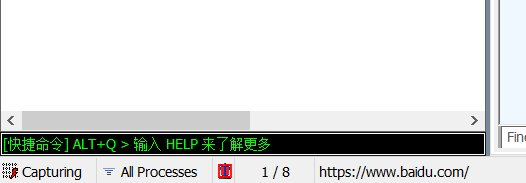
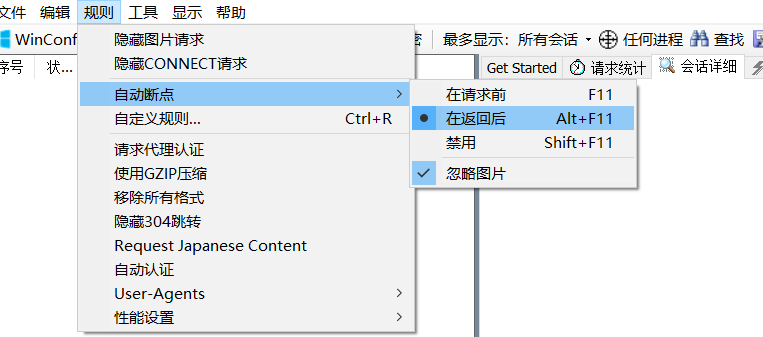

# 工作原理

以代理web服务器的形式工作的，它使用代理地址:127.0.0.1，端口:8888。

 当Fiddler退出的时候它会自动注销， 这样就不会影响别的程序。不过如果Fiddler非正常退出，这时候因为Fiddler没有自动注销，会造成网页无法访问。 解决的办法是重新启动下Fiddler。

正常退出：


[Fiddler 汉化包插件任意版本可用](https://blog.tzhhone.cn/app/373.html)


# 配置

## 为什么配置

不配置你抓不到包，更解析不到https请求包，那等于没用

## 配置过程

实质上就是给浏览器安装一个证书（PC端抓包），移动端抓包也一样，安装fiddler的证书

### 证书生成

工具--->选项


勾选下面的解密https，弹窗选中yes


然后一直选是，之后看到下面的选项，全选之后，点击Actions


选中这个选项，然后就在桌面上生成一个证书


### 证书导入

将证书导入到浏览器或者是手机目录下

这里用edge为例


选“受信任的根证书######”，然后导入刚刚的证书就可以了。

这时就可以进行抓包了，会自动显示浏览器里的包，但是如果这时发现全是http包，没有https的化，还是回到这个界面


把decrypt https和下面的两个选上，然后点击ok，就可以看到https包了


# 使用方式

## 窗口作用


大致可以看作三个模块，左边是会话列表，下面是命令行，右边的上面是客户端请求，下面的服务器响应。

### 会话列表


**Result** : HTTP响应的状态

**Protocol**：请求使用的协议（如HTTP/HTTPS）

**HOST**：请求地址的域名/ip

**URL**：请求的服务器路径和文件名，也包含GET参数

**BODY**：请求的大小，以byte为单位

**Content-Type**：请求响应的类型

**Caching**：请求的缓存过期时间或缓存控制header的值

**Process**：发出此请求的Windows进程及进程ID

**Comments** ：用户通过脚本或者菜单给此session增加的备注

**custom**：用户可以通过脚本设置的自定义值

这里直接中英备注，不是所有时候都能拿到中文的fiddler

### 请求列表


网格视图可以很简单的查看键值关系

### 响应列表


工具栏的作用基本和请求列表的作用相同，但是这里是服务器的回应。

上图是抓到的itest的响应，可以看到时间等一系列的信息

## 设置过滤

### 过滤host


这里找到工具栏的Filters，然后点击使用过滤，写上要接受的host的地址，多个地址的话用分号隔开。


这样fiddler只能抓到指定host的数据包了，但是用完记得取消。

### 过滤特点URL

抓包很全面，把图片，图标全都抓到了，分析起来很困难，所以设置一下让他直接忽略那些不重要的东西

```
REGEX:(?insx)/[^\?&]*\.(css|ico|jpg|png|gif|bmp|wav|js)(\?.*)?$

```

这里直接正则表达式过滤

如下图进行使用


也可以用


这个功能，删除特定的数据包，方便分析。

**最后别忘了点击右上角的Action里的run，不然就白设置了。**

## 断点和重放

### 两种断点

- before response：这个是打在request请求的时候，未到达服务器之前



点一下这个框，变成红色，就是设置了请求断点。拦截了请求包。


- after response：也就是服务器响应之后，在Fiddler将响应传回给客户端之前

上述地方再点一下，就变成了响应断点


另一种方式



也可以在这里设置断点。

还可以

```
bpu https://www.baidu.com/”
```

回车执行，接下来就会中断URL中包含此地址的请求。

输入bpu进行取消。

### 修改包内容

断点段下来之后，就可以修改包的内容

这里用itest为例

在断点断下包之后，直接在这个界面就可以修改


这里把history改成false，或者后面改成1，都会看到不同的现象。

同理，下响应断点也可以修改服务器端响应的内容。