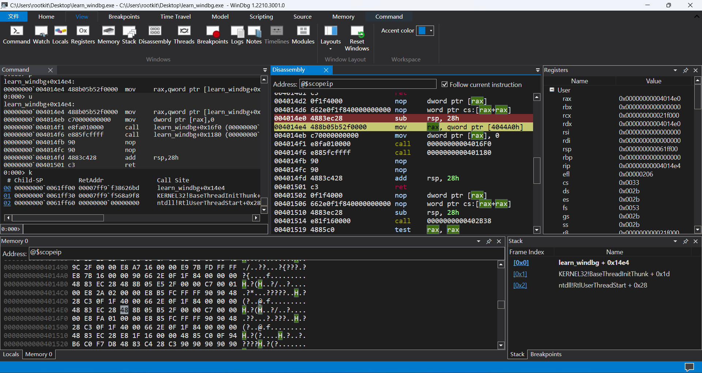
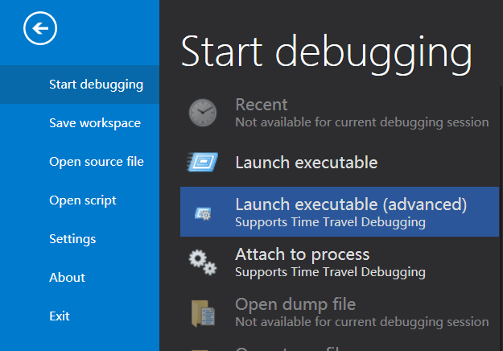
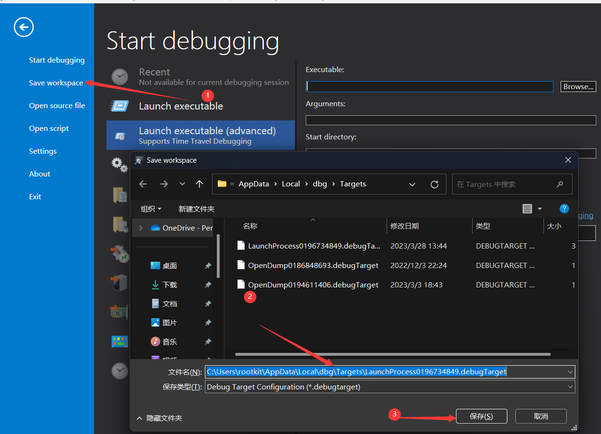
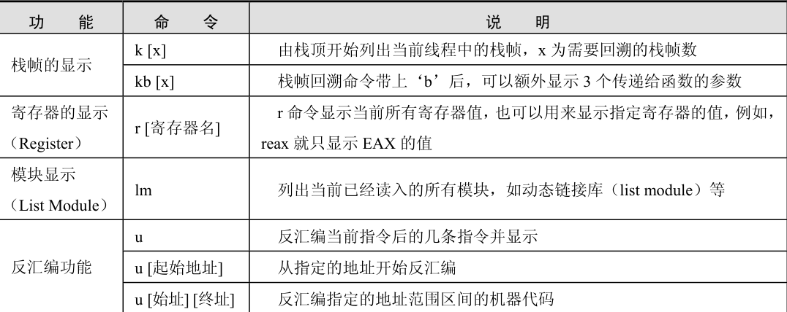
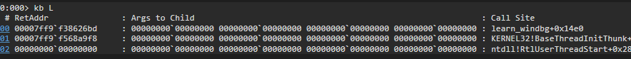
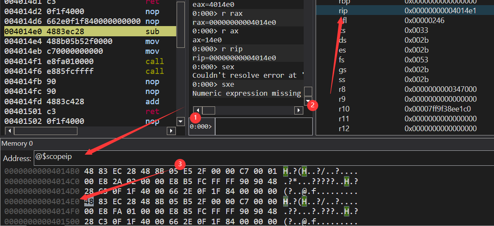
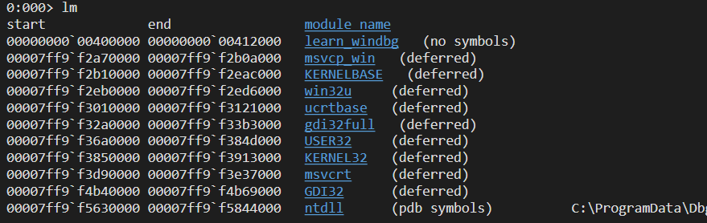
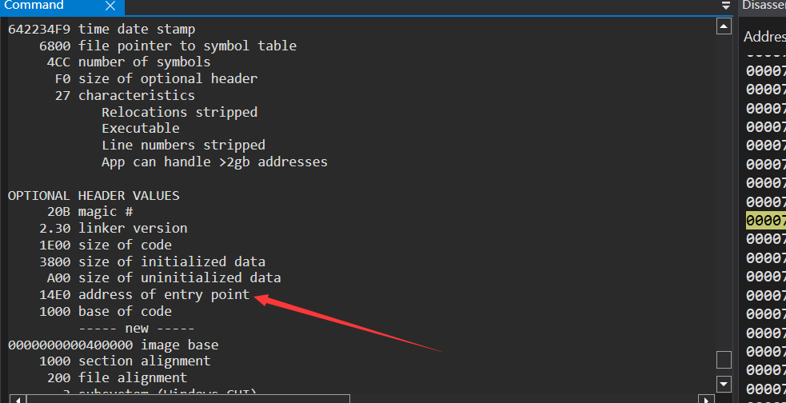
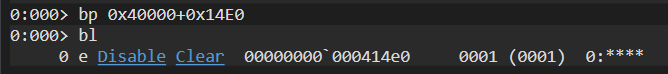
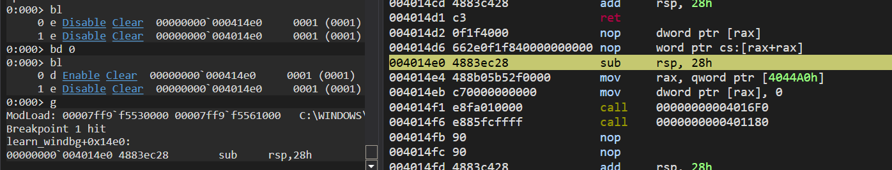

记录windbg的常用命令和调试方法，没有中文版，全是英文，比较难受。使用起来类似于Windows上的gdb调试。

# 窗口设置

windbg初始窗口设置比较单一，无法满足正常的调试需要，所以需要补充几个窗口：

最终结果：



主题比较单一，就一个亮模式一个暗模式。可以从工具栏的`view`窗口来添加窗口。常用窗口：

- 寄存器：register

  所有的值可以在双击后更改

- 反汇编：disassemble

  f9：下断点；f10相当于f8：单步步过；f11相当于f7：单步步进。

  shift+f11：运行完当前函数，相当于fini

- 栈：stack

  更加用户友好了，不会很乱

- 看到左下角有一个locals窗口，这个和vs调试窗口一样，可以显示局部变量。

- 内存：memory，可以设置多个内存窗口，但是会比较拥挤。

  把之前的删了，直接输入地址就可以自动跳转到相关地址，可以实现`在内存中转到`。

从文件选项中可以载入程序，或者附加进程，或者附加其他的东西，比如内核和远程调试



设置好界面之后，可以将当前的配置进行保存，方便之后一直使用而不用重新设计。



# 常用命令

## 1、标准命令

## 调试

t 或者 F11  ===>  单步，遇到函数跟进（step into）
p 或者 F10 单步  ===>  遇到函数跳过（step over）

Shift + F11  ===>  跳出当前函数（step out）.

## 执行：go

g [地址|函数名]  ===>  持续执行到指定位置的指令
gh[地址|函数名]  ===>  持续执行时，如果遇到异常则中断
gn[地址|函数名]  ===>  持续执行时，即使遇到异常也忽略

## 断点：breakpoint

### 软件

bl  ===>  列出已设置的断点。显示结果中，第一列为断点的 ID；第二列为断
点当前状态，‘e’表示断点处于活动状态（enable），‘d’表示断点暂
时被禁用；第三列为断点的位置（breakpoint list）
be[断点 ID]  ===>  激活断点（breakpoint e nable）
bd[断点 ID]  ===>  禁用断点（breakpoint disa ble）
bc[断点 ID]  ===>  清除断点（break point clear）
bp[地址|函数名]  ===>  设置断点。如不指定地址，则在当前指令上下断点。

注意，这里介绍的是最基础的断点方式，WinDbg 中可以结合地址、函数名、消息等各种条件设置很复杂的断点。此外，bu、bm 等命令也可设置断点.

bu ===>  设置一个延迟的以后再求解的断点，用于对尚未加载模块中的代码设置断点。当指定的模块被加载时，WinDBG会真正落实这个断点。所以bu命令对于调试动态加载模块的入口函数或者初始化代码特别有用

bm ===>  用来批量设置断点。比如：

对于msvcr80d模块中的所有print开头的函数设置断点：`bm msvcr80d!print*`

### 硬件

WinDBG的ba命令用来设置硬件断点，其格式如下：

```
ba [ID] Access Size [Option] [Address[Passes]] ["Command String"]
```

- ID用来指定断点序号
- Access用来指定触发断点的访问方式 可以为以下几个字母之一
  - e 读取和执行时触发断点
  - r 读取和写入时触发断点
  - w 写入时触发断点
  - i 有IO操作时触发断点
- Size用来指定访问的长度 x86系统可以为1 2 4三种值
- Passes参数和CommandString参数的用法与设置软件断点命令中的一样

使用例子：

对内存地址0041717c的一字节访问、字访问、双字访问（读写）都会触发这个断点	`ba r1 0x401000`

查看硬件寄存器的状态的话要直接去看DR状态寄存器。

## 数据显示：display

d [地址]  ===>  显示内存数据。默认情况下按照字节和 ASCII 显示，即等同于 DB 命令。如果修改了显示模式，再次使用时则与最后一次数据显示命令所使用的显示模式相同
db [地址]  ===>  按照字节模式显示内存数据（display byte）
dd [地址]  ===>  按照双字模式显示内存数据（display dword）
dD  ===>  按双精度浮点数的模式显示内存数据。注意这条命令和前面一条命令是区别大小写的（display Double Float）
da  ===>  按 ASCII 模式显示（display ASCII）
du  ===>  按 Unicode 模式显示（display Unicode）
ds  ===>  按字符串模式显示。注意，在没有‘\0’作为字符串结束时，不要轻易用这条命令打印内存，否则 WinDbg 会将遇到的第一个 NULL 前的东西都打印出来（display String）
dt  ===>  套用已知的数据结构模板（structure）显示内存。这个命令很有用，例如，在调试堆时可以直接用这个命令把内存按照堆表的格式显示出来。

r ===> 查看寄存器的值【r rax】

## 数据编译：edit

e [地址][数据]  ===>  修改任意内存地址的值
Eb`  ===>  以字节形式写入
ed[地址][数据]  ===>  以双字形式写入
ea[地址][数据]  ===>  以 ASCII 字符形式写入，注意，ASCII 字符串需要加双引号
eu[地址][数据]  ===>  以 Unicode 字符形式写入，注意，Unicode 字符串需要加双引号

## 其他



## 栈相关

| 命令 | 含义                                             |
| :--- | :----------------------------------------------- |
| k    | 显示调用堆栈                                     |
| kb   | 显示调用堆栈和栈上的前三个参数                   |
| kp   | 参数和参数值都以函数原型格式显示出来(必须有符号) |
| kv   | kb命令的基础上增加显示FPO信息和调用约定          |
| kn   | 命令会在每行前显示栈帧的序号                     |



但是这里显示的参数是 **在栈上的** 参数，在寄存器里的参数看不到。

## 搜索

输入命令
**s –a 00400000 L53000 “Wrong”**
该命令的意思是以ASCII码形式在内存地址00400000往后53000个字节搜索字符串“Wrong”。
s，就是要调用查找的命令
-a，指定使用ASCII码的形式查找
00400000，指定要开始寻找的内存地址。

**WinDbg不支持模糊搜索，所以这里输入的字符串必定要完全正确。**

没有xdbg那种显示所有字符串的能力

## 2、元命令

用来提供标准命令没有提供的调试功能，与标准命令一样，元命令也是内建在调试器引擎或者WinDBG程序文件中的。

所有元命令都以一个点（.）开始，所以元命令也被称为点命令。例如

- .reload 重新载入符号
- .reboot 重启目标机器
- .restart 重启调试器
- .logfile 显示信息

## 3、拓展命令

扩展命令用于扩展某一方面的调试功能。与标准命令和元命令是内建在WinDBG程序文件中不同，扩展命令是实现在动态加载的扩展模块（DLL）文件中的。**所有的拓展命令用`!`开头**

通过WinDBG的SDK，用户可以编写自己的扩展模块和扩展命令，例如漏洞测试常用的一个mona插件

##  4、伪寄存器

WinDBG自动定义了很多伪寄存器。在命令行和命令文件中都可以使用伪寄存器。WinDBG会自动将其替换（展开）为合适的值。例如下面这个@$scopeip就是一个伪寄存器，它代表当前的eip指针。



查阅可以得到一些常用的伪寄存器

| 伪寄存器  | 含义                                     |
| :-------- | :--------------------------------------- |
| $ea       | 调试目标所执行上一条指令的有效地址       |
| $ea2      | 调试目标所执行上一条指令的第二个有效地址 |
| $exp      | 表达式评估器所评估的上一条表达式         |
| $ra       | 当前函数的返回地址                       |
| $eip      | 指令指针寄存器                           |
| $eventip  | 当前调试事件发生时的指令指针             |
| $previp   | 上一事件的指令指针                       |
| $relip    | 与当前事件关联的指令指针                 |
| $scopeip  | 当前上下文的指令指针                     |
| $exentry  | 当前进程的入口地址                       |
| $retreg   | 首要的函数返回值寄存器                   |
| $retreg64 | 64位格式的首要函数返回寄存器             |
| $csp      | 栈顶指针ESP                              |
| $p        | 上一个内存显示命令所打印的第一个值       |
| $proc     | 当前进程EPROCESS结构的指针               |
| $thread   | 当前线程ETHREAD结构的指针                |
| $peb      | 当前进程的进程环境块(PEB)的地址          |
| $teb      | 当前线程的线程环境块(TEB)地址            |
| $tpid     | 拥有当前线程的进程ID(PID)                |
| $tid      | 当前线程的线程ID                         |
| $bpx      | X号断点的地址                            |
| $frame    | 当前栈帧的序号                           |
| $dbgtime  | 当前时间                                 |
| $callret  | 使用.call命令调用的上一个函数的返回值    |
| $ptrsize  | 调试目标所在系统的指针类型宽度           |
| $pagesize | 调试目标所在的系统的内存页字节数         |


# 软件调试：r3

windbg的灵魂是内核调试和驱动调试以及dump文件分析，但是先用r3来熟悉一下怎么使用。

## 基本调试

### 寻找入口点

不像xdbg一样，会自动段在程序入口点，windbg会断在程序初始化的dll库中，而且断的很细致，所以需要手动定位程序入口点：

1、查看载入的所有模块：lm



获得到了载入内存中的要调试程序的baseaddr。

2、查看入口点RVA：!dh -a model_name

!dh命令还是用处比较广泛的

```shell
0:000> !dh -h
Usage: dh [options] address
Dumps headers from an image based at address
Options:
   -a      Dump everything			;查看所有信息
   -f      Dump file headers		;查看文件头
   -s      Dump section headers		 ;查看节区头
   -e      Dump exports				;查看导出表
   -i      Dump imports				;查看导入表
```

这里其实要获得入口点的话无所谓用哪个命令，因为他在前面的具体程序信息里。



### 断点

直接base+rva的地址处下一个断点防止跑飞：



### 执行

直接go到这个地址就可以了。



command界面可以显示汇编，但是比较有限，所以我一般习惯额外开一个disassem界面来观察汇编。

## 高级调试

### 模块加载时断点

- sx：控制被调试的程序发生某个异常或特定事件时，调试器要采取的动作

  ```shell
  0:000> sx
    ct - Create thread - ignore
    et - Exit thread - ignore
   cpr - Create process - ignore
   epr - Exit process - break
    ld - Load module - output
    ud - Unload module - ignore
   ser - System error - ignore
   ibp - Initial breakpoint - break
   iml - Initial module load - break
   out - Debuggee output - output
  
    av - Access violation - break - not handled
  asrt - Assertion failure - break - not handled
   aph - Application hang - break - not handled
   bpe - Break instruction exception - break
  bpec - Break instruction exception continue - handled
    eh - C++ EH exception - second-chance break - not handled
   clr - CLR exception - second-chance break - not handled
  clrn - CLR notification exception - second-chance break - handled
   cce - Control-Break exception - break
    cc - Control-Break exception continue - handled
   cce - Control-C exception - break
    cc - Control-C exception continue - handled
    dm - Data misaligned - break - not handled
  dbce - Debugger command exception - ignore - handled
    gp - Guard page violation - break - not handled
    ii - Illegal instruction - second-chance break - not handled
    ip - In-page I/O error - break - not handled
    dz - Integer divide-by-zero - break - not handled
   iov - Integer overflow - break - not handled
    ch - Invalid handle - break
    hc - Invalid handle continue - not handled
   lsq - Invalid lock sequence - break - not handled
   isc - Invalid system call - break - not handled
    3c - Port disconnected - second-chance break - not handled
   svh - Service hang - break - not handled
   sse - Single step exception - break
  ssec - Single step exception continue - handled
   sbo - Security check failure or stack buffer overrun - break - not handled
   sov - Stack overflow - break - not handled
    vs - Verifier stop - break - not handled
  vcpp - Visual C++ exception - ignore - handled
   wkd - Wake debugger - break - not handled
   rto - Windows Runtime Originate Error - second-chance break - not handled
   rtt - Windows Runtime Transform Error - second-chance break - not handled
   wob - WOW64 breakpoint - break - handled
   wos - WOW64 single step exception - break - handled
  
     * - Other exception - second-chance break - not handled
  ```

- sxe：在任何错误处理器被激活之前目标立即中断到调试器中

# 驱动调试：r0

利用vmware和windbg的联动进行调试，防止本机死机蓝屏。但是我还不会，等用到再说