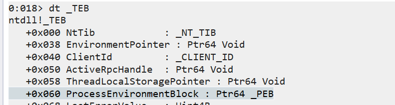
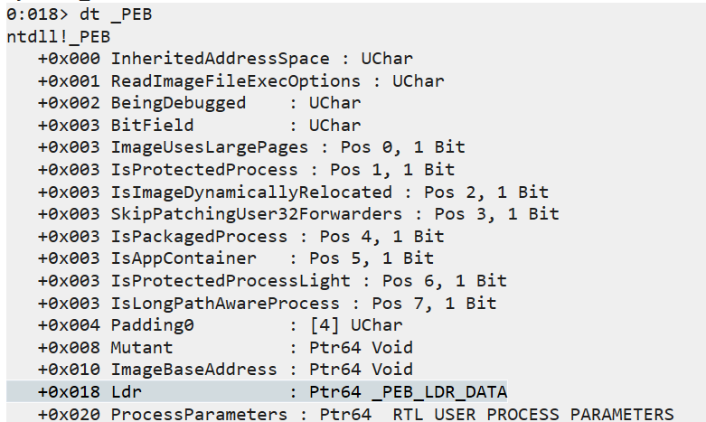
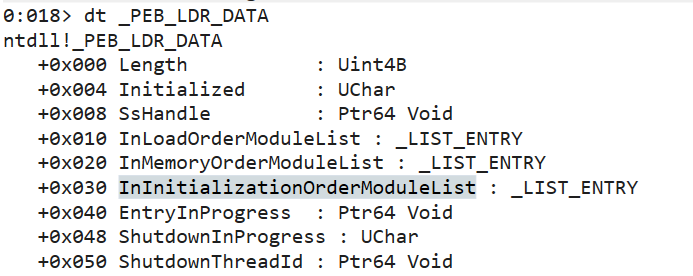
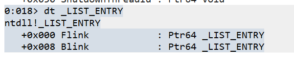
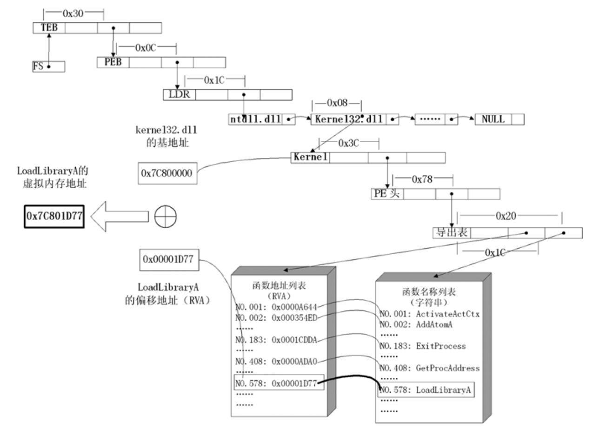
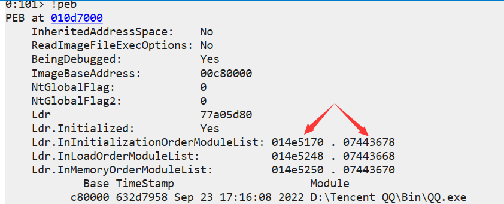
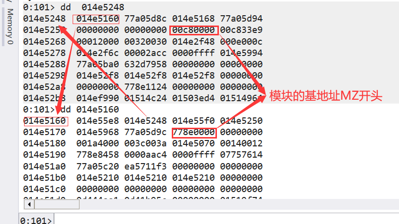
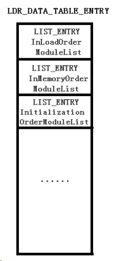

# 问题

Windows下的shellcode中往往会用到大量的API函数，这些API来自各种的调用库，这时就涉及到了地址定位的问题。

# 一、程序保护

简单对比对比，至于每种保护怎么绕过，那之后再说，好久不打pwn了。

## Windows

### GS

和canary一样，通过在栈上设置关键值来保护溢出。

异常处理SEH链也在栈上因此可以覆盖SEH链为jmp esp的地址，之后触发异常跳转到esp执行shellcode。

### SafeSEH

SafeSEH是在程序编译的时候，就将所有的异常处理函数进行注册。凡是执行过程中触发异常后，都要经过一个检验函数，检查SEH链指向的地址是否在注册的列表中。

可以有效防止GS中的修改SEH的方式。

### DEP

堆和栈只有读写权限没有执行权限。linux上是利用ret2libc的方式绕过，Windows上通过执行VirtualProtect()将shellcode所在内存属性添加上可执行权限来绕过这个方式。

### ASLR

地址空间布局随机化（ASLR）应运而上，ALSR即是让exe、dll的地址全都随机。有效防止了DEP的攻击方式，压根定位不到ROP。

- 堆喷射

对抗ASLR的方式是暴力把程序空间占满，全铺上shellcode，只要跳转地址没落在已有模块中，落在我们的空间中即可以执行了shellcode，但是这样做无法绕过DEP，这种将程序空间全部占满铺上shellcode的技术被称为堆喷射技术，堆喷射技术只能对抗ASLR，缺无法对抗ASLR+DEP的双重防护。

### CFG

微软在Win 8.1 Update 3以及Win 10中启用了一种抵御内存泄露攻击的新机制，即Control Flow Guard(CFG)——控制流防护。

通过在间接跳转前插入校验代码，检查目标地址的有效性，进而可以阻止执行流跳转到预期之外的地点， 最终及时并有效的进行异常处理，避免引发相关的安全问题。

简单的说，就是在程序间接跳转之前，会判断这个将要跳转的地址是否是合法的。

## linux

利用peda插件的`checksec`可以查看程序开启的保护。


### CANNARY

金丝雀保护，linux上最经典的栈溢出保护策略，类似于Windows下的GS保护。

canary设计是以“x00”结尾，本意就是为了保证canary可以截断字符串，但是这也成为了识别canary的关键标志。

泄露栈中canary的思路是覆盖canary的低字节，来打印出剩余的canary部分。

常用格式化字符串或者是 fork函数的单字节爆破两种方式进行泄露

### FORTIFY

这个保护基本没法绕，这是一个由GCC实现的源码级别的保护机制，其功能是在编译的时候检查源码以避免潜在的缓冲区溢出等错误。

加了这个保护（编译时加上参数`-D_FORTIFY_SOURCE=2`）一些敏感函数如read, fgets, memcpy, printf等等会被替换成read_chk, fgets_chk, memcpy_chk,printf_chk等带_chk后缀的函数。

### NX

经典的堆栈不可执行保护，No-execute保护。将数据所在内存页标识为不可执行，当程序溢出成功转入shellcode时，程序会尝试在数据页面上执行指令，此时CPU就会抛出异常，而不是去执行恶意指令。和windows下的DEP原理相同。

说是堆栈不可执行，实际上是整个 **数据页面**上都不行，这时jmp-shellcode的方式就不行了，就到了最传统的return-to-libc的攻击方式。

### PIE

内存空间随机化保护，position-independent executable。在每次加载程序时都变换加载地址，从而不能通过ROPgadget等一些工具来帮助解题。通过扰乱获取固定的地址定位来保护程序。`-no-pie`参数来开启关闭。

影响的是绝对地址，但是相对偏移不变。

### RELRO

read only relocation。设置符号重定向表格为只读或在程序启动时就解析并绑定所有动态符号，从而减少对GOT（Global Offset Table）攻击。这种防范方式是对延迟绑定攻击的一种防护。


# 二、API地址定位

api在dll库里，api相对于dll基地址的偏移是不变的.

## Base address

### 过程

1、通过`FS`寄存器定位到线程环境块TEB结构体。（64-bit用的是GS寄存器）。

2、在TEB结构体中找到PEB结构体（32，64位不同）



3、通过PEB结构体找到指向 PEB_LDR_DATA 结构体的指针，存放着已经被进程装载的动态链接库的信息。



```
InLoadOrderModuleList;                //模块加载顺序
InMemoryOrderModuleList;              //模块在内存中的顺序
InInitializationOrderModuleList;      //模块初始化装载顺序
```

4、在上述结构体中找到模块初始化链表的头指针 InInitializationOrderModuleList



5、看到链表的结构也比较简单



6、模块初始化链表 InInitializationOrderModuleList 中按顺序存放着 PE 装入运行时初始化模块的信息。

​	  第一个链表结点是 ntdll.dll，第二个是kernelbase.dll，第三个链表结点就是 kernel32.dll。

7、找到属于 kernel32.dll 的结点后，在其基础上再偏移 0x08 就是 kernel32.dll 在内存中的加载基地址。

这是因为，kernel32这占据8字节。

8、从 kernel32.dll 的加载基址算起，偏移 0x3C 的地方就是其 PE 头，这个是通过静态分析得到的，pe文件结构

9、PE 头偏移 0x78 的地方存放着指向函数导出表的指针。

- 流程图



### 实现代码

获取到LDR之后，这个双链表指向进程装载的模块，结构中的每个指针，指向了一个LDR_DATA_TABLE_ENTRY 的结构（The head of a doubly-linked list that contains the loaded modules for the process. Each item in the list is a pointer to an LDR_DATA_TABLE_ENTRY structure ）`InMemoryOrderModuleList`含进程的已加载模块的多维链接列表的头





可以看到这样的一个双向链表。这样就可以获得 LDR_DATA_TABLE_ENTRY 结构体的基本结构了



```c
typedef struct _LDR_DATA_TABLE_ENTRY {
    PVOID Reserved1[2];
    LIST_ENTRY InMemoryOrderLinks;
    PVOID Reserved2[2];
    PVOID DllBase;
    PVOID Reserved3[2];
    UNICODE_STRING FullDllName;
    BYTE Reserved4[8];
    PVOID Reserved5[3];
#pragma warning(push)
#pragma warning(disable: 4201) // we'll always use the Microsoft compiler
    union {
        ULONG CheckSum;
        PVOID Reserved6;
    } DUMMYUNIONNAME;
#pragma warning(pop)
    ULONG TimeDateStamp;
} LDR_DATA_TABLE_ENTRY, *PLDR_DATA_TABLE_ENTRY;
```

可以利用上面的结构体查找dll的基地址。关键还是节点的遍历。

```c
#include<stdio.h>
#include<stdlib.h>
#include<Windows.h>
#include<winternl.h>
#include<string.h>

typedef LONG(NTAPI* NtQueryInformationProcessPtr)(
	HANDLE ProcessHandle,
	DWORD ProcessInformationClass,
	PVOID ProcessInformation,
	ULONG ProcessInformationLength,
	PULONG ReturnLength
	);

int main()
{
	PWSTR ModuleName[10];
	DWORD64 ModuleAddr[10];

	DWORD ProcID = 29616;
	HANDLE hProcess = OpenProcess(PROCESS_ALL_ACCESS, FALSE, ProcID);

	HMODULE hNtdll = LoadLibraryA("ntdll.dll");
	if (hNtdll == NULL)
	{
		printf("无法加载 ntdll.dll 库\n");
		return 1;
	}

	NtQueryInformationProcessPtr NtQueryInformationProcess = (NtQueryInformationProcessPtr)GetProcAddress(hNtdll, "NtQueryInformationProcess");

	//find base addr by peb
	PROCESS_BASIC_INFORMATION pbi;
	ULONG ReturnLength;
	NTSTATUS status = NtQueryInformationProcess(hProcess, 0, &pbi, sizeof(pbi), &ReturnLength);
	if (status != 0)
	{
		printf("NtQueryInformationProcess 失败，错误码 %lu\n", status);
		return 1;
	}

	PEB peb;
	ReadProcessMemory(hProcess, pbi.PebBaseAddress, &peb, sizeof(peb), NULL);

	PPEB_LDR_DATA ldrr = peb.Ldr;
	PLIST_ENTRY pListEntry = ldrr->InMemoryOrderModuleList.Flink;

	int i = 0;
	int j = 0;
	while (pListEntry != &ldrr->InMemoryOrderModuleList)
	{
		PLDR_DATA_TABLE_ENTRY pEntry = CONTAINING_RECORD(pListEntry, LDR_DATA_TABLE_ENTRY, InMemoryOrderLinks);

		ModuleAddr[i] = (DWORD64)pEntry->DllBase;
		ModuleName[i] = pEntry->FullDllName.Buffer;
		
		pListEntry = pListEntry->Flink;
		i++;
	}


	for (j = 0; j < i; j++)
	{
		printf("%lls --> ", ModuleName[j]);
		printf("%I64p\n", ModuleAddr[j]);
	}

	printf("finish\n");
	CloseHandle(hProcess);
	return 0;
}
```

上述代码实现了利用InMemoryOrderModuleList链表。访问导入模块基地址的功能，同时也可以访问模块的名称字符串。

一般的程序显示的导入模块顺序是：

```
[++] Loaded DLL: {C:\Users\Rootkit\Desktop\dll

[++] Loaded DLL: {C:\WINDOWS\SYSTEM32\ntdll.dll}
base address: <00007FFC9D970000>

[++] Loaded DLL: {C:\WINDOWS\System32\KERNEL32.DLL}
base address: <00007FFC9CA30000>

[++] Loaded DLL: {C:\WINDOWS\System32\KERNELBASE.dll}
base address: <00007FFC9B470000>

[++] Loaded DLL: {C:\WINDOWS\SYSTEM32\VCRUNTIME140D.dll}
base address: <00007FFC61640000>

[++] Loaded DLL: {C:\WINDOWS\SYSTEM32\ucrtbased.dll}
base address: <
```

先是自己的路径，遇到中文会截断，然后是一些系统dll。

### 缺点

只能访问到当前载入的dll，不因为dll基本是动态载入的，所以访问到的比较少，同时对于loadlibrary访问的dll也是无法获取到的。

## Offset address

### 思路

1、

拿到基地址实际上就是`MZ`所在的地址，这时候根据PE文件结构直接定位就可以了。这里需要定位的是程序的**导出表**

利用结构体和`ReadProcessMemory`函数将内容读进结构体，就可以定位到函数的导出表

2、

直接记住偏移，基址不同，但是偏移是一定的。