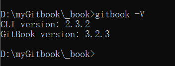
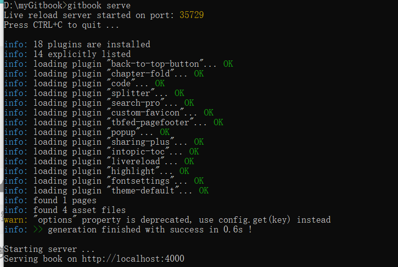
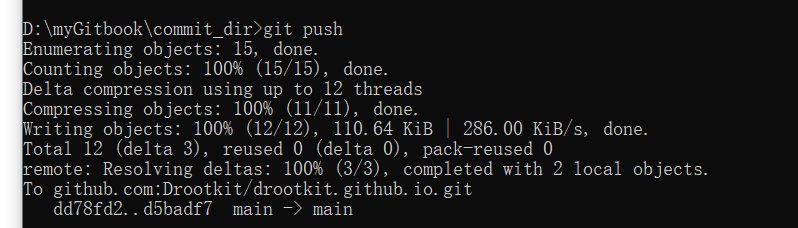
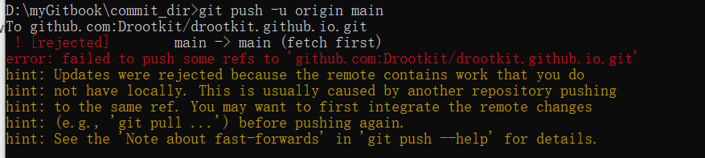

如何在化工原理课堂构建gitbook作为自己的博客

# hexo和gitbook对比

没啥好对比的，我就感觉hexo用起来比较方便，比如构建博客，挂在公网或者是github上比较方便；但是我认为那个适合作为一个交流平台，不适合用来笔记；所谓大道至简，hexo的便利性导致他的臃肿性。所以才来尝试使用gitbook来构建博客，与其说是博客，不如说是笔记系统，更加方便简单的笔记系统。

gitbook可以根据不同的类型进行分类，左边的目录支持二级目录（实践发现支持三级目录），小母鹿都在文章里的右边。

而且book对于文章的目录管理非常自由，只有buil的时候可以索引到就可以。

可能别的也可以，但是我不知道，如果任何人来找我关于这个进行争论，别怪我没素质下限

# gitbook搭建准备

记录搭建的过程，方便以后快速搭建。或者以备不时之需。

## 环境准备

### 需要：

1. github账号，就像是hexo那种####.github.io的那种GitHub page仓库。
2. npm和node环境，npm需要低版本，高版本的不能匹配gitbook。
3. 脑子，百度，google，梯子
4. git
5. everything，可以帮助我更加方便的找到安装的文件在哪一个目录里

### 工具下载

```cmd
npm install gitbook-cli -g
```

这里注意需要配置环境变量，在 **查看高级系统设置 **里，添加对应的目录

之前建议npm进行换源，不然下载可能会出问题。

下载结束之后，在cmd里输入

```shell
gitbook --version
```

需要注意的是如果显示找不到gitbook这个命令，则需要仔细的看一下自己的path有没有填入正确的值。

这时gitbook会进行自己的一个安装和配置。

#### 可能的报错

gitbook报错1：

npm版本太高，导致安装失败。

gitbook报错2：

找到报错的那个js文件，进去之后把67行左右的三个连续的代码注释掉，注意，一定不能注释报错行的代码，不然就无法自行安装配置gitbook。

解决上述错误之后重复指令

```shell
gitbook --version
```

出现警告无所谓，等一等等他安装完成。就行。成功后应该是



如果只有第一行的话说明不行，需要重新走一遍--version。并且注意一下那个可能会报错的js文件。

### 本地环境

自己找一个想放置文章的目录，当做gitbook的本地目录。然后进入目录

我这里用的目录是`D:\myGitbook`，进入目录执行：

```shell
gitbook init
```

如果没有在目录下生成两个md文件，说明你配错了。建议全部删除然后在npm官网下载msi文件进行安装，而不是下载zip，至于为啥我也不知道，你要是知道可以给我发邮件 crootkit@gmail.com 不胜感激。

目录下的 **SUMMARY.md**是很重要的，他决定了gitbook左边的目录。通过研究这个文件，可以发现他是怎么对文章进行索引的，这也可以根据他的格式来看到如何索引到我们的文章，所以我在该目录下创建了一个新的目录用来放置我的md文章。

通过命令

```shell
gitbook build
```

可以对本地的项目进行build，这个命令也集合到了gitbook serve里，但是我还是喜欢先build一下。

serve命令可以在本地起一个端口，类似于hexo s命令。

可以在本地起一个服务进行预览。



类似与这样的形势，就是成功了。

### 下载插件

在稀土掘金上找到了说是需要的12个插件，我稍微删改了一下。

插件需要写在`D:\myGitbook\book.json`中，我的是这样的。

```json
{
    "plugins": [
        "back-to-top-button",
        "chapter-fold",
        "code",
        "splitter",
        "-lunr",
        "-search",
        "search-pro",
        "custom-favicon",
        "tbfed-pagefooter",
        "popup",
        "-sharing",
        "sharing-plus",
        "intopic-toc"
    ],
    "pluginsConfig": {
        "favicon": "./icon/book.ico",
        "tbfed-pagefooter": {
            "copyright": "没有版权，随便复制，免费的知识应该共享",
            "modify_label": "该文章修订时间：",
            "modify_format": "YYYY-MM-DD HH:mm:ss"
        },
        "sharing": {
            "douban": true,
            "facebook": true,
            "google": true,
            "pocket": true,
            "qq": true,
            "qzone": true,
            "twitter": true,
            "weibo": true,
            "all": [
                "douban",
                "facebook",
                "google",
                "instapaper",
                "linkedin",
                "twitter",
                "weibo",
                "messenger",
                "qq",
                "qzone",
                "viber",
                "whatsapp"
            ]
        }
    }
}
```

然后执行一下`gitbook install`就可以按部就班的下载了。

当你想添加一个插件时，我是这样解决的：

- 首先讲原先的book文件改名
- 建立新的book文件然后写入要更新的插件，进行install操作
- 然后讲两个book合并

如果新增插件的数量不是很多，可以采用单独下载的方式然后将插件的名称合并到之前book中。

**注意：**如果在build的时候没有将之前的book合并的话，会出现之前的插件无法索引的情况。

根据网络因素决定下载速度。

下载完成执行

```shell
gitbook build
gitbook serve
```

# 托管到drootkit.github.io

## 明确一点

进行build之后，会在目录下生成一个`_book`目录，里面有一个index文件，这个文件就是整个完整的网页。

所以我们只需要把这个目录里的内容同步到github上去就行。

目录里的内容不全是网页需要用到的内容，我们可以创建一个`.gitignore	`里面包含一些不需要提交到网页上的文件。

注意：每一次的build都会刷新_book目录下的所有的文件，导致.git会消失，所以就新建一个目录，每次生成的东西有用的放进去，既省去了gitignore也防止了git每次被刷没。

在这个新的目录里，build之后将生成的文件直接复制进去就可以，但是需要注意的是不要把里面的.git给覆盖掉，里面的git文件夹经过第一次配置好之后，后续就可以直接进行push了，相对比较方便。



## 上线gitbook

**进行build之后，进入_book文件夹：**

```shell
git init  #初始化本地git仓库
```

方法有很多，反正只要把这些文件push上去就行。

至于github的配置，参考hexo的github配置，那个信息比较多。

```shell
git config --global user.name "###"
git config --global user.email "###@4444.***"
```

绑定远程仓库

```shell
git remote add origin 你的远程仓库地址
```

绑定之后因为本地还是master，远程一般是main，所以改一下本地分支

```shell
git config --global init.defaultBranch main
```

然后就三件套

```shell
git add .
git commit -m "必须写注释，不然报错"
git push #用-f来强制覆盖之前远程仓库里的东西
```

然后网页登录看看仓库里有没有东西，有了之后等一会，直接去访问网址就可以访问到gitbook了。

### 可能的报错 remote

1 遇到push失败（常见于更新的时候）



尝试强制覆盖

```shell
git push -u origin main -f
```

即可成功

2 遇到的新问题，当存在两个名称一样的标题的时候，会自动定位到第一个标题，所以这里的可能的报错我将其后面跟上了`remote`

玩的开心

# 可能的自动化脚本

能我哪天把这个搞差不多清楚了还是要写一个自动化的脚本的。不然每次都要手动复制可太麻烦了，一不注意再把我的git覆盖掉，那可是真的操了狗了。

每次加入新的文章之后都要修改summary那个md也是一件麻烦事，但是麻烦带来的高度的可操作性，这一点还是很难平衡的。总之我感觉这个是比hexo要好用的，依赖没有hexo那么多，相对来说也方便配置一点。

```python
import os

# 删除git目录中的没有用的md文件，只上传html文件，效果一样（md和png）
def cleanGit():
    path = 'D:\\myGitbook\\commit_dir\\MyArticles'
    for root, dirs, files in os.walk(path):
        for name in files:
            if (name.endswith(".md") or name.endswith(".png")):
                print(name)
                print(os.path.join(root, name))
                os.remove(os.path.join(root, name))
    # 删除空目录
    # for root, dirs, files in os.walk(path):
    #     if not os.listdir(root):
    #         os.rmdir(root)

# 清理本地的build目录，文本和图片
def cleanLocal():
    path = 'D:\\myGitbook\\localOpreat\\_book\\MyArticles'
    for root, dirs, files in os.walk(path):
        for name in files:
            if (name.endswith(".md") or name.endswith(".png")):
                print(name)
                print(os.path.join(root, name))
                os.remove(os.path.join(root, name))
    # 删除空目录
    # for root, dirs, files in os.walk(path):
    #     if not os.listdir(root):
    #         os.rmdir(root)

cleanGit()
```

删除空目录的代码会出问题，暂时就不写了。

因为每一次写文章都要走一遍过程，相对比较麻烦，于是决定每周向github更新一次或者啥时候开心了就向github推送更新一次。
